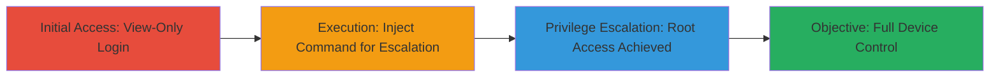

---
tags:
  - command-injection
  - privilege-escalation
  - unifi-protect
  - embedded-linux
type: attack_chain
tools: []
tactics:
  - '[[Execution]]'
  - '[[Privilege Escalation]]'
verified: false
platforms:
  - Linux
  - Embedded Linux
submitted: true
complexity: medium
created_at: '2023-10-01T00:00:00Z'
procedures:
  - '[[procedures/Exploit-Command-Injection-in-UniFi-Protect]]'
step_count: 2
techniques:
  - '[[Unix Shell]]'
  - '[[Exploitation for Privilege Escalation]]'
updated_at: '2025-12-14T17:30:07.317Z'
description: >-
  Attack chain exploiting command injection in UniFi Protect's custom commands
  feature to escalate from view-only access to full root privileges on Cloud Key
  Gen2 Plus devices.
skill_level: intermediate
impact_level: high
id: 1afe1516-c148-4018-95ba-caae4b03af39
validated: true
mitre_tactics:
  - '[[Execution]]'
  - '[[Privilege Escalation]]'
mitre_techniques:
  - '[[Unix Shell]]'
  - '[[Exploitation for Privilege Escalation]]'
---
# View-Only to Root Privilege Escalation via Command Injection in UniFi Protect

Multi-stage attack chain demonstrating privilege escalation from view-only access to root on UniFi Protect devices running v1.13.2 or prior, via command injection in the custom commands feature. This vulnerability allows arbitrary command execution, enabling role modifications and full device control on Cloud Key Gen2 Plus hardware.

## Chain Metrics Dashboard

| Metric | Value |
|--------|-------|
| Chain Status | Unverified |
| Total Steps | 2 |
| Execution Time | ~5 minutes |
| Skill Level | Intermediate |
| Complexity | Medium |
| Impact Level | High |

## Attack Flow Visualization



## Prerequisites & Requirements

### Required Tools

- Web browser or [[tools/curl]] for API interaction

### Target Environment

- UniFi Protect v1.13.2 or prior
- Cloud Key Gen2 Plus hardware
- Embedded Linux OS
- Access to UniFi Protect web interface (typically port 443)

### Initial Access Requirements

- Valid view-only user credentials
- Network access to the UniFi Protect device (local or remote via Ubiquiti account)
- No prior root access required

## Detailed Attack Procedures

### Step 1: Gain View-Only Access

**Objective**: Authenticate as a view-only user to access the UniFi Protect interface and reach the custom commands feature.

**Instructions**: Log in to the UniFi Protect web interface using view-only credentials. Navigate to the camera or device management section where custom commands can be executed (e.g., via maintenance or diagnostic tools).

**Expected Output**: Successful login and access to the dashboard without administrative privileges.

**Success Indicators**:
- Dashboard loads with view-only restrictions (e.g., cannot modify settings)
- Custom commands interface is accessible

### Step 2: Exploit Command Injection for Privilege Escalation

procedure: [[procedures/Exploit-Command-Injection-in-UniFi-Protect]]

**Objective**: Inject arbitrary commands via the custom commands feature to modify user roles and escalate to root.

**Instructions**: In the custom commands input field, inject a payload that appends root privileges to the attacker's user account, such as using usermod to add the user to the root group. For example, craft the input as a legitimate command followed by the injection: `ping -c 1 127.0.0.1; usermod -aG root attacker_user #`. Submit the command and verify escalation by attempting root-level actions.

Use [[commands/inject-usermod-escalation]] to simulate the injection if testing via API:

```bash
curl -X POST https://protect-device/api/custom-command -H "Authorization: Bearer view-only-token" -d '{"command": "ping -c 1 127.0.0.1; usermod -aG root attacker_user #"}'
```

**Expected Output**: Command executes without error, and subsequent login or session refresh grants root access.

**Success Indicators**:
- No validation errors on submission
- Ability to perform root actions (e.g., access restricted files or execute system commands)
- Log confirmation of role change

## Attack Chain Summary

### Key Achievements

1. Bypassed view-only restrictions via command injection
2. Escalated privileges to root without authentication bypass
3. Achieved full control over the UniFi Protect device, including data exfiltration or further persistence

## Technique & Tactic Coverage

### MITRE ATT&CK Techniques

- [[Unix Shell]] Unix Shell
- [[Exploitation for Privilege Escalation]] Exploitation for Privilege Escalation

### MITRE ATT&CK Tactics

- [[Execution]] Execution
- [[Privilege Escalation]] Privilege Escalation

---
*Last updated: 2023-10-01T00:00:00Z*
