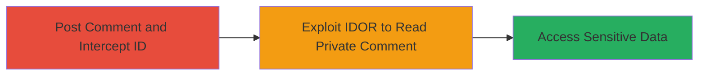

---
tags:
  - idor
  - web
  - unauthorized-access
  - vimeo
  - privacy-bypass
type: attack_chain
tools: []
tactics:
  - '[[Initial Access]]'
  - '[[Collection]]'
verified: false
platforms:
  - Web
submitted: true
complexity: medium
created_at: '2023-10-01T00:00:00Z'
procedures:
  - '[[procedures/Intercept-Comment-Creation-to-Obtain-ID]]'
  - '[[procedures/Exploit-IDOR-in-Comment-Edit-to-Read-Private-Comment]]'
step_count: 2
techniques:
  - '[[Exploit Public-Facing Application]]'
updated_at: '2025-12-14T17:25:23.401Z'
description: >-
  Multi-stage attack exploiting Insecure Direct Object Reference (IDOR) in
  Vimeo's comment editing to unauthorizedly read private comments on private
  videos by manipulating the comment_id parameter.
skill_level: intermediate
impact_level: high
id: 60eded73-2910-45c2-a359-36dfd8a22907
validated: true
mitre_tactics:
  - '[[Initial Access]]'
  - '[[Collection]]'
mitre_techniques:
  - '[[Exploit Public-Facing Application]]'
---
# Vimeo IDOR in Comment Editing Endpoint to Read Private Comments

Multi-stage attack chain demonstrating a complete attack workflow exploiting an IDOR vulnerability in Vimeo's comment system, allowing unauthorized reading of private comments on private videos.

## Chain Metrics Dashboard

| Metric | Value |
|--------|-------|
| Chain Status | Unverified |
| Total Steps | 2 |
| Execution Time | ~5 minutes |
| Skill Level | Intermediate |
| Complexity | Medium |
| Impact Level | High |

## Attack Flow Visualization



## Prerequisites & Requirements

### Required Tools

- Web proxy tool like Burp Suite for intercepting requests
- Two separate user accounts on Vimeo (one for posting, one for reading)

### Target Environment

- Vimeo web platform
- Access to a private video where comments can be posted
- No special services or ports required beyond standard HTTPS (443)

### Initial Access Requirements

- Valid Vimeo accounts with permission to view and comment on private videos
- Network access to vimeo.com
- No prior elevated access needed

## Detailed Attack Procedures

### Step 1: Post Comment and Intercept ID
procedure: [[procedures/Intercept-Comment-Creation-to-Obtain-ID]]

**Objective**: Create a private comment on a private video and capture its unique ID via request interception to enable subsequent unauthorized access.

**Instructions**: Log in with the first account, navigate to a private video, and post a comment while intercepting the HTTP request using a proxy tool. Look for the generated comment_id in the response or request parameters.

For example, the intercepted POST request to create a comment might look like this (proxied through Burp):

```http
POST /api/v2/videos/<video_id>/comments HTTP/1.1
Host: vimeo.com
Authorization: Bearer <token>
Content-Type: application/json

{"text": "Test private comment"}
```

The response will include the comment_id, e.g., {"id": 1301116}.

**Expected Output**: Captured comment_id value, such as 1301116.

**Success Indicators**:
- Comment successfully posted on private video
- comment_id extracted from intercepted request/response

### Step 2: Exploit IDOR to Read Private Comment
procedure: [[procedures/Exploit-IDOR-in-Comment-Edit-to-Read-Private-Comment]]

**Objective**: Use a second account to craft a request to the comment edit endpoint, replacing the comment_id with the target private ID to retrieve and read the comment content without authorization.

**Instructions**: Log in with the second account that lacks access to the private video. Intercept or directly send a GET request to the edit form endpoint, manipulating the comment_id parameter to the one obtained in Step 1. Use a tool like curl for direct testing:

Execute [[commands/curl-vimeo-comment-edit]] to fetch the private comment:

```bash
curl "https://vimeo.com/<video_id>?comment_id=1301116&is_sticky=0&action=comment_edit_form" -H "Cookie: <session_cookie>"
```

**Expected Output**: HTML response containing the private comment text, e.g., revealing "Test private comment" in the form fields.

**Success Indicators**:
- Response includes the private comment content
- Bypassed privacy controls confirmed by accessing comment from unauthorized account

## Attack Chain Summary

### Key Achievements

1. Obtained private comment ID through interception during creation
2. Exploited IDOR to read unauthorized private comment content
3. Demonstrated bypass of Vimeo's privacy controls on private videos

## Technique & Tactic Coverage

### MITRE ATT&CK Techniques

- [[Exploit Public-Facing Application]]

### MITRE ATT&CK Tactics

- [[Initial Access]]
- [[Collection]]

---
*Last updated: 2023-10-01T00:00:00Z*
