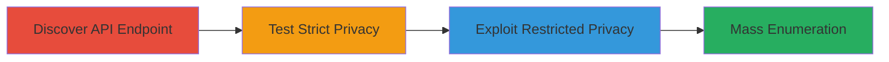

---
tags:
  - information-disclosure
  - api-misconfiguration
  - enumeration
  - vimeo
type: attack_chain
tools: []
tactics:
  - '[[Reconnaissance]]'
verified: false
platforms:
  - Web
submitted: true
complexity: medium
created_at: '2024-01-01T00:00:00Z'
procedures:
  - '[[procedures/Discover-Vimeo-Legacy-OEmbed-API-Endpoint]]'
  - '[[procedures/Test-OEmbed-API-with-Strictly-Private-Video]]'
  - '[[procedures/Exploit-OEmbed-API-with-Restricted-Private-Videos]]'
  - '[[procedures/Enumerate-Private-Videos-via-Sequential-IDs]]'
step_count: 4
techniques:
  - '[[Active Scanning]]'
  - '[[Client Configurations]]'
updated_at: '2025-12-14T17:32:01.482Z'
description: >-
  Multi-stage reconnaissance attack exploiting Vimeo's legacy oEmbed API to
  disclose titles of private videos with restricted privacy settings, enabling
  mass enumeration of sensitive content.
skill_level: intermediate
impact_level: high
id: 19df9eb0-e93b-4adb-a16b-d4eae7e40694
validated: true
mitre_tactics:
  - '[[Reconnaissance]]'
mitre_techniques:
  - '[[Active Scanning]]'
  - '[[Client Configurations]]'
---
# Vimeo Legacy API Disclosure of Private Video Titles via OEmbed Endpoint

Multi-stage attack chain demonstrating reconnaissance and information disclosure via Vimeo's legacy oEmbed API, which fails to enforce privacy settings for restricted videos, allowing title extraction and mass enumeration.

## Chain Metrics Dashboard

| Metric | Value |
|--------|-------|
| Chain Status | Unverified |
| Total Steps | 4 |
| Execution Time | ~5 minutes |
| Skill Level | Intermediate |
| Complexity | Medium |
| Impact Level | High |

## Attack Flow Visualization



## Prerequisites & Requirements

### Required Tools

- Browser or [[commands/curl-vimeo-oembed-test]]

### Target Environment

- Web platform
- Vimeo API service accessible
- No authentication required for public endpoints

### Initial Access Requirements

- Internet access
- Knowledge of target video URLs or IDs
- No credentials needed

## Detailed Attack Procedures

### Step 1: Discover Legacy OEmbed API Endpoint
procedure: [[procedures/Discover-Vimeo-Legacy-OEmbed-API-Endpoint]]

**Objective**: Identify the vulnerable legacy API endpoint used for oEmbed embedding.

**Instructions**: Examine Vimeo's developer documentation or test known oEmbed patterns to locate the endpoint at https://vimeo.com/api/oembed.json?url=.

**Expected Output**: Confirmation of the endpoint accepting a video URL parameter for JSON response.

**Success Indicators**:
- Endpoint responds to basic queries
- API documentation or testing reveals parameter acceptance

### Step 2: Test OEmbed API with Strictly Private Video
procedure: [[procedures/Test-OEmbed-API-with-Strictly-Private-Video]]

**Objective**: Verify that the API correctly enforces the strictest privacy setting ('Only me') by returning a 404 error.

**Instructions**: Use [[commands/curl-vimeo-oembed-test]] to query a video set to 'Only me' privacy:

```bash
curl "https://vimeo.com/api/oembed.json?url=https%3A//vimeo.com/152133387"
```

**Expected Output**: HTTP 404 Not Found response, confirming enforcement for strict privacy.

**Success Indicators**:
- 404 response received
- No video metadata returned

### Step 3: Exploit OEmbed API with Restricted Private Videos
procedure: [[procedures/Exploit-OEmbed-API-with-Restricted-Private-Videos]]

**Objective**: Demonstrate information disclosure by querying videos with less strict privacy settings, extracting titles.

**Instructions**: Target videos set to 'Only people I follow', 'Only people I choose', or 'Only people with a password' using [[commands/curl-vimeo-oembed-test]]:

```bash
curl "https://vimeo.com/api/oembed.json?url=https%3A//vimeo.com/[VIDEO_ID]"
```

Compare with direct video page access, which returns 404.

**Expected Output**: JSON response including {"type":"video","title":"My secret video",...}.

**Success Indicators**:
- Title and metadata disclosed in JSON
- Direct page access denied (404)

### Step 4: Enumerate Private Videos via Sequential IDs
procedure: [[procedures/Enumerate-Private-Videos-via-Sequential-IDs]]

**Objective**: Scale the disclosure to harvest thousands of private video titles using sequential ID enumeration.

**Instructions**: Script iteration over sequential video IDs (e.g., 1 to 10000) with [[commands/curl-vimeo-oembed-test]], filtering responses where API returns data but page 404s.

```bash
for id in {1..10000}; do curl -s "https://vimeo.com/api/oembed.json?url=https%3A//vimeo.com/$id" | jq .title; done
```

**Expected Output**: List of disclosed private video titles.

**Success Indicators**:
- Multiple titles extracted
- Enumeration reveals sensitive content patterns

## Attack Chain Summary

### Key Achievements

1. Identified privacy enforcement gap in legacy API
2. Confirmed disclosure for restricted videos
3. Enabled scalable enumeration of private content

## Technique & Tactic Coverage

### MITRE ATT&CK Techniques

- [[Active Scanning]]
- [[Client Configurations]]

### MITRE ATT&CK Tactics

- [[Reconnaissance]]

---
*Last updated: 2024-01-01T00:00:00Z*
