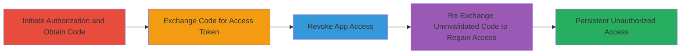

# Vimeo OAuth2 Authorization Bypass via Revocation Failure

Multi-stage attack chain demonstrating a complete attack workflow exploiting the failure of Vimeo's OAuth2 API to invalidate authorization codes when a user revokes app access, enabling attackers to bypass revocation and maintain unauthorized account access.

## Chain Metrics Dashboard

| Metric | Value |
|--------|-------|
| Chain Status | Unverified |
| Total Steps | 4 |
| Execution Time | ~10 minutes |
| Skill Level | Intermediate |
| Complexity | Medium |
| Impact Level | High |

## Attack Flow Visualization



## Prerequisites & Requirements

### Required Tools

- [[tools/getAccessToken-sh]]
- [[tools/me-sh]]

### Target Environment

- Web platform with access to Vimeo's OAuth2 API
- Required services: Vimeo OAuth2 authorization endpoint
- Network access requirements: Internet connectivity to api.vimeo.com and a registered redirect URI (e.g., https://avuln.com/callback)

### Initial Access Requirements

- Valid Vimeo user credentials for authorization
- Registered OAuth2 client app with client_id (e.g., 79658bbee0da8be5254a5137bc0fcc93f7059a2a)
- No prior access needed beyond standard web browser and API tools

## Detailed Attack Procedures

### Step 1: Initiate Authorization and Obtain Code

procedure: [[procedures/Initiate-OAuth2-Authorization-and-Obtain-Code]]

**Objective**: Start the OAuth2 flow to obtain an initial authorization code from the target Vimeo account.

**Instructions**: Open the authorization URL in a browser and log in to authorize the app, then extract the code from the redirect callback.

**Expected Output**: Authorization code in callback URL, e.g., code=e1fa87cd449ae55b74445b31ac79450c14eeb657.

**Success Indicators**:
- User logged in and app authorized
- Valid code extracted from redirect

### Step 2: Exchange Code for Access Token and Verify

procedure: [[procedures/Exchange-Authorization-Code-for-Access-Token]]

**Objective**: Convert the authorization code into a valid access token and confirm it works by querying user info.

**Instructions**: Use [[commands/exchange-oauth-code-for-token]] with the obtained code, then verify with [[commands/verify-access-token]] using the new token.

```bash
./getAccessToken.sh e1fa87cd449ae55b74445b31ac79450c14eeb657
./me.sh d3ac3bb53d1c4ebc3de7d28e4ed801c0
```

**Expected Output**: Access token response with 200 OK on verification, showing user data.

**Success Indicators**:
- Access token received
- API call to /me returns user info

### Step 3: Revoke Application Access

procedure: [[procedures/Revoke-Application-Access]]

**Objective**: Disconnect the app from the user's Vimeo account settings to revoke the current access token.

**Instructions**: Navigate to the apps settings page and revoke access for the test app.

**Expected Output**: App disconnected; subsequent token verification fails with 401.

**Success Indicators**:
- App listed as revoked in settings
- Existing token invalidates on API call

### Step 4: Exploit Revocation Failure to Regain Access

procedure: [[procedures/Exploit-Revocation-Failure-to-Regain-Access]]

**Objective**: Use a previously obtained but uninvalidated authorization code to generate a new access token, bypassing the revocation.

**Instructions**: Obtain a second code before revocation if needed, then exchange it post-revocation using [[commands/exchange-oauth-code-for-token]], and verify with [[commands/verify-access-token]].

```bash
./getAccessToken.sh 82e24f835184f47cd83f249907e7bd5018bf62c9
./me.sh 9eabdc746910ea39c07395ee1b69a2b9
```

**Expected Output**: New access token issued with 200 OK on verification, despite revocation.

**Success Indicators**:
- New token generated successfully
- API access restored post-revocation

## Attack Chain Summary

### Key Achievements

1. Successful initial OAuth2 authorization and token acquisition
2. Confirmation of revocation invalidating existing tokens but not codes
3. Bypass of revocation to regain full API access to user account

## Technique & Tactic Coverage

### MITRE ATT&CK Techniques

- [[Valid Accounts]] Valid Accounts
- [[Use Alternate Authentication Material]] Use Alternate Authentication Material

### MITRE ATT&CK Tactics

- [[Initial Access]] Initial Access
- [[Persistence]] Persistence

---

*Last updated: 2023-10-01T00:00:00Z*
