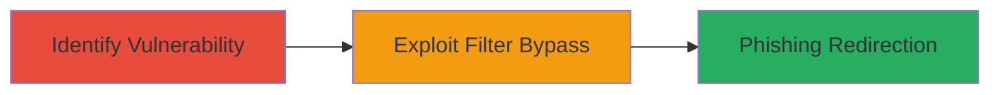

---
tags:
  - open-redirect
  - phishing
  - filter-bypass
  - web-vulnerability
type: attack_chain
tools: []
tactics:
  - '[[Initial Access]]'
verified: false
platforms:
  - Web
submitted: true
complexity: medium
created_at: '2023-10-01T00:00:00Z'
procedures:
  - '[[procedures/Bypass-Vimeo-Image-Filter-for-Open-Redirect]]'
step_count: 2
techniques:
  - '[[Drive-by Compromise]]'
updated_at: '2025-12-14T17:24:23.341Z'
description: >-
  Demonstrates bypassing Vimeo's open redirection filters in the /tools/edit
  endpoint to redirect users to arbitrary external domains, enabling phishing
  attacks.
skill_level: intermediate
impact_level: high
id: 110280f8-69ef-4e57-8fa8-d03299161c0f
validated: true
mitre_tactics:
  - '[[Initial Access]]'
mitre_techniques:
  - '[[Drive-by Compromise]]'
---
# Vimeo Open Redirection Bypass via Image Parameter Filter Manipulation

Multi-stage attack chain demonstrating a complete attack workflow exploiting an open redirection vulnerability in Vimeo's /tools/edit endpoint. The attack bypasses domain and extension filters by embedding required strings in the query parameters, allowing redirection to attacker-controlled domains for phishing.

## Chain Metrics Dashboard

| Metric | Value |
|--------|-------|
| Chain Status | Unverified |
| Total Steps | 2 |
| Execution Time | ~2 minutes |
| Skill Level | Intermediate |
| Complexity | Medium |
| Impact Level | High |

## Attack Flow Visualization



## Prerequisites & Requirements

### Required Tools

- Web browser or [[commands/curl-vimeo-redirect-test]]

### Target Environment

- Vimeo web application
- Public access to https://vimeo.com/tools/edit
- No authentication required

### Initial Access Requirements

- Internet access
- No credentials needed
- Ability to craft and access URLs

## Detailed Attack Procedures

### Step 1: Identify the Open Redirection Vulnerability
procedure: [[procedures/Bypass-Vimeo-Image-Filter-for-Open-Redirect]]

**Objective**: Analyze the /tools/edit endpoint to understand the image parameter filters and identify bypass opportunities.

**Instructions**: Review the endpoint behavior by testing the image parameter with standard Vimeo CDN URLs. Use [[commands/curl-vimeo-redirect-test]] to send a request and observe the redirection logic:

```bash
curl -L "https://vimeo.com/tools/edit?image=https://vimeocdn.com/example.png" -I
```

This reveals that the filter requires 'vimeocdn.com/' in the URL and an image extension like .png. Craft a bypass payload by placing 'vimeocdn.com/' in the query string of an external domain.

**Expected Output**: HTTP response showing redirection only for filtered URLs; no redirect for unfiltered external domains.

**Success Indicators**:
- Confirmation that the endpoint performs open redirection based on the image parameter
- Identification of filter weaknesses (substring matching without proper parsing)

### Step 2: Exploit the Filter Bypass for Redirection
procedure: [[procedures/Bypass-Vimeo-Image-Filter-for-Open-Redirect]]

**Objective**: Demonstrate successful redirection to an attacker-controlled domain by exploiting the filter bypass, simulating a phishing lure.

**Instructions**: Construct the malicious URL with the external domain (e.g., securityidiots.com) ending in .png and embed 'vimeocdn.com/' in the query string. Access the URL using [[commands/curl-vimeo-redirect-test]]:

```bash
curl -L "https://vimeo.com/tools/edit?image=http://securityidiots.com?vimeocdn.com/.png" -I
```

In a real attack, embed this URL in a phishing email or link to trick users into clicking it, leading to the attacker's site.

**Expected Output**: HTTP 302 redirect to http://securityidiots.com, bypassing the domain filter.

**Success Indicators**:
- Redirection occurs to the external domain
- No blocking by Vimeo's filters

## Attack Chain Summary

### Key Achievements

1. Bypassed domain restriction by query string manipulation
2. Enabled arbitrary external redirection for phishing
3. Demonstrated impact on user trust in Vimeo links

## Technique & Tactic Coverage

### MITRE ATT&CK Techniques

- [[Drive-by Compromise]]

### MITRE ATT&CK Tactics

- [[Initial Access]]

---
*Last updated: 2023-10-01T00:00:00Z*
