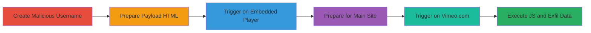

# Vimeo XSS via Unescaped Username in Video Thumbnails for Arbitrary JavaScript Execution

Multi-stage attack chain demonstrating a complete XSS workflow on Vimeo, exploiting unescaped user names in video thumbnails to inject HTML/SVG tags that execute JavaScript from the window.name property, leading to arbitrary code execution and potential cookie theft or session hijacking on viewers of the attacker's videos.

## Chain Metrics Dashboard

| Metric | Value |
|--------|-------|
| Chain Status | Unverified |
| Total Steps | 5 |
| Execution Time | ~2 minutes |
| Skill Level | Intermediate |
| Complexity | Medium |
| Impact Level | High |

## Attack Flow Visualization

## Prerequisites & Requirements

### Required Tools

- Web browser (e.g., Chrome, Firefox)
- Text editor for HTML files

### Target Environment

- Vimeo platform (player.vimeo.com and vimeo.com)
- Attacker requires a Vimeo account
- Victim views videos via iframe embed or direct site

### Initial Access Requirements

- Valid Vimeo account for attacker
- No special credentials needed beyond account creation
- Network access to Vimeo services

## Detailed Attack Procedures

### Step 1: Create Malicious Username
procedure: [[procedures/Create-Malicious-Vimeo-Username-for-XSS]]

**Objective**: Register a Vimeo account with a username containing injectable HTML/SVG to exploit unescaped output in thumbnails.

**Instructions**: Sign up for a new Vimeo account and set the username to an SVG tag that loads JavaScript from window.name. Upload a short video (under 10 seconds) to trigger the thumbnail display quickly.

**Expected Output**: Account created with malicious username; video uploaded and ready for viewing.

**Success Indicators**:
- Username saved as '<svg onload=eval(name)></svg>'
- Video appears in account dashboard

### Step 2: Prepare window.name Payload
procedure: [[procedures/Prepare-window-name-Payload-with-HTML-File]]

**Objective**: Create an HTML file that sets window.name to a JavaScript payload for execution via the SVG onload.

**Instructions**: Create and save an HTML file named 'name_xss_iframe.html' with content that sets window.name to 'prompt(document.domain,document.cookie)' and embeds an iframe loading the attacker's Vimeo video player.

**Expected Output**: HTML file ready; when opened, it sets the payload and loads the iframe.

**Success Indicators**:
- File opens without errors
- Iframe loads the Vimeo player

### Step 3: Trigger XSS on Embedded Player
procedure: [[procedures/Trigger-XSS-on-Player-vimeo-com-Without-Interaction]]

**Objective**: Execute the XSS payload on player.vimeo.com via iframe without victim interaction, by waiting for video end and thumbnail display.

**Instructions**: Open the prepared HTML file in a browser. The iframe will autoplay or load the video; wait 10 seconds for it to end, displaying the 'More from [user]' thumbnail, which triggers the SVG onload evaluating the window.name payload.

**Expected Output**: Alert box showing domain and cookies, indicating JS execution.

**Success Indicators**:
- Prompt appears with document.domain and document.cookie
- No manual clicks required

### Step 4: Prepare Payload for Main Site
procedure: [[procedures/Prepare-Payload-for-Vimeo-com-Site]]

**Objective**: Adapt the payload for direct vimeo.com access, using a link to the video.

**Instructions**: Create another HTML file 'name_xss.html' that sets window.name to the same payload and includes a hyperlink to watch the attacker's video on vimeo.com.

**Expected Output**: HTML file with link to video.

**Success Indicators**:
- File loads and displays the watch video link

### Step 5: Trigger XSS on Vimeo.com
procedure: [[procedures/Trigger-XSS-on-Vimeo-com-with-Video-Playback]]

**Objective**: Execute XSS on vimeo.com with minimal interaction (click to watch and play video), leading to payload execution on thumbnail display.

**Instructions**: Open 'name_xss.html', click the 'Watch video' link to navigate to vimeo.com, then play the video. Wait 10 seconds for it to end and show the thumbnail, triggering the unescaped username payload.

**Expected Output**: JS execution via prompt with domain and cookies.

**Success Indicators**:
- Video plays and ends
- Alert shows stolen data

## Attack Chain Summary

### Key Achievements

1. Account creation with injectable username exploiting unescaped HTML output.
2. Payload delivery via window.name in external HTML, enabling no-interaction XSS on embeds.
3. Arbitrary JS execution stealing viewer cookies and domain info, enabling session hijacking.

## Technique & Tactic Coverage

### MITRE ATT&CK Techniques

- [[JavaScript]]

### MITRE ATT&CK Tactics

- [[Execution]]
- [[Collection]]

---
*Last updated: 2024-01-01T00:00:00Z*
