---
tags:
  - phishing
  - clickjacking
  - credential-theft
  - oauth-misuse
  - twitter
  - google
  - viral-propagation
type: attack_chain
tools:
  - '[[tools/RiskIQ]]'
  - '[[tools/VPN]]'
  - '[[tools/Clean-Browser-Instance]]'
tactics:
  - '[[Initial Access]]'
  - '[[Credential Access]]'
  - '[[Persistence]]'
verified: false
platforms:
  - Web
  - Twitter
  - Google
submitted: true
complexity: medium
created_at: '2023-10-01T00:00:00Z'
procedures:
  - '[[procedures/Send-Malicious-Truncated-Link-in-Twitter-DM]]'
  - '[[procedures/Trigger-Google-SetSID-Logout-and-Relogin]]'
  - '[[procedures/Capture-Credentials-via-Malicious-Google-App]]'
  - '[[procedures/Redirect-to-Randomized-Malicious-Twitter-OAuth]]'
  - '[[procedures/Bypass-Google-Login-for-Direct-Redirect]]'
  - '[[procedures/Automate-Twitter-App-Authentication-via-JavaScript]]'
  - '[[procedures/Manual-Twitter-Sign-In-Fallback-for-JS-Disabled]]'
step_count: 7
techniques:
  - '[[T1566.002]]'
  - '[[Drive-by Compromise]]'
  - '[[LLMNR-NBT-NS Poisoning and SMB Relay]]'
  - '[[Pass the Hash]]'
updated_at: '2025-12-14T17:28:12.918Z'
description: >-
  A multi-stage phishing attack exploiting Twitter's DM link truncation to
  disguise malicious URLs, leading to Google credential capture and unauthorized
  installation of malicious Twitter apps for viral propagation.
skill_level: intermediate
impact_level: high
id: a6e8b54a-2ae8-409a-a144-05571a6df75b
validated: true
mitre_tactics:
  - '[[Initial Access]]'
  - '[[Credential Access]]'
  - '[[Persistence]]'
mitre_techniques:
  - '[[T1566.002]]'
  - '[[Drive-by Compromise]]'
  - '[[LLMNR-NBT-NS Poisoning and SMB Relay]]'
  - '[[Pass the Hash]]'
---
# Viral Twitter DM Clickjacking via Link Truncation for Google Credential Theft and Malicious Twitter App Installation

Multi-stage attack chain exploiting Twitter's DM link truncation to deliver phishing payloads disguised as YouTube links, resulting in Google credential harvesting and malicious Twitter app installations that enable automated viral spread via DMs to followers.

## Chain Metrics Dashboard

| Metric | Value |
|--------|-------|
| Chain Status | Unverified |
| Total Steps | 7 |
| Execution Time | ~5 minutes |
| Skill Level | Intermediate |
| Complexity | Medium |
| Impact Level | High |

## Attack Flow Visualization

```mermaid
graph LR
    A[Send Malicious DM] --> B[User Clicks Link]
    B --> C[Google Logout/Relogin]
    C --> D[Credential Capture]
    D --> E[Redirect to Twitter OAuth]
    E --> F[App Installation]
    F --> G[Viral DM Propagation]

    style A fill:#e74c3c
    style B fill:#f39c12
    style C fill:#f39c12
    style D fill:#e67e22
    style E fill:#3498db
    style F fill:#9b59b6
    style G fill:#27ae60
```

## Prerequisites & Requirements

### Required Tools

- [[tools/RiskIQ]]
- [[tools/VPN]]
- [[tools/Clean-Browser-Instance]]

### Target Environment

- Web platform with Twitter and Google accounts
- Access to Twitter DMs (reciprocal follows or open DMs)
- No specific ports; relies on HTTPS services for Twitter OAuth and Google Authentication

### Initial Access Requirements

- Compromised Twitter account for sending DMs
- Network access to internet
- Victim must be logged into Google/Twitter in browser

## Detailed Attack Procedures

### Step 1: Send Malicious Truncated Link in Twitter DM
procedure: [[procedures/Send-Malicious-Truncated-Link-in-Twitter-DM]]

**Objective**: Deliver a phishing link disguised as a YouTube video to lure the victim into clicking.

**Instructions**: From a compromised Twitter account, send a DM to reciprocal followers or open contacts containing a long malicious URL starting with 'accounts.youtube.com/accounts/SetSID' followed by parameters that truncate to appear benign.

**Expected Output**: Victim receives DM with truncated link like 'accounts.youtube.com/accounts/SetSI...'.

**Success Indicators**:
- DM sent successfully
- Victim views the truncated link without suspicion

### Step 2: Trigger Google SetSID Logout and Relogin
procedure: [[procedures/Trigger-Google-SetSID-Logout-and-Relogin]]

**Objective**: Force the victim to log out of Google and prompt a relogin to intercept credentials.

**Instructions**: Victim clicks the link, which resolves to the full Google SetSID endpoint designed to log out and redirect for relogin.

**Expected Output**: Browser navigates to Google logout page and then prompts for credentials.

**Success Indicators**:
- Victim is logged out of Google
- Relogin prompt appears

### Step 3: Capture Credentials via Malicious Google App
procedure: [[procedures/Capture-Credentials-via-Malicious-Google-App]]

**Objective**: Harvest Google credentials during the forced relogin process.

**Instructions**: During relogin, the malicious Google app intercepts the entered credentials; the chain then redirects to getmorefollowers.biz.

**Expected Output**: Credentials captured and stored by attacker; redirect to follower site.

**Success Indicators**:
- Credentials harvested
- Redirect to getmorefollowers.biz occurs

### Step 4: Redirect to Randomized Malicious Twitter OAuth
procedure: [[procedures/Redirect-to-Randomized-Malicious-Twitter-OAuth]]

**Objective**: Install a malicious third-party Twitter app via randomized OAuth endpoints.

**Instructions**: Use VPN to test and simulate redirects from getmorefollowers.biz to freefollower.eu/redirect.php, which randomizes to one of 10+ malicious Twitter OAuth URLs like api.twitter.com/oauth/authenticate?oauth_token=Eqx8ggAAAAAA_RPwAAABa-oLM2U.

**Expected Output**: Twitter authentication screen for malicious app.

**Success Indicators**:
- Redirect chain completes
- Randomized OAuth endpoint reached

### Step 5: Bypass Google Login for Direct Redirect
procedure: [[procedures/Bypass-Google-Login-for-Direct-Redirect]]

**Objective**: Handle victims not logged into Google by skipping credential capture.

**Instructions**: If no Google session, directly redirect to getmorefollowers.biz and proceed to Twitter app installation.

**Expected Output**: Straight to follower site without Google interaction.

**Success Indicators**:
- Bypass successful
- Chain continues to Twitter OAuth

### Step 6: Automate Twitter App Authentication via JavaScript
procedure: [[procedures/Automate-Twitter-App-Authentication-via-JavaScript]]

**Objective**: Grant broad permissions to the malicious app automatically if victim is logged into Twitter.

**Instructions**: On the OAuth screen, JavaScript auto-clicks the 'Authenticate' button to install the app and enable DM sending.

**Expected Output**: App installed with permissions to send DMs.

**Success Indicators**:
- App authenticated
- Permissions granted without manual input

### Step 7: Manual Twitter Sign-In Fallback for JS Disabled
procedure: [[procedures/Manual-Twitter-Sign-In-Fallback-for-JS-Disabled]]

**Objective**: Fallback for environments without JavaScript to still achieve app installation.

**Instructions**: Victim sees 'Sign in with Twitter' on freefollower.eu and manually authenticates the app.

**Expected Output**: Manual app installation completes.

**Success Indicators**:
- Manual sign-in performed
- App installed despite JS disable

## Attack Chain Summary

### Key Achievements

1. Disguised phishing via Twitter DM truncation affecting over 1,000 verified accounts
2. Harvested thousands of Google credentials
3. Installed malicious Twitter apps for automated viral DM propagation

## Technique & Tactic Coverage

### MITRE ATT&CK Techniques

- [[T1566.002]]
- [[Drive-by Compromise]]
- [[LLMNR-NBT-NS Poisoning and SMB Relay]]
- [[Pass the Hash]]

### MITRE ATT&CK Tactics

- [[Initial Access]]
- [[Credential Access]]
- [[Persistence]]

---

*Last updated: 2023-10-01T00:00:00Z*
