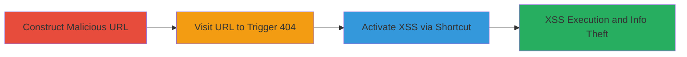

# WAF Bypass via Double-Encoded Non-Standard ASCII Characters Leading to Reflected XSS on Starbucks 404 Pages

Multi-stage attack chain demonstrating a complete attack workflow exploiting a WAF misconfiguration to enable reflected XSS on critical Starbucks domains.

## Chain Metrics Dashboard

| Metric | Value |
|--------|-------|
| Chain Status | Unverified |
| Total Steps | 2 |
| Execution Time | ~1 minute |
| Skill Level | Intermediate |
| Complexity | Medium |
| Impact Level | High |

## Attack Flow Visualization

## Prerequisites & Requirements

### Required Tools

- [[tools/Firefox]]

### Target Environment

- Web platform
- Starbucks domains (e.g., www.starbucks.com.br)
- Access to a browser supporting accesskeys (Firefox 69.0.3 or similar)

### Initial Access Requirements

- No credentials required
- Direct network access to Starbucks websites
- No prior access needed; targets public-facing web applications

## Detailed Attack Procedures

### Step 1: Construct and Visit Malicious URL
procedure: [[procedures/Bypass-WAF-with-Double-Encoded-Non-Standard-ASCII-in-URL]]

**Objective**: Bypass the WAF by inserting non-standard ASCII hex values (%80-%FF) between double-encoded quotes and spaces in the URL, triggering a 404 page that reflects the XSS payload without filtering.

**Instructions**: Open Firefox and navigate to the crafted URL: https://www.starbucks.com.br/testing%2522%80%2520accesskey='x'%2520onclick='confirm%601%60. The %2522 represents double-encoded double quotes, %80 is the bypassing non-standard ASCII character, and the payload embeds an accesskey and onclick event for later execution.

**Expected Output**: The browser loads a 404 error page that reflects the unfiltered payload, setting up the accesskey='x' and onclick='confirm(1)' without triggering WAF blocks.

**Success Indicators**:
- 404 page loads without WAF rejection
- Page source shows reflected payload including accesskey and onclick attributes

### Step 2: Trigger XSS Payload Execution
procedure: [[procedures/Trigger-XSS-Payload-via-Accesskey-Shortcut]]

**Objective**: Activate the injected JavaScript by using the browser's accesskey shortcut, executing the confirm dialog and demonstrating arbitrary JS execution for potential info theft or unauthorized actions.

**Instructions**: With the 404 page loaded, press the accesskey shortcut: CONTROL+ALT+X on Mac or ALT+SHIFT+X on Windows. This triggers the onclick event, running the JavaScript payload.

**Expected Output**: A browser confirm dialog appears with the message from confirm(1), confirming JS execution in the victim's context.

**Success Indicators**:
- Confirm dialog pops up
- JavaScript executes without errors, allowing further payloads for data exfiltration

## Attack Chain Summary

### Key Achievements

1. Evaded WAF protections from prior fix (report 629745) using non-standard ASCII (%80-%FF).
2. Achieved reflected XSS on multiple Starbucks domains' 404 pages.
3. Enabled JavaScript execution for information theft and unauthorized victim actions.

## Technique & Tactic Coverage

### MITRE ATT&CK Techniques

- [[Exploit Public-Facing Application]]
- [[JavaScript]]

### MITRE ATT&CK Tactics

- [[Initial Access]]
- [[Execution]]
- [[Collection]]

---

*Last updated: 2023-10-01T00:00:00Z*
