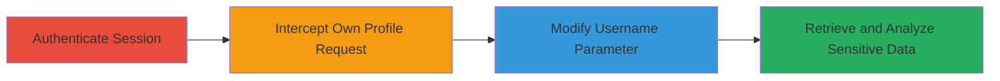

---
tags:
  - broken-access-control
  - idor
  - api
  - information-disclosure
  - email-metadata
  - account-enumeration
type: attack_chain
tools:
  - '[[tools/Burp-Suite]]'
tactics:
  - '[[Discovery]]'
  - '[[Collection]]'
verified: false
platforms:
  - Web
submitted: true
complexity: medium
created_at: '2023-10-01T00:00:00Z'
procedures:
  - '[[procedures/Exploit-WakaTime-API-Broken-Access-Control]]'
step_count: 4
techniques:
  - '[[Account Discovery]]'
  - '[[T1213.003]]'
updated_at: '2025-12-14T17:32:39.071Z'
description: >-
  Multi-stage attack exploiting broken access control in WakaTime API to
  retrieve sensitive user metadata like email confirmation status and privacy
  preferences using an authenticated session.
skill_level: intermediate
impact_level: high
id: 68d9a055-b2eb-4126-a226-bb2f2d1be61b
validated: true
mitre_tactics:
  - '[[Discovery]]'
  - '[[Collection]]'
mitre_techniques:
  - '[[Account Discovery]]'
  - '[[T1213.003]]'
---
# WakaTime API Broken Access Control Exposing User Email Verification and Privacy Settings

Multi-stage attack chain demonstrating exploitation of broken access control in the WakaTime API endpoint /api/v1/users/{username}, allowing authenticated users to access sensitive metadata of arbitrary users, including email verification status and privacy settings. This leads to account enumeration, privacy violations, and enables targeted attacks like phishing or credential stuffing.

## Chain Metrics Dashboard

| Metric | Value |
|--------|-------|
| Chain Status | Unverified |
| Total Steps | 4 |
| Execution Time | ~5 minutes |
| Skill Level | Intermediate |
| Complexity | Medium |
| Impact Level | High |

## Attack Flow Visualization



## Prerequisites & Requirements

### Required Tools

- [[tools/Burp-Suite]]

### Target Environment

- Web platform with WakaTime application
- Access to REST API over HTTP/2
- No specific ports required beyond standard HTTPS (443)

### Initial Access Requirements

- Valid WakaTime user credentials for authentication
- Network access to wakatime.com
- Proxy tool configured for traffic interception

## Detailed Attack Procedures

### Step 1: Authenticate as a Valid User
procedure: [[procedures/Exploit-WakaTime-API-Broken-Access-Control]]

**Objective**: Obtain a valid session cookie to interact with the API.

**Instructions**: Log in to the WakaTime web application using valid credentials to establish an authenticated session. This generates a session cookie necessary for API requests.

**Expected Output**: Successful login with session cookie in browser or proxy.

**Success Indicators**:
- Session cookie captured (e.g., in proxy history)
- Access to user dashboard confirmed

### Step 2: Intercept Request to Own Profile
procedure: [[procedures/Exploit-WakaTime-API-Broken-Access-Control]]

**Objective**: Capture the structure of a legitimate profile request to understand the endpoint.

**Instructions**: Navigate to your own profile in the WakaTime application while proxying traffic. Use [[commands/curl-request-own-profile]] equivalent via proxy to simulate:

```bash
curl -X GET "https://wakatime.com/api/v1/users/attacker_user" -H "Host: wakatime.com" -H "Cookie: session_cookie_here"
```

**Expected Output**: JSON response with own profile data, including fields like is_email_confirmed.

**Success Indicators**:
- Request intercepted and visible in proxy
- Response received without errors

### Step 3: Modify Username to Target Another User
procedure: [[procedures/Exploit-WakaTime-API-Broken-Access-Control]]

**Objective**: Bypass access controls by altering the username parameter to access unauthorized data.

**Instructions**: In the proxy, modify the intercepted request's path parameter from your username to any target username. Replay using [[commands/curl-request-arbitrary-profile]]:

```bash
curl -X GET "https://wakatime.com/api/v1/users/target_username" -H "Host: wakatime.com" -H "Cookie: session_cookie_here"
```

**Expected Output**: JSON response with target user's metadata.

**Success Indicators**:
- Modified request succeeds (200 OK)
- No authorization error returned

### Step 4: Analyze Response for Sensitive Data
procedure: [[procedures/Exploit-WakaTime-API-Broken-Access-Control]]

**Objective**: Extract and review leaked sensitive information for further exploitation.

**Instructions**: Examine the JSON response from the modified request using tools like jq or manual inspection. Sample via [[commands/analyze-api-response]]:

```bash
curl -s "https://wakatime.com/api/v1/users/target_username" -H "Cookie: session_cookie_here" | jq '.is_email_confirmed, .is_email_public, .public_email'
```

**Expected Output**: Fields like {"is_email_confirmed": true, "is_email_public": false, "public_email": null}.

**Success Indicators**:
- Sensitive fields (e.g., email status) visible in response
- Confirmation of information leakage

## Attack Chain Summary

### Key Achievements

1. Successful authentication and session hijacking for API access
2. Bypassing access controls to enumerate arbitrary user profiles
3. Exposure of privacy-sensitive metadata enabling targeted social engineering

## Technique & Tactic Coverage

### MITRE ATT&CK Techniques

- [[Account Discovery]]
- [[T1213.003]]

### MITRE ATT&CK Tactics

- [[Discovery]]
- [[Collection]]

---
*Last updated: 2023-10-01T00:00:00Z*
