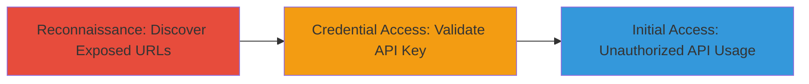

---
tags:
  - api-key-exposure
  - information-disclosure
  - reconnaissance
  - credential-access
type: attack_chain
tools:
  - '[[tools/gau]]'
tactics:
  - '[[Reconnaissance]]'
  - '[[Credential Access]]'
  - '[[Initial Access]]'
verified: false
platforms:
  - Web
submitted: true
complexity: low
created_at: '2024-01-01T00:00:00Z'
procedures:
  - '[[procedures/Discover-Exposed-URLs-with-Gau]]'
  - '[[procedures/Validate-Exposed-API-Key-on-WakaTime]]'
step_count: 2
techniques:
  - '[[Search Engines]]'
  - '[[Credentials In Files]]'
  - '[[Valid Accounts]]'
updated_at: '2025-12-14T17:32:39.423Z'
description: >-
  Attack chain demonstrating the discovery and validation of an exposed user API
  key in publicly archived URLs, leading to potential unauthorized access to
  WakaTime user data.
skill_level: intermediate
impact_level: medium
id: f3754f25-8ea5-4c23-8542-db570c50080d
validated: true
mitre_tactics:
  - '[[Reconnaissance]]'
  - '[[Credential Access]]'
  - '[[Initial Access]]'
mitre_techniques:
  - '[[Search Engines]]'
  - '[[Credentials In Files]]'
  - '[[Valid Accounts]]'
---
# WakaTime API Key Exposure via Public URL Archives

Multi-stage attack chain demonstrating the discovery of an exposed user API key in historical URLs archived in public sources like the Wayback Machine and AlienVault, followed by validation to confirm unauthorized access potential.

## Chain Metrics Dashboard

| Metric | Value |
|--------|-------|
| Chain Status | Unverified |
| Total Steps | 2 |
| Execution Time | ~5 minutes |
| Skill Level | Intermediate |
| Complexity | Low |
| Impact Level | Medium |

## Attack Flow Visualization



## Prerequisites & Requirements

### Required Tools

- [[tools/gau]]
- curl (standard HTTP client)

### Target Environment

- Web platform
- Access to WakaTime domain (wakatime.com)
- Internet connectivity for querying public archives

### Initial Access Requirements

- No prior credentials needed
- Public internet access
- Basic command-line proficiency

## Detailed Attack Procedures

### Step 1: Discover Exposed URLs
procedure: [[procedures/Discover-Exposed-URLs-with-Gau]]

**Objective**: Retrieve historical URLs from public archives to identify exposed sensitive information like API keys.

**Instructions**: Use [[commands/gau-fetch-historical-urls]] to enumerate URLs associated with the target domain:

```bash
gau wakatime.com > historical_urls.txt
```

Review the output file for URLs containing potential secrets, such as API keys in query parameters.

**Expected Output**: A list of URLs, including one with the exposed key: https://wakatime.com/api/v1/users/current/summaries?start=today&end=today&api_key=waka_edf47c40-cabf-46e7-9f88-f1b44f00431f

**Success Indicators**:
- URLs retrieved from archives
- Identification of a URL with an API key in the query string

### Step 2: Validate Exposed API Key
procedure: [[procedures/Validate-Exposed-API-Key-on-WakaTime]]

**Objective**: Test the discovered API key to confirm it grants unauthorized access to protected endpoints.

**Instructions**: Use [[commands/curl-test-wakatime-api-key]] to query the WakaTime API endpoint with the exposed key:

```bash
curl "https://wakatime.com/api/v1/users/current/summaries?start=today&end=today&api_key=waka_edf47c40-cabf-46e7-9f88-f1b44f00431f"
```

Compare with a request without the key, which should return 401 Unauthorized.

**Expected Output**: Successful JSON response with user summary data instead of 401 error.

**Success Indicators**:
- API request authenticates successfully
- Access to user-specific data without proper authorization

## Attack Chain Summary

### Key Achievements

1. Discovered an exposed API key in public archives using passive reconnaissance.
2. Validated the key's functionality, confirming potential for data disclosure or unauthorized actions.
3. Demonstrated information disclosure vulnerability leading to credential access.

## Technique & Tactic Coverage

### MITRE ATT&CK Techniques

- [[Search Engines]] Search Open Websites/Domains
- [[Credentials In Files]] Credentials In Files
- [[Valid Accounts]] Valid Accounts

### MITRE ATT&CK Tactics

- [[Reconnaissance]] Reconnaissance
- [[Credential Access]] Credential Access
- [[Initial Access]] Initial Access

---
*Last updated: 2024-01-01T00:00:00Z*
