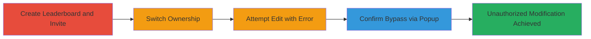

---
tags:
  - access-control-bypass
  - waktime
  - leaderboard
  - privilege-escalation
  - web-vulnerability
type: attack_chain
tools: []
tactics:
  - '[[Privilege Escalation]]'
verified: false
platforms:
  - Web
submitted: true
complexity: medium
created_at: '2023-10-01T00:00:00Z'
procedures:
  - '[[procedures/Create-WakaTime-Private-Leaderboard-and-Invite-Member]]'
  - '[[procedures/Transfer-Ownership-in-WakaTime-Leaderboard]]'
  - '[[procedures/Bypass-Access-Control-to-Edit-WakaTime-Leaderboard-Owner-Name]]'
step_count: 5
techniques:
  - '[[Valid Accounts]]'
updated_at: '2025-12-14T17:28:59.286Z'
description: >-
  A multi-step attack exploiting improper access controls in WakaTime's private
  leaderboard feature, allowing a demoted member to bypass restrictions and
  modify the new owner's name, leading to unauthorized data manipulation.
skill_level: intermediate
impact_level: medium
id: f47dbecd-13c5-4bea-9557-82a187b9a638
validated: true
mitre_tactics:
  - '[[Privilege Escalation]]'
mitre_techniques:
  - '[[Valid Accounts]]'
---
# WakaTime Private Leaderboard Access Control Bypass for Unauthorized Owner Name Modification

Multi-stage attack chain demonstrating an access control bypass in WakaTime's private leaderboard feature, where a member can unauthorizedly modify the owner's name after role switching, despite initial forbidden errors.

## Chain Metrics Dashboard

| Metric | Value |
|--------|-------|
| Chain Status | Unverified |
| Total Steps | 5 |
| Execution Time | ~10 minutes |
| Skill Level | Intermediate |
| Complexity | Medium |
| Impact Level | Medium |

## Attack Flow Visualization

## Prerequisites & Requirements

### Required Tools

- Web browser (e.g., Chrome)
- Two WakaTime accounts (owner and member, can be same user different emails)

### Target Environment

- WakaTime web application
- Private leaderboard feature
- No specific ports or services beyond standard HTTPS access

### Initial Access Requirements

- Valid WakaTime credentials for two accounts
- Network access to waketime.com
- No prior elevated access needed

## Detailed Attack Procedures

### Step 1: Create Private Leaderboard
procedure: [[procedures/Create-WakaTime-Private-Leaderboard-and-Invite-Member]]

**Objective**: Set up a private leaderboard using the owner account to establish the test environment.

**Instructions**: Log in to WakaTime with account A (owner). Navigate to the leaderboard creation feature, select 'Private' visibility, and name it 'test1'. Submit to create the leaderboard.

**Expected Output**: Confirmation of leaderboard creation, accessible only to invited members.

**Success Indicators**:
- Leaderboard 'test1' appears in the owner's dashboard
- Privacy settings confirm private access

### Step 2: Invite Member Account
procedure: [[procedures/Create-WakaTime-Private-Leaderboard-and-Invite-Member]]

**Objective**: Add a second account as a member to the private leaderboard for role testing.

**Instructions**: From account A, go to the 'test1' leaderboard settings, use the invite feature to send an email invitation to account B (same user, different email). Log in to account B and accept the invitation to join as a member.

**Expected Output**: Account B listed as a member in the leaderboard.

**Success Indicators**:
- Invitation email received and accepted
- Account B can view the private leaderboard

### Step 3: Switch Ownership Roles
procedure: [[procedures/Transfer-Ownership-in-WakaTime-Leaderboard]]

**Objective**: Demote the original owner and promote the member to owner, setting up the bypass scenario.

**Instructions**: From account A (current owner), navigate to the members section in 'test1' leaderboard settings. Edit roles: assign owner to account B and member to account A. Save changes.

**Expected Output**: Updated member list showing account B as owner and account A as member.

**Success Indicators**:
- Role changes reflected in the UI for both accounts
- Account A now has member privileges only

### Step 4: Attempt Unauthorized Edit
procedure: [[procedures/Bypass-Access-Control-to-Edit-WakaTime-Leaderboard-Owner-Name]]

**Objective**: Test access controls by attempting to edit the new owner's name from the member account, expecting a denial.

**Instructions**: Log in as account A (now member). Go to the 'test1' members section, click edit on account B's (owner) name, enter 'testing', and submit.

**Expected Output**: Forbidden error message displayed.

**Success Indicators**:
- Error popup or message: 'Forbidden' or access denied
- No immediate change visible

### Step 5: Confirm Bypass
procedure: [[procedures/Bypass-Access-Control-to-Edit-WakaTime-Leaderboard-Owner-Name]]

**Objective**: Re-attempt the edit to reveal the bypass, where the change persists despite the error.

**Instructions**: From account A, click the edit button again on account B's name. Observe the popup pre-filled with 'Enter new name for testing'.

**Expected Output**: Popup shows the previously entered name 'testing', indicating the change was applied backend despite the frontend error.

**Success Indicators**:
- Popup reflects the unauthorized change
- Owner name modified to 'testing' visible to members

## Attack Chain Summary

### Key Achievements

1. Successful creation and setup of private leaderboard with dual accounts
2. Role transfer to simulate privilege change
3. Bypassed access controls to modify owner details unauthorizedly

## Technique & Tactic Coverage

### MITRE ATT&CK Techniques

- [[Valid Accounts]]

### MITRE ATT&CK Tactics

- [[Privilege Escalation]]

---
*Last updated: 2023-10-01T00:00:00Z*
