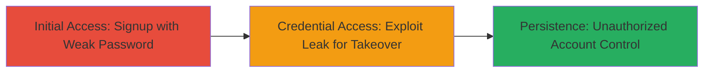

# Weak Password Policy Exploitation Leading to Account Takeover in Signup Process

Multi-stage attack chain demonstrating exploitation of weak password policies during signup to enable account takeovers via leaked or guessable credentials.

## Chain Metrics Dashboard

| Metric | Value |
|--------|-------|
| Chain Status | Unverified |
| Total Steps | 2 |
| Execution Time | ~5 minutes |
| Skill Level | Beginner |
| Complexity | Low |
| Impact Level | High |

## Attack Flow Visualization

## Prerequisites & Requirements

### Required Tools

- Web browser (e.g., Chrome or Firefox)

### Target Environment

- Web platform with signup functionality
- No specific ports or services required beyond standard HTTPS (port 443)
- Internet access to the target signup endpoint

### Initial Access Requirements

- No prior credentials needed
- Public access to the signup page
- Ability to register new accounts

## Detailed Attack Procedures

### Step 1: Create Account with Weak Password
procedure: [[procedures/Create-Account-with-Weak-Password]]

**Objective**: Register a new account using a deliberately weak password to demonstrate the lack of enforcement for strong password requirements.

**Instructions**: Navigate to the target's signup page and attempt to create an account with a simple, guessable password such as "password123". Verify that the platform accepts it without validation errors.

**Expected Output**: Successful account creation confirmation, with the weak password stored in the system.

**Success Indicators**:
- Account registered without password strength warnings or rejections
- Login successful using the weak password

### Step 2: Exploit Password Leak for Account Takeover
procedure: [[procedures/Exploit-Password-Leak-for-Takeover]]

**Objective**: Leverage the weak password to simulate or demonstrate a leak scenario, enabling unauthorized access to other accounts with similar weak credentials.

**Instructions**: Once a weak password is accepted, monitor for potential leaks (e.g., via shared databases or exposed logs). Attempt to guess or brute-force other accounts using common weak passwords like "password123" on the login endpoint.

**Expected Output**: Successful login to a target account using the guessed weak password, confirming takeover.

**Success Indicators**:
- Unauthorized access to account dashboard or features
- No rate-limiting or lockout on failed login attempts with weak passwords

## Attack Chain Summary

### Key Achievements

1. Successful creation of account with weak, guessable password due to absent policy enforcement.
2. Demonstration of password leak risk, leading to potential account takeover.
3. Highlighted impact on user account security across the platform.

## Technique & Tactic Coverage

### MITRE ATT&CK Techniques

- [[Valid Accounts]] Valid Accounts
- [[Brute Force]] Brute Force

### MITRE ATT&CK Tactics

- [[Initial Access]] Initial Access

---
*Last updated: 2023-10-01T12:00:00Z*
