# 🎯 Web app exploit ImageMagick + Shellshock w/ reverse shell & docker priv esc

> **Enhanced Attack Chain Dashboard** — Privilege Escalation Chain

---

## 📊 Chain Metrics Dashboard

| Metric | Value |
|--------|-------|
| **Chain Status** | ⚠️ **UNVERIFIED** |
| **Total Steps** | `8` |
| **Execution Time** | ~2-4 hours |
| **Skill Level** | 🟡 Intermediate-Advanced |
| **Complexity** | High |
| **Impact Level** | 🔴 **CRITICAL** |

---

## 🎭 Attack Flow Visualization

```mermaid
graph TD
    A[🌐 Reconnaissance]
    B[🎯 Initial Access]
    C[🔓 Exploitation]
    D[📊 Enumeration]
    E[⚙️ Privilege Escalation]
    F[👑 Objective Complete]
    A --> B
    B --> C
    C --> D
    D --> E
    E --> F
    
    style A fill:#4a90e2,stroke:#2e5c8a,stroke-width:3px,color:#fff
    style C fill:#e25555,stroke:#8a2e2e,stroke-width:3px,color:#fff
    style D fill:#9b59b6,stroke:#6c3483,stroke-width:3px,color:#fff
    style F fill:#27ae60,stroke:#1e8449,stroke-width:3px,color:#fff
```



---

## 🛠️ Prerequisites & Requirements

### Required Tools
```bash path=null start=null
# Tools will be listed here based on procedures
```

### Target Environment
- ✅ Linux target system
- ✅ Web application target
- ✅ Network connectivity to target

### Initial Access Requirements
- 🔓 Requirements based on first step of chain
- 🔓 See detailed procedures below

---

## 🔬 Detailed Attack Procedures

### **[Step 1]** Basic Port Scan with Service Enumeration

**Progress:** `█░░░░░░░░░` 12% | **Risk:** 🟢 Low

**Procedure:** [[Basic Port Scan with Service Enumeration]]

> 📝 **Objective:** Perform an Nmap port scan on a target and enumerate banners of ports 1-1024, as well as popular services (a full list can be found in /usr/share/nmap/nmap-services).

**Expected Output:**
- Refer to procedure documentation for details

**Success Indicators:** ✅ Objective achieved

---

### **[Step 2]** Enumerate and Analyze an SSL/TLS Certificate

**Progress:** `██░░░░░░░░` 25% | **Risk:** 🟢 Low

**Procedure:** [[Enumerate and Analyze an SSL/TLS Certificate]]

> 📝 **Objective:** Organizations include information in their SSL certificates which can disclose details and aid attackers in the enumeration and development of attack vectors. SSL certificates will often list alternate DNS names (suggesting virtual hosts are configured on the target), registration dates, validity,

**Expected Output:**
- Refer to procedure documentation for details

**Success Indicators:** ✅ Objective achieved

---

### **[Step 3]** Directory Brute Force a Web App (GoBuster)

**Progress:** `███░░░░░░░` 37% | **Risk:** 🔴 High

**Procedure:** [[Directory Brute Force a Web App (GoBuster)]]

> 📝 **Objective:** Enumerate a website's files and folders by performing a dictionary brute force on possible file and folder names.

**Expected Output:**
- Refer to procedure documentation for details

**Success Indicators:** ✅ Objective achieved

---

### **[Step 4]** Directory Brute Force a Web App with Extensions (GoBuster)

**Progress:** `█████░░░░░` 50% | **Risk:** 🔴 High

**Procedure:** [[Directory Brute Force a Web App with Extensions (GoBuster)]]

> 📝 **Objective:** Perform a directory brute force while specifying extensions. Choose file extensions to brute force based on initial recon of  files on the webserver (.php, .asp, .js, etc), directories (cgi-bin suggests .sh scripts), underlying technology disclosed in headers (Python, PHP, Ruby), etc. For example,

**Expected Output:**
- Refer to procedure documentation for details

**Success Indicators:** ✅ Objective achieved

---

### **[Step 5]** Exploit ImageMagick (ImageTragick) for Code Execution

**Progress:** `██████░░░░` 62% | **Risk:** 🔴 High

**Procedure:** [[Exploit ImageMagick (ImageTragick) for Code Execution]]

> 📝 **Objective:** ImageTragick is a code execution vulnerability found in ImageMagick tools before 6.9.3-10, and version 7.x prior to 7.0.1-1. As many web applications use ImageMagick for displaying and converting files,  uploading an image file containing a crafted payload may allow attackers to  execute arbitrary

**Expected Output:**
- Refer to procedure documentation for details

**Success Indicators:** ✅ Objective achieved

---

### **[Step 6]** Find Linux Files with Elevated Privileges

**Progress:** `███████░░░` 75% | **Risk:** 🟡 Medium

**Procedure:** [[Find Linux Files with Elevated Privileges]]

> 📝 **Objective:** Linux and *nix systems include features which allow certain programs to run with elevated privileges. This is a requirement for many system services, but occasionally these programs may allow attackers to execute arbitrary commands. Setuid - Programs with this permission set can run commands as the

**Expected Output:**
- Refer to procedure documentation for details

**Success Indicators:** ✅ Objective achieved

---

### **[Step 7]** Exploit Shellshock on a Vulnerable Web App

**Progress:** `████████░░` 87% | **Risk:** 🔴 High

**Procedure:** [[Exploit Shellshock on a Vulnerable Web App]]

> 📝 **Objective:** Shellshock is a family of security bugs in the Bash shell (pre 43-027), which allows attackers to remotely execute arbitrary commands on a vulnerable system. Web servers can be exploited by identifying a vulnerable script in the /cgi-bin directory, then using fields in the header to specify command

**Expected Output:**
- Refer to procedure documentation for details

**Success Indicators:** ✅ Objective achieved

---

### **[Step 8]** Docker Privilege Escalation Using Docker Group

**Progress:** `██████████` 100% | **Risk:** 🟡 Medium

**Procedure:** [[Docker Privilege Escalation Using Docker Group]]

> 📝 **Objective:** Docker host systems with users who are part of the "docker" group are able to escalate privileges to root by mounting the root file system within a container, bypassing permissions on the host system. This is considered a misconfiguration, as non-admin users should never be added to this group.

**Expected Output:**
- Refer to procedure documentation for details

**Success Indicators:** ✅ Objective achieved

---

## 🎯 Attack Chain Summary

### Key Achievements
- ✅ Find Linux Files with Elevated Privileges
- ✅ Exploit Shellshock on a Vulnerable Web App
- ✅ Basic Port Scan with Service Enumeration
- ✅ Enumerate and Analyze an SSL/TLS Certificate
- ✅ Docker Privilege Escalation Using Docker Group
- ... and 3 more procedures

---

## 📈 Technique & Tactic Coverage

---

**Last Updated:** 2023-05-29T16:48:53.162677+00:00 | **Chain Version:** 2.0 Enhanced | **Status:** ⚠️ Draft
