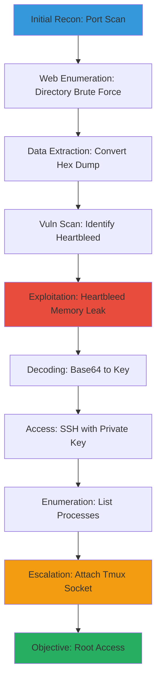

# Web-Application-Enumeration-and-Heartbleed-Exploit-to-Root-Access

Multi-stage attack chain demonstrating reconnaissance, vulnerability exploitation via Heartbleed, credential extraction, SSH access, and privilege escalation through tmux misconfiguration on a Linux web server in a CTF environment.

## Chain Metrics Dashboard

| Metric | Value |
|--------|-------|
| Chain Status | Unverified |
| Total Steps | 9 |
| Execution Time | ~2-4 hours |
| Skill Level | Intermediate-Advanced |
| Complexity | High |
| Impact Level | Critical |

## Attack Flow Visualization



## Prerequisites & Requirements

### Required Tools

- [[tools/Nmap]]
- [[tools/Wfuzz]]
- [[tools/Python]] (for Heartbleed PoC)
- [[tools/openssl]]
- [[tools/tmux]]

### Target Environment

- Linux target system with vulnerable OpenSSL (1.0.1 to 1.0.1g)
- Web application on HTTPS (port 443)
- SSH service enabled
- Network connectivity to target

### Initial Access Requirements

- No authentication required
- Attacker machine with Kali Linux or equivalent
- Wordlist for brute force (e.g., common.txt)

## Detailed Attack Procedures

### Step 1: Basic Port Scan with Service Enumeration
procedure: [[procedures/basic-port-scan-with-service-enumeration]]

**Objective**: Identify open ports and services on the target to map the attack surface, focusing on web-related ports.

**Instructions**: Run a service enumeration scan on the target IP to detect common ports like 80, 443, and 22.

Use [[commands/nmap-port-scan-with-banner-enumeration]]:

```bash
nmap -sV $_TARGET_IP
```

Analyze the output for web services on port 443.

**Expected Output**: List of open ports with service versions, e.g., 443/tcp open https OpenSSL.

**Success Indicators**:
- HTTPS service detected on port 443
- No firewalls blocking basic scans

### Step 2: Directory Brute Force Web App with Wfuzz
procedure: [[procedures/directory-brute-force-web-app-with-wfuzz]]

**Objective**: Discover hidden directories and files on the web application to identify potential entry points or sensitive data.

**Instructions**: Target the web root and brute force common directories using a wordlist.

Use [[commands/wfuzz-directory-brute-force]]:

```bash
wfuzz --hc 404 -c -w $_WORDLIST -u http://$_TARGET_IP/FUZZ
```

Filter for 200/301 responses to find accessible paths.

**Expected Output**: Table of responses showing directories like /admin or /backup with status codes.

**Success Indicators**:
- Discovery of non-standard directories
- Identification of web app structure

### Step 3: Convert Hex Dump to Binary
procedure: [[procedures/convert-hex-dump-to-binary]]

**Objective**: Transform leaked hex-encoded data from memory dump into usable binary format, such as a private key file.

**Instructions**: Save the hex dump to a file and convert it using xxd.

First, create input file with hex data, then use [[commands/xxd-convert-hex-dump-to-binary]]:

```bash
xxd -ps -r $_INPUT > $_OUTPUT
```

Verify the binary file integrity.

**Expected Output**: Binary file (e.g., id_rsa) ready for use.

**Success Indicators**:
- Successful conversion without errors
- Valid SSH key format in output

### Step 4: Port Scan with Vulnerability Enumeration
procedure: [[procedures/port-scan-with-vulnerability-enumeration]]

**Objective**: Scan for known vulnerabilities, specifically targeting Heartbleed on the HTTPS service.

**Instructions**: Run Nmap with vuln scripts focused on port 443.

Use [[commands/nmap-port-scan-with-vuln-scripts]]:

```bash
nmap -script vuln -p 443 $_TARGET_IP
```

Review output for Heartbleed indicators.

**Expected Output**: Vulnerability details, e.g., ssl-heartbleed: VULNERABLE.

**Success Indicators**:
- Heartbleed confirmed as vulnerable
- CVE-2014-0160 listed

### Step 5: Exploit Heartbleed Vulnerability
procedure: [[procedures/exploit-heartbleed-vulnerability]]

**Objective**: Exploit the Heartbleed bug to read server memory and extract sensitive data like private keys.

**Instructions**: Download the PoC script and run it against the target to dump memory.

Use [[commands/exploit-heartbleed-to-read-protected-memory]]:

```bash
python2 heartbleed-poc.py $_TARGET_IP -n 5 -f $_OUTPUT.txt
```

Search the dump for SSH keys or credentials.

**Expected Output**: Hex memory dump containing readable data like private keys.

**Success Indicators**:
- Memory leak successful (large response)
- Sensitive data (e.g., RSA key) extracted

### Step 6: Decode Base64 Encoded String
procedure: [[commands/decode-base64-encoded-string]]

**Objective**: Decode any Base64-encoded portions of the leaked data to reveal plaintext credentials or keys.

**Instructions**: Pipe the Base64 string to the decode command.

Use [[commands/decode-base64-encoded-string]]:

```bash
base64 -d <<< $_STRING
```

Save the output for further use.

**Expected Output**: Plaintext string, e.g., decoded private key content.

**Success Indicators**:
- Valid decoding without errors
- Readable key or password

### Step 7: Connect to SSH Server with Private Key
procedure: [[procedures/connect-to-ssh-server-with-private-key]]

**Objective**: Use the extracted private key to authenticate and gain shell access via SSH.

**Instructions**: Specify the key file and username (often root or a service account) to connect.

Use [[commands/ssh-connect-with-private-key]]:

```bash
ssh -i $_PRIVATE_KEY -l $_USER $_TARGET_IP
```

Accept host key if prompted.

**Expected Output**: Successful login prompt or shell.

**Success Indicators**:
- Authentication succeeds
- Remote shell obtained

### Step 8: List Running Processes
procedure: [[procedures/list-running-processes]]

**Objective**: Enumerate running processes to identify tmux sessions or other escalation vectors.

**Instructions**: Run ps to list all processes and grep for tmux.

Use [[commands/ps-list-all-running-processes]]:

```bash
ps aux | grep tmux
```

Note socket paths.

**Expected Output**: Process list showing tmux with socket details.

**Success Indicators**:
- Tmux processes identified
- Socket paths readable

### Step 9: Attach to Existing Tmux Server Socket by Path
procedure: [[procedures/attach-to-existing-tmux-server-socket-by-path]]

**Objective**: Exploit misconfigured tmux socket permissions to attach and gain elevated session access, achieving root privileges.

**Instructions**: Use the socket path from processes to attach.

Use [[commands/tmux-attach-to-socket]]:

```bash
tmux -S $_SOCKET_PATH attach
```

Execute commands in the attached session.

**Expected Output**: Attached to root tmux session with elevated prompt.

**Success Indicators**:
- Privilege escalation to root
- Full control of target

## Attack Chain Summary

### Key Achievements

1. Identified vulnerable web service via enumeration
2. Exploited Heartbleed to leak private key
3. Gained SSH access using leaked credentials
4. Escalated to root via tmux socket abuse

---

*Last updated: 2023-05-29T16:48:53.162677+00:00*
