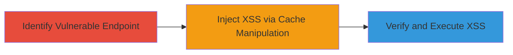

---
tags:
  - web-cache-deception
  - xss
  - reflected-xss
  - web
type: attack_chain
tools:
  - '[[tools/Curl]]'
tactics:
  - '[[Initial Access]]'
  - '[[Execution]]'
commands:
  - '[[commands/curl-cache-test]]'
  - '[[commands/curl-xss-inject]]'
platforms:
  - Web
complexity: medium
procedures:
  - '[[procedures/Identify-Vulnerable-Endpoint-for-Cache-Deception]]'
  - '[[procedures/Inject-XSS-Payload-via-Cache-Manipulation]]'
  - '[[procedures/Verify-and-Execute-Reflected-XSS]]'
step_count: 3
techniques:
  - '[[Exploit Public-Facing Application]]'
  - '[[JavaScript]]'
description: >-
  Exploitation of web cache deception vulnerability to enable reflected XSS
  attacks on a web platform
skill_level: intermediate
impact_level: high
id: 6f91d600-a46a-4424-a95a-fa6b5dc376f4
created_at: '2025-12-13T09:00:34.273Z'
updated_at: '2025-12-13T09:00:34.273Z'
verified: false
validated: true
submitted: true
mitre_tactics:
  - '[[Initial Access]]'
  - '[[Execution]]'
mitre_techniques:
  - '[[Exploit Public-Facing Application]]'
  - '[[JavaScript]]'
---
# Web Cache Deception Leading to Reflected XSS

## Overview

This attack chain demonstrates the exploitation of a web cache deception vulnerability on Algolia's platform, leading to reflected cross-site scripting (XSS). The vulnerability allows an attacker to manipulate caching behavior to inject and cache malicious scripts, potentially enabling session hijacking, data theft, or other client-side exploits. The attack was identified through testing by manipulating URLs to deceive the cache into storing dynamic content as static, injecting XSS payloads, and verifying execution.

## Attack Flow Visualization



## Prerequisites & Requirements

### Required Tools
- [[tools/Curl]]

### Target Environment
- Web platform with caching mechanisms (e.g., Algolia)
- Open ports: 80/443 (HTTP/HTTPS)
- Network access to the target web application

### Initial Access Requirements
- No credentials required
- Public access to the web application
- Ability to send HTTP requests to the target

## Detailed Attack Procedures

### Step 1: Identify Vulnerable Endpoint
procedure: [[procedures/Identify-Vulnerable-Endpoint-for-Cache-Deception]]

**Objective**: Locate an endpoint susceptible to web cache deception by testing caching behavior on dynamic pages.

**Instructions**: Use [[commands/curl-cache-test]] to send requests with manipulated URLs, appending fake static extensions like '/fake.css' to dynamic paths:

```bash
curl -I "https://target.algolia.com/dynamic-page/fake.css"
```

Check response headers for caching indicators (e.g., Cache-Control, Age). Repeat with variations to confirm if the server caches the response improperly.

**Expected Output**: HTTP headers showing the response is cached (e.g., 'Age: 123' indicating cache hit).

**Success Indicators**:
- Response is cached with dynamic content treated as static
- No anti-cache mechanisms prevent storage

### Step 2: Inject XSS Payload via Cache Manipulation
procedure: [[procedures/Inject-XSS-Payload-via-Cache-Manipulation]]

**Objective**: Manipulate the cache to store a page containing a reflected XSS payload.

**Instructions**: Craft a URL that includes the XSS payload in a parameter and appends a fake extension to deceive the cache, using [[commands/curl-xss-inject]]:

```bash
curl "https://target.algolia.com/search?query=<script>alert('XSS')</script>/fake.js"
```

Send the request to force the server to process and cache the malicious response.

**Expected Output**: Server responds with the payload reflected in the cached content.

**Success Indicators**:
- Payload is stored in the cache
- Subsequent requests to the same URL serve the cached malicious page

### Step 3: Verify and Execute Reflected XSS
procedure: [[procedures/Verify-and-Execute-Reflected-XSS]]

**Objective**: Confirm the XSS executes by accessing the cached page and observing script execution.

**Instructions**: Access the cached URL in a browser or use [[commands/curl-cache-test]] to retrieve the cached response:

```bash
curl "https://target.algolia.com/search?query=<script>alert('XSS')</script>/fake.js"
```

In a browser, navigate to the URL to trigger the alert or other script behavior.

**Expected Output**: The XSS payload executes, such as displaying an alert box.

**Success Indicators**:
- Script executes on the client-side
- Potential for session hijacking or data theft demonstrated

## Attack Chain Summary

### Key Achievements
1. Identification of cache deception vulnerability
2. Successful injection and caching of XSS payload
3. Verification of reflected XSS execution

## Technique & Tactic Coverage

### MITRE ATT&CK Techniques
- [[Exploit Public-Facing Application]]
- [[JavaScript]]

### MITRE ATT&CK Tactics
- [[Initial Access]]
- [[Execution]]
