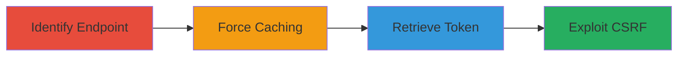

---
tags:
  - web-cache-deception
  - csrf
  - token-theft
  - account-takeover
type: attack_chain
tools:
  - '[[tools/Web-Cache-Deception-Concept]]'
tactics:
  - '[[Initial Access]]'
  - '[[Collection]]'
commands:
  - '[[commands/curl-manipulate-url-for-caching]]'
  - '[[commands/curl-fetch-cached-response]]'
  - '[[commands/curl-forge-csrf-request]]'
platforms:
  - Web
complexity: medium
procedures:
  - '[[procedures/Identify-Dynamic-Endpoint-for-Web-Cache-Deception]]'
  - '[[procedures/Force-Victim-to-Cache-gdToken-via-Deceptive-URL]]'
  - '[[procedures/Retrieve-Cached-gdToken-from-Web-Cache]]'
  - '[[procedures/Exploit-Stolen-gdToken-for-CSRF-Account-Takeover]]'
step_count: 4
techniques:
  - '[[Exploit Public-Facing Application]]'
  - '[[Steal Web Session Cookie]]'
description: >-
  Multi-stage attack exploiting web cache deception to steal CSRF tokens and
  enable account takeover
skill_level: intermediate
impact_level: high
id: ba3a88e1-be78-45ef-986d-05945edd8ddd
created_at: '2025-12-13T09:00:34.611Z'
updated_at: '2025-12-13T09:00:34.611Z'
verified: false
validated: true
submitted: true
mitre_tactics:
  - '[[Initial Access]]'
  - '[[Collection]]'
mitre_techniques:
  - '[[Exploit Public-Facing Application]]'
  - '[[Steal Web Session Cookie]]'
---
# Web Cache Deception for CSRF Token Theft and Account Takeover in Glassdoor

Multi-stage attack chain demonstrating a complete attack workflow exploiting web cache deception in Glassdoor to steal a user's gdToken (CSRF token), enabling forged requests and potential account takeover.

## Chain Metrics Dashboard

| Metric | Value |
|--------|-------|
| Chain Status | Unverified |
| Total Steps | 4 |
| Execution Time | ~10 minutes |
| Skill Level | Intermediate |
| Complexity | Medium |
| Impact Level | High |

## Attack Flow Visualization



## Prerequisites & Requirements

### Required Tools

- [[tools/Web-Cache-Deception-Concept]]

### Target Environment

- Web platform
- Glassdoor web application
- Network access to Glassdoor endpoints

### Initial Access Requirements

- Ability to host an attacker-controlled page
- Victim must be logged into Glassdoor
- No prior credentials needed for attacker

## Detailed Attack Procedures

### Step 1: Identify Dynamic Endpoint
procedure: [[procedures/Identify-Dynamic-Endpoint-for-Web-Cache-Deception]]

**Objective**: Locate a dynamic endpoint that reflects the gdToken and can be tricked into caching by appending a static extension.

**Instructions**: Analyze Glassdoor's dynamic endpoints to find one that includes the gdToken in responses. Manipulate the URL by appending a static file extension like '.css' using [[commands/curl-manipulate-url-for-caching]]:

```bash
curl "https://www.glassdoor.com/dynamic-endpoint.css"
```

Verify if the response can be cached due to path confusion.

**Expected Output**: Identification of a vulnerable endpoint that caches user-specific data.

**Success Indicators**:
- Endpoint reflects gdToken
- URL manipulation triggers caching behavior

### Step 2: Force Victim to Cache gdToken
procedure: [[procedures/Force-Victim-to-Cache-gdToken-via-Deceptive-URL]]

**Objective**: Trick the logged-in victim into loading the deceptive URL to cache their gdToken.

**Instructions**: Host an attacker-controlled page that embeds a request to the deceptive URL, such as via an img tag. When the victim visits, it triggers caching. Simulate this with [[commands/curl-manipulate-url-for-caching]] from the victim's perspective:

```bash
curl "https://www.glassdoor.com/dynamic-endpoint.css" -H "Cookie: victim-session-cookie"
```

**Expected Output**: The victim's response containing gdToken is cached.

**Success Indicators**:
- Victim loads the page
- Cache stores the response

### Step 3: Retrieve Cached gdToken
procedure: [[procedures/Retrieve-Cached-gdToken-from-Web-Cache]]

**Objective**: Fetch the cached response to extract the gdToken.

**Instructions**: Access the cached URL directly using [[commands/curl-fetch-cached-response]]:

```bash
curl "https://www.glassdoor.com/dynamic-endpoint.css"
```

Parse the response for the gdToken value.

**Expected Output**: Cached response containing the victim's gdToken.

**Success Indicators**:
- gdToken extracted successfully
- No authentication required for retrieval

### Step 4: Exploit Stolen gdToken
procedure: [[procedures/Exploit-Stolen-gdToken-for-CSRF-Account-Takeover]]

**Objective**: Use the gdToken to forge CSRF requests and take over the account.

**Instructions**: Craft and send forged requests using the stolen gdToken with [[commands/curl-forge-csrf-request]]:

```bash
curl "https://www.glassdoor.com/account-action" -H "gdToken: stolen-token" -d "malicious-payload"
```

**Expected Output**: Successful execution of account-modifying actions.

**Success Indicators**:
- CSRF protection bypassed
- Account takeover achieved

## Attack Chain Summary

### Key Achievements

1. Identification and exploitation of cacheable dynamic endpoint
2. Theft of victim's CSRF token via deception
3. Execution of unauthorized actions leading to takeover

## Technique & Tactic Coverage

### MITRE ATT&CK Techniques

- [[Exploit Public-Facing Application]]
- [[Steal Web Session Cookie]]

### MITRE ATT&CK Tactics

- [[Initial Access]]
- [[Collection]]

*Last updated: 2023-10-01*
