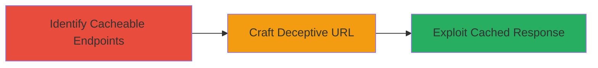

---
tags:
  - web-cache-deception
  - information-leakage
  - tiktok-ads
type: attack_chain
tools: []
tactics:
  - '[[Initial Access]]'
  - '[[Collection]]'
commands:
  - '[[commands/curl-test-cache-behavior]]'
  - '[[commands/curl-access-cached-resource]]'
platforms:
  - Web
complexity: medium
procedures:
  - '[[procedures/Identify-Cacheable-Endpoints-in-TikTok-Ads]]'
  - '[[procedures/Craft-Deceptive-URL-for-Cache-Poisoning]]'
  - '[[procedures/Exploit-Cached-Response-for-Info-Leakage]]'
step_count: 3
techniques:
  - '[[Exploit Public-Facing Application]]'
description: >-
  Exploitation of web cache misconfigurations in TikTok Ads to deceive caching
  mechanisms and leak sensitive information from authenticated users.
skill_level: intermediate
impact_level: high
id: 481188a2-3e90-4557-9a28-31dd63c7a249
created_at: '2025-12-13T09:00:34.016Z'
updated_at: '2025-12-13T09:00:34.016Z'
verified: false
validated: true
submitted: true
mitre_tactics:
  - '[[Initial Access]]'
  - '[[Collection]]'
mitre_techniques:
  - '[[Exploit Public-Facing Application]]'
---
# Web Cache Deception in TikTok Ads Leading to Information Leakage

## Overview

This attack chain demonstrates a theoretical web cache deception vulnerability in TikTok Ads, where misconfigurations in caching mechanisms allow an attacker to trick the system into caching sensitive, authenticated pages as static resources. By crafting a deceptive URL, an attacker can poison the cache when an authenticated user interacts with it, leading to potential leakage of private information. The vulnerability was reported via HackerOne, triaged, resolved by TikTok, and a bounty was awarded. This chain outlines the steps to identify, exploit, and verify the information leakage.

## Attack Flow Visualization



## Prerequisites & Requirements

### Required Tools

- None specifically required; basic web tools like curl or a browser suffice.

### Target Environment

- Platform: Web
- Services: TikTok Ads
- Network access: Public internet access to TikTok Ads endpoints

### Initial Access Requirements

- No prior credentials needed for the attacker, but the victim must be authenticated on TikTok Ads
- Ability to share crafted links with authenticated users

## Detailed Attack Procedures

### Step 1: Identify Cacheable Endpoints
procedure: [[procedures/Identify-Cacheable-Endpoints-in-TikTok-Ads]]

**Objective**: Scan and identify endpoints in TikTok Ads that may be susceptible to caching due to misconfigurations.

**Instructions**: Use [[commands/curl-test-cache-behavior]] to test various TikTok Ads URLs for caching behavior:

```bash
curl -I https://ads.tiktok.com/example-endpoint -H 'User-Agent: Mozilla/5.0'
```

Look for headers like Cache-Control or X-Cache indicating caching. Test authenticated vs. unauthenticated responses.

**Expected Output**: HTTP headers showing cache hits or misses, identifying potentially cacheable dynamic pages.

**Success Indicators**:
- Endpoints confirmed as cacheable
- Differences in authenticated content observed

### Step 2: Craft Deceptive URL for Cache Poisoning
procedure: [[procedures/Craft-Deceptive-URL-for-Cache-Poisoning]]

**Objective**: Create a URL that appends a static-like extension to a dynamic endpoint, tricking the cache into storing sensitive data.

**Instructions**: Modify the identified URL by appending a file extension like .css or .jpg, e.g., https://ads.tiktok.com/sensitive-page.css. Share this link with an authenticated user to trigger caching.

Use [[commands/curl-test-cache-behavior]] to simulate:

```bash
curl https://ads.tiktok.com/sensitive-page.css -H 'Cookie: authenticated-session-cookie'
```

**Expected Output**: The cache stores the response as a static file.

**Success Indicators**:
- URL successfully triggers cache storage
- No immediate errors from the server

### Step 3: Exploit Cached Response for Info Leakage
procedure: [[procedures/Exploit-Cached-Response-for-Info-Leakage]]

**Objective**: Access the poisoned cache to retrieve leaked information from the authenticated session.

**Instructions**: As an unauthenticated attacker, request the cached URL using [[commands/curl-access-cached-resource]]:

```bash
curl https://ads.tiktok.com/sensitive-page.css
```

Inspect the response for sensitive data like user info or session details.

**Expected Output**: Cached response containing leaked authenticated data.

**Success Indicators**:
- Sensitive information retrieved from cache
- Confirmation of data leakage without authentication

## Attack Chain Summary

### Key Achievements

1. Identification of vulnerable caching endpoints in TikTok Ads
2. Successful cache poisoning via deceptive URLs
3. Extraction of sensitive information from cached responses

## Technique & Tactic Coverage

### MITRE ATT&CK Techniques

- [[Exploit Public-Facing Application]]

### MITRE ATT&CK Tactics

- [[Initial Access]]
- [[Collection]]

*Last updated: 2023-10-01*
