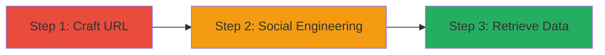

---
tags:
  - web-cache-deception
  - information-leakage
  - social-engineering
type: attack_chain
tools: []
tactics:
  - '[[Initial Access]]'
  - '[[Collection]]'
commands: []
platforms:
  - Web
complexity: medium
procedures:
  - '[[procedures/Craft-Exploit-URL-for-Web-Cache-Deception]]'
  - '[[procedures/Social-Engineer-Victim-to-Access-Crafted-URL]]'
  - '[[procedures/Retrieve-Leaked-Data-from-Cache]]'
step_count: 3
techniques:
  - '[[Exploit Public-Facing Application]]'
  - '[[Phishing]]'
description: >-
  Multi-stage attack chain exploiting Web Cache Deception on algolia.com to leak
  authenticated user data via manipulated URLs and social engineering.
skill_level: intermediate
impact_level: high
id: 620f5e41-e547-4961-bcb0-ac43af19f49d
created_at: '2025-12-13T09:00:34.523Z'
updated_at: '2025-12-13T09:00:34.523Z'
verified: false
validated: true
submitted: true
mitre_tactics:
  - '[[Initial Access]]'
  - '[[Collection]]'
mitre_techniques:
  - '[[Exploit Public-Facing Application]]'
  - '[[Phishing]]'
---
# Web Cache Deception on Algolia.com Leading to Personal Information Leakage

## Overview

This attack chain demonstrates the exploitation of a Web Cache Deception vulnerability on algolia.com. An attacker crafts a URL that mimics a static CSS file appended to a dynamic endpoint serving personal information. By socially engineering an authenticated victim to access this URL, the caching proxy stores the sensitive response. The attacker then retrieves the cached data, leading to leakage of personal and sensitive information.

## Attack Flow Visualization



## Prerequisites & Requirements

### Required Tools

- None (browser-based exploitation)

### Target Environment

- Platform: Web
- Required services: Caching proxy on algolia.com
- Network access: Public internet access to algolia.com

### Initial Access Requirements

- No prior credentials needed for attacker
- Victim must be authenticated on algolia.com
- Ability to socially engineer the victim

## Detailed Attack Procedures

### Step 1: Craft Exploit URL
procedure: [[procedures/Craft-Exploit-URL-for-Web-Cache-Deception]]

**Objective**: Create a manipulated URL that tricks the caching proxy into treating dynamic content as cacheable static resources.

**Instructions**: Identify a dynamic endpoint on algolia.com that serves personal information when authenticated. Append a fake CSS file extension, such as '/user/profile/random.css', to the URL to mimic a static file.

For example:

```bash
# Manual URL crafting (no command needed, but can be tested with curl)
curl 'https://algolia.com/dynamic-endpoint/random.css'
```

**Expected Output**: A URL that appears as a static CSS file but loads dynamic content.

**Success Indicators**:
- URL successfully mimics a static resource
- No immediate errors in URL formation

### Step 2: Social Engineer Victim Access
procedure: [[procedures/Social-Engineer-Victim-to-Access-Crafted-URL]]

**Objective**: Trick an authenticated user into loading the crafted URL, causing the caching proxy to store their private data.

**Instructions**: Use phishing or other social engineering tactics to convince the victim to click the link while logged into algolia.com. The server will respond with the victim's personal data, which the proxy caches due to the static-like URL.

For example, send a message: 'Check out this style update: https://algolia.com/dynamic-endpoint/random.css'

**Expected Output**: Victim accesses the URL, and the response is cached.

**Success Indicators**:
- Victim confirms access or indicators show cache population
- No alerts or blocks from the victim

### Step 3: Retrieve Leaked Data
procedure: [[procedures/Retrieve-Leaked-Data-from-Cache]]

**Objective**: Access the cached version of the URL to obtain the victim's sensitive information.

**Instructions**: Visit the same crafted URL as an unauthenticated user. The caching proxy serves the stored response containing the leaked data.

For example:

```bash
# Access via curl to retrieve cached content
curl 'https://algolia.com/dynamic-endpoint/random.css'
```

**Expected Output**: The cached page containing the victim's personal information.

**Success Indicators**:
- Sensitive data is returned from the cache
- Data matches expected personal information format

## Attack Chain Summary

### Key Achievements

1. Successful manipulation of URLs to bypass cache controls
2. Leakage of authenticated user data via social engineering
3. Unauthorized access to cached sensitive information

## Technique & Tactic Coverage

### MITRE ATT&CK Techniques

- [[Exploit Public-Facing Application]]
- [[Phishing]]

### MITRE ATT&CK Tactics

- [[Initial Access]]
- [[Collection]]

*Last updated: 2023-10-01*
