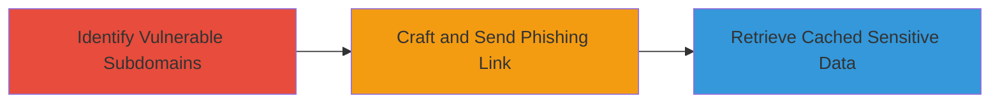

---
tags:
  - web-cache-deception
  - phishing
  - cache-manipulation
type: attack_chain
tools: []
tactics:
  - '[[Initial Access]]'
  - '[[Collection]]'
commands:
  - '[[commands/curl-test-cache-behavior]]'
  - '[[commands/curl-retrieve-cached-page]]'
platforms:
  - Web
complexity: medium
procedures:
  - '[[procedures/Identify-Vulnerable-Subdomains]]'
  - '[[procedures/Craft-Phishing-Link-for-Cache-Deception]]'
  - '[[procedures/Retrieve-Cached-Sensitive-Data]]'
step_count: 3
techniques:
  - '[[Exploit Public-Facing Application]]'
  - '[[Phishing]]'
description: >-
  Multi-stage attack exploiting Web Cache Deception on Kaspersky subdomains to
  steal sensitive user information via phishing and cache manipulation
skill_level: intermediate
impact_level: high
id: 60bd7c46-7756-4ecc-922b-13575968af60
created_at: '2025-12-13T09:00:34.057Z'
updated_at: '2025-12-13T09:00:34.057Z'
verified: false
validated: true
submitted: true
mitre_tactics:
  - '[[Initial Access]]'
  - '[[Collection]]'
mitre_techniques:
  - '[[Exploit Public-Facing Application]]'
  - '[[Phishing]]'
---
# Web Cache Deception on Kaspersky Subdomains for Sensitive Data Theft

Multi-stage attack chain demonstrating how attackers can exploit Web Cache Deception vulnerabilities on multiple subdomains of kaspersky.com. By tricking users into visiting phishing links that force the caching of sensitive pages, attackers can later retrieve the cached data, leading to theft of sensitive user information. This chain is based on a reported vulnerability resolved by adjusting caching settings.

## Chain Metrics Dashboard

| Metric | Value |
|--------|-------|
| Chain Status | Unverified |
| Total Steps | 3 |
| Execution Time | ~10 minutes |
| Skill Level | Intermediate |
| Complexity | Medium |
| Impact Level | High |

## Attack Flow Visualization



## Prerequisites & Requirements

### Required Tools

- None specific, but web browser and command-line tools like curl are useful

### Target Environment

- Web platform
- Access to kaspersky.com subdomains
- No specific ports or services required beyond HTTP/HTTPS

### Initial Access Requirements

- Ability to send phishing links to victims
- Network access to the target subdomains

## Detailed Attack Procedures

### Step 1: Identify Vulnerable Subdomains
procedure: [[procedures/Identify-Vulnerable-Subdomains]]

**Objective**: Discover subdomains of kaspersky.com that are susceptible to Web Cache Deception due to improper caching configurations.

**Instructions**: Use reconnaissance techniques to list subdomains. Then, test caching behavior by requesting pages with cacheable extensions. For example, use [[commands/curl-test-cache-behavior]] to check if a page is cached improperly:

```bash
curl -I https://subdomain.kaspersky.com/sensitive-page.css
```

Analyze headers for cache-control misconfigurations.

**Expected Output**: List of vulnerable subdomains with confirmed cacheable sensitive pages.

**Success Indicators**:
- Subdomains identified
- Caching misconfiguration confirmed via headers

### Step 2: Craft and Send Phishing Link
procedure: [[procedures/Craft-Phishing-Link-for-Cache-Deception]]

**Objective**: Create a malicious link that tricks the victim into loading and caching a sensitive page on the vulnerable subdomain.

**Instructions**: Construct a URL that appends a cacheable extension to a sensitive endpoint, such as https://subdomain.kaspersky.com/account-info.css. Send this via phishing email or message to the victim. When the victim visits, the page is cached.

**Expected Output**: Victim caches the sensitive page unknowingly.

**Success Indicators**:
- Phishing link delivered
- Victim interaction confirmed (e.g., via tracking)

### Step 3: Retrieve Cached Sensitive Data
procedure: [[procedures/Retrieve-Cached-Sensitive-Data]]

**Objective**: Access the cached version of the sensitive page to steal user information.

**Instructions**: Request the same manipulated URL used in the phishing link, such as with [[commands/curl-retrieve-cached-page]]:

```bash
curl https://subdomain.kaspersky.com/sensitive-page.css
```

The cache serves the victim's sensitive data to the attacker.

**Expected Output**: Cached sensitive user information retrieved.

**Success Indicators**:
- Sensitive data visible in response
- No authentication required for access

## Attack Chain Summary

### Key Achievements

1. Identification of exploitable subdomains
2. Successful phishing to force caching
3. Unauthorized access to sensitive cached data

## Technique & Tactic Coverage

### MITRE ATT&CK Techniques

- [[Exploit Public-Facing Application]]
- [[Phishing]]

### MITRE ATT&CK Tactics

- [[Initial Access]]
- [[Collection]]

*Last updated: 2023-10-01*
