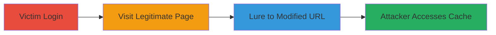

---
tags:
  - web-cache-deception
  - information-disclosure
  - cdn
type: attack_chain
tools:
  - '[[tools/Web-Browser]]'
tactics:
  - '[[Initial Access]]'
  - '[[Collection]]'
commands:
  - '[[commands/browser-access-url]]'
platforms:
  - Web
complexity: medium
procedures:
  - '[[procedures/Log-In-as-Victim]]'
  - '[[procedures/Visit-Legitimate-Authenticated-Page]]'
  - '[[procedures/Lure-Victim-to-Modified-URL]]'
  - '[[procedures/Access-Cached-Content-Unauthenticated]]'
step_count: 4
techniques:
  - '[[Drive-by Compromise]]'
  - '[[Data from Cloud Storage]]'
description: >-
  Multi-stage attack chain exploiting web cache deception to expose
  authenticated user data and token information on a web application.
skill_level: intermediate
impact_level: high
id: ad28f138-0eab-49de-ace5-f6b1c15f7a5f
created_at: '2025-12-13T09:00:34.339Z'
updated_at: '2025-12-13T09:00:34.339Z'
verified: false
validated: true
submitted: true
mitre_tactics:
  - '[[Initial Access]]'
  - '[[Collection]]'
mitre_techniques:
  - '[[Drive-by Compromise]]'
  - '[[Data from Cloud Storage]]'
---
# Web Cache Deception to Expose Authenticated User Data

Multi-stage attack chain demonstrating a complete attack workflow exploiting web cache deception on a web application like Chaturbate, where appending a static file extension to a dynamic URL tricks the cache into storing authenticated content publicly, allowing unauthorized access to personal data and tokens.

## Chain Metrics Dashboard

| Metric | Value |
|--------|-------|
| Chain Status | Unverified |
| Total Steps | 4 |
| Execution Time | ~5 minutes |
| Skill Level | Intermediate |
| Complexity | Medium |
| Impact Level | High |

## Attack Flow Visualization



## Prerequisites & Requirements

### Required Tools

- [[tools/Web-Browser]]

### Target Environment

- Web platform
- Services: CDN for caching
- Network access requirements: Public internet access to the target URL

### Initial Access Requirements

- Ability to lure a logged-in victim to a modified URL
- No prior credentials needed for attacker

## Detailed Attack Procedures

### Step 1: Victim Logs In
procedure: [[procedures/Log-In-as-Victim]]

**Objective**: Establish an authenticated session as the victim to access protected content.

**Instructions**: The victim accesses the site with valid credentials using [[tools/Web-Browser]] to log in. Navigate to the login page and enter credentials.

```bash
# No command-line execution; performed via browser GUI
```

**Expected Output**: Successful login and authenticated session established.

**Success Indicators**:
- Victim is logged in
- Access to authenticated pages confirmed

### Step 2: Victim Visits Legitimate Page
procedure: [[procedures/Visit-Legitimate-Authenticated-Page]]

**Objective**: Load the authenticated dynamic page content.

**Instructions**: While authenticated, the victim navigates to the legitimate endpoint using [[tools/Web-Browser]]: https://chaturbate.com/my_collection/.

```bash
# No command-line execution; performed via browser navigation
```

**Expected Output**: The personalized account page loads with user data and tokens.

**Success Indicators**:
- Page content displays authenticated data

### Step 3: Lure Victim to Modified URL
procedure: [[procedures/Lure-Victim-to-Modified-URL]]

**Objective**: Trick the victim into visiting a modified URL to cache the authenticated content publicly.

**Instructions**: Lure the logged-in victim to visit the modified URL using [[tools/Web-Browser]]: https://chaturbate.com/my_collection/min.js. This appends a static extension, tricking the CDN into caching the dynamic content as a static file.

```bash
# No command-line execution; performed via social engineering or link sharing
```

**Expected Output**: The page loads for the victim, and the content is cached by the CDN.

**Success Indicators**:
- Victim visits the URL
- Cache is populated with authenticated content

### Step 4: Attacker Accesses Cached Content
procedure: [[procedures/Access-Cached-Content-Unauthenticated]]

**Objective**: Retrieve the cached authenticated content without credentials.

**Instructions**: As the attacker, use [[tools/Web-Browser]] in incognito mode or a different browser to access the cached URL: https://chaturbate.com/my_collection/min.js.

Execute [[commands/browser-access-url]] to fetch the content:

```bash
curl https://chaturbate.com/my_collection/min.js
```

**Expected Output**: The cached page containing the victim's personal data and tokens is returned.

**Success Indicators**:
- Unauthorized access to authenticated content
- Exposure of tokens and personal information

## Attack Chain Summary

### Key Achievements

1. Successful caching of authenticated content via URL modification
2. Unauthorized retrieval of personal user data
3. Demonstration of information disclosure vulnerability

## Technique & Tactic Coverage

### MITRE ATT&CK Techniques

- [[Drive-by Compromise]]
- [[Data from Cloud Storage]]

### MITRE ATT&CK Tactics

- [[Initial Access]]
- [[Collection]]

*Last updated: [TIMESTAMP]*
