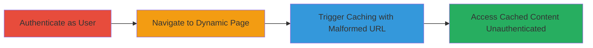

---
tags:
  - web-cache-deception
  - caching-vulnerability
  - unauthorized-access
  - data-exposure
type: attack_chain
tools:
  - '[[tools/Web-Browser-Incognito-Mode]]'
tactics:
  - '[[Initial Access]]'
  - '[[Collection]]'
commands: []
platforms:
  - Web
complexity: medium
procedures:
  - '[[procedures/Exploit-Web-Cache-Deception-via-Malformed-URL]]'
step_count: 4
techniques:
  - '[[Exploit Public-Facing Application]]'
description: >-
  Multi-stage attack chain exploiting web cache deception to expose
  authenticated user data publicly
skill_level: intermediate
impact_level: high
id: da1ce63f-25c3-4f95-9042-ad0a36506f03
created_at: '2025-12-13T09:00:33.923Z'
updated_at: '2025-12-13T09:00:33.923Z'
verified: false
validated: true
submitted: true
mitre_tactics:
  - '[[Initial Access]]'
  - '[[Collection]]'
mitre_techniques:
  - '[[Exploit Public-Facing Application]]'
---
# Web Cache Deception to Expose User Earning Information via Malformed URL

Multi-stage attack chain demonstrating a complete workflow for exploiting a web cache deception vulnerability on berush.com. The attack involves authenticating as a user, navigating to a dynamic page with sensitive information, appending a fake static extension to trigger improper caching, and then accessing the cached content unauthenticated to expose the victim's earning state data.

## Chain Metrics Dashboard

| Metric | Value |
|--------|-------|
| Chain Status | Unverified |
| Total Steps | 4 |
| Execution Time | ~5 minutes |
| Skill Level | Intermediate |
| Complexity | Medium |
| Impact Level | High |

## Attack Flow Visualization

## Prerequisites & Requirements

### Required Tools

- [[tools/Web-Browser-Incognito-Mode]]

### Target Environment

- Platform: Web
- Services: CDN for caching
- Network access: Public internet access to berush.com

### Initial Access Requirements

- Valid user credentials for berush.com
- Ability to lure or control a logged-in user session

## Detailed Attack Procedures

### Step 1: Authenticate as User
procedure: [[procedures/Exploit-Web-Cache-Deception-via-Malformed-URL]]

**Objective**: Gain authenticated access to the target website to interact with dynamic content.

**Instructions**: Open a web browser and navigate to the berush.com login page. Enter valid user credentials to authenticate.

**Expected Output**: Successful login confirmation and access to user dashboard.

**Success Indicators**:
- User is logged in
- Session cookies are set

### Step 2: Navigate to Dynamic Confirmation Page
procedure: [[procedures/Exploit-Web-Cache-Deception-via-Malformed-URL]]

**Objective**: Access the personalized page containing sensitive earning state information.

**Instructions**: In the authenticated browser session, navigate to https://www.berush.com/en/register/confirmation/success.

**Expected Output**: Page loads displaying user's earning state and other personalized data.

**Success Indicators**:
- Dynamic content is visible
- No errors in page loading

### Step 3: Trigger Caching with Malformed URL
procedure: [[procedures/Exploit-Web-Cache-Deception-via-Malformed-URL]]

**Objective**: Force the server to cache the dynamic content as a static resource by appending a fake extension.

**Instructions**: In the same authenticated session, visit the malformed URL https://www.berush.com/en/register/confirmation/success/none.css. This causes the server to serve the dynamic page but cache it due to the .css extension.

**Expected Output**: The page loads normally, but the content is now cached publicly.

**Success Indicators**:
- Page loads without authentication errors
- Caching is triggered (may require verification via cache headers if accessible)

### Step 4: Access Cached Page Unauthenticated
procedure: [[procedures/Exploit-Web-Cache-Deception-via-Malformed-URL]]

**Objective**: Retrieve the exposed sensitive data without authentication.

**Instructions**: Open a new incognito browser window or different browser without logging in. Visit https://www.berush.com/en/register/confirmation/success/none.css to access the cached content.

**Expected Output**: The cached page displays the victim's earning state information.

**Success Indicators**:
- Sensitive data is visible without login
- Unauthorized access confirmed

## Attack Chain Summary

### Key Achievements

1. Successful authentication and access to dynamic content
2. Improper caching of personalized data
3. Public exposure of sensitive user information

## Technique & Tactic Coverage

### MITRE ATT&CK Techniques

- [[Exploit Public-Facing Application]]

### MITRE ATT&CK Tactics

- [[Initial Access]]
- [[Collection]]

*Last updated: 2023-10-01*
