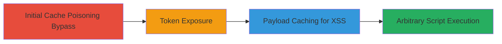

# Web Cache Poisoning Bypassing Fix to Expose Anti-CSRF Tokens and Chain to Stored XSS

Multi-stage attack chain demonstrating a complete attack workflow exploiting web cache poisoning on Glassdoor to expose sensitive Anti-CSRF tokens and enable stored XSS.

## Chain Metrics Dashboard

| Metric | Value |
|--------|-------|
| Chain Status | Unverified |
| Total Steps | 2 |
| Execution Time | ~5 minutes |
| Skill Level | Intermediate |
| Complexity | Medium |
| Impact Level | High |

## Attack Flow Visualization



## Prerequisites & Requirements

### Required Tools

- [[tools/Burp-Suite]] (for crafting and sending HTTP requests)
- Browser developer tools (for inspecting cached responses)

### Target Environment

- Web application using Cloudflare CDN
- Vulnerable to cache poisoning via URL manipulation with file extensions
- Services: HTTP/HTTPS on standard ports (80/443)

### Initial Access Requirements

- No credentials required; public-facing web application
- Network access to the target domain (e.g., glassdoor.com)
- Ability to send crafted HTTP requests

## Detailed Attack Procedures

### Step 1: Bypass Cache Poisoning Fix to Expose gdToken
procedure: [[procedures/Bypass-Web-Cache-Poisoning-Fix-to-Expose-gdToken]]

**Objective**: Exploit URL manipulation with .js extension to bypass previous cache poisoning fix and cache a response containing the sensitive Anti-CSRF token (gdToken) across different pages.

**Instructions**: Use a proxy tool like Burp Suite to craft and send a GET request to a manipulated URL that tricks the cache into storing the response. Target URLs like /job-listing/ followed by a .js extension and a job ID parameter to force a 200 OK response that includes the gdToken.

Execute [[commands/cache-poisoning-token-exposure]] to send the request:

```bash
curl -X GET "https://www.glassdoor.com/job-listing/011.js?jl=1007452474740" -H "User-Agent: Mozilla/5.0" -v
```

Inspect the response for the gdToken in the cached content. Verify caching by accessing the URL from another session or IP to confirm the poisoned cache serves the sensitive data.

**Expected Output**: 200 OK response containing the gdToken in the body, cached and served to subsequent requests.

**Success Indicators**:
- gdToken visible in the cached response
- Token persists across different user sessions or pages

### Step 2: Chain to Stored XSS via Malicious Payload Caching
procedure: [[procedures/Chain-Web-Cache-Poisoning-to-Stored-XSS]]

**Objective**: Leverage the poisoned cache to store and serve a malicious XSS payload, leading to arbitrary JavaScript execution on victim browsers when they access affected pages.

**Instructions**: Build on the poisoned cache by sending a request to a URL with an image extension (.jpeg) appended to a page path, embedding an XSS payload in the query or body. Use a timestamp parameter to avoid cache busting if needed.

Execute [[commands/cache-poisoning-xss-payload]] to cache the payload:

```bash
curl -X GET "https://www.glassdoor.com/member/home/index.htm/x.jpeg?t=2021111121" -H "User-Agent: Mozilla/5.0" -v --data "<script>alert('XSS')</script>"
```

Trigger the XSS by having a victim visit the affected page, where the cache serves the malicious payload. Validate by checking browser console for script execution.

**Expected Output**: Cached response includes the XSS payload, executed as JavaScript on victim load.

**Success Indicators**:
- Malicious script executes in victim's browser
- Arbitrary code runs, e.g., alert popup or data exfiltration

## Attack Chain Summary

### Key Achievements

1. Bypassed previous web cache poisoning fix using .js URL extensions to expose gdToken.
2. Chained poisoning to stored XSS by caching payloads in image-like URLs.
3. Enabled arbitrary script execution on victims without direct access.

## Technique & Tactic Coverage

### MITRE ATT&CK Techniques

- [[Exploit Public-Facing Application]]
- [[JavaScript]]

### MITRE ATT&CK Tactics

- [[Initial Access]]
- [[Execution]]

---
*Last updated: 2023-10-01T00:00:00Z*
