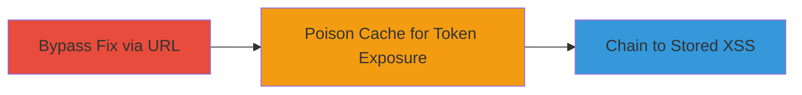

---
tags:
  - web-cache-poisoning
  - xss
  - stored-xss
  - csrf-bypass
type: attack_chain
tools: []
tactics:
  - '[[Initial Access]]'
  - '[[Execution]]'
commands:
  - '[[commands/get-job-listing-js]]'
  - '[[commands/get-member-home-xss]]'
platforms:
  - Web
complexity: medium
procedures:
  - '[[procedures/Bypass-Previous-Fix-via-URL-Caching]]'
  - '[[procedures/Exploit-Web-Cache-Poisoning-for-Token-Exposure]]'
  - '[[procedures/Chain-to-Stored-XSS-via-Payload-Caching]]'
step_count: 3
techniques:
  - '[[Exploit Public-Facing Application]]'
  - '[[JavaScript]]'
description: >-
  Multi-stage attack exploiting web cache poisoning to expose anti-CSRF tokens
  and chain to stored XSS on Glassdoor's platform
skill_level: intermediate
impact_level: high
id: f0abd4f9-be37-444b-b8fb-0c003fbc21dd
created_at: '2025-12-13T09:00:34.788Z'
updated_at: '2025-12-13T09:00:34.788Z'
verified: false
validated: true
submitted: true
mitre_tactics:
  - '[[Initial Access]]'
  - '[[Execution]]'
mitre_techniques:
  - '[[Exploit Public-Facing Application]]'
  - '[[JavaScript]]'
---
# Web Cache Poisoning to Expose Anti-CSRF Token and Stored XSS on Glassdoor

Multi-stage attack chain demonstrating web cache poisoning on Glassdoor's platform, bypassing a previous fix to expose the gdToken (anti-CSRF token) and chaining to stored XSS by caching malicious payloads. This allows compromise of anti-CSRF protections and execution of arbitrary JavaScript.

## Chain Metrics Dashboard

| Metric | Value |
|--------|-------|
| Chain Status | Unverified |
| Total Steps | 3 |
| Execution Time | ~5 minutes |
| Skill Level | Intermediate |
| Complexity | Medium |
| Impact Level | High |

## Attack Flow Visualization



## Prerequisites & Requirements

### Required Tools

- None (browser or HTTP client like curl)

### Target Environment

- Web platform (Glassdoor-like site)
- Cloudflare caching enabled
- Network access to target URLs

### Initial Access Requirements

- Public access to target endpoints
- No credentials needed

## Detailed Attack Procedures

### Step 1: Bypass Previous Fix via URL Caching
procedure: [[procedures/Bypass-Previous-Fix-via-URL-Caching]]

**Objective**: Access a specific URL with .js extension to trigger caching and bypass prior mitigations, exposing sensitive data.

**Instructions**: Send a GET request to the job listing endpoint using [[commands/get-job-listing-js]]:

```bash
curl 'https://www.glassdoor.com/job-listing/011.js?jl=1007452474740'
```

**Expected Output**: HTTP 200 OK response with cached content including gdToken.

**Success Indicators**:
- Response cached based on .js extension
- gdToken exposed in response

### Step 2: Exploit Web Cache Poisoning for Token Exposure
procedure: [[procedures/Exploit-Web-Cache-Poisoning-for-Token-Exposure]]

**Objective**: Poison the cache to share the gdToken across different pages due to improper validation.

**Instructions**: Leverage the cached response from Step 1 to access the gdToken on other pages. No specific command needed beyond verifying cache hit via repeated requests to similar endpoints.

**Expected Output**: gdToken accessible across multiple Glassdoor pages.

**Success Indicators**:
- Token shared across pages
- Anti-CSRF protection bypassed

### Step 3: Chain to Stored XSS via Payload Caching
procedure: [[procedures/Chain-to-Stored-XSS-via-Payload-Caching]]

**Objective**: Cache a malicious XSS payload to enable stored XSS execution.

**Instructions**: Send a GET request with an XSS payload to the member home endpoint using [[commands/get-member-home-xss]]:

```bash
curl 'https://www.glassdoor.com/member/home/index.htm/x.jpeg?t=2021111121' -H 'X-Payload: <script>alert(1)</script>'
```

**Expected Output**: Payload cached and executable as stored XSS.

**Success Indicators**:
- XSS payload cached
- Arbitrary JavaScript execution in victim browser

## Attack Chain Summary

### Key Achievements

1. Bypassed previous cache fix
2. Exposed anti-CSRF token across pages
3. Enabled stored XSS for potential account compromise

## Technique & Tactic Coverage

### MITRE ATT&CK Techniques

- [[Exploit Public-Facing Application]]
- [[JavaScript]]

### MITRE ATT&CK Tactics

- [[Initial Access]]
- [[Execution]]

*Last updated: 2023-10-01*
