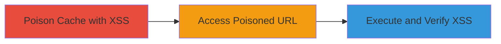

---
tags:
  - xss
  - cache-poisoning
  - web-cache-deception
  - discourse
type: attack_chain
tools:
  - '[[tools/webcachedeception-php]]'
tactics:
  - '[[Initial Access]]'
  - '[[Execution]]'
commands:
  - '[[commands/inject-xss-via-cache-poisoning-script]]'
  - '[[commands/get-request-with-cache-deception]]'
platforms:
  - Web
  - AWS
complexity: medium
procedures:
  - '[[procedures/Poison-Web-Cache-with-XSS-Payload]]'
  - '[[procedures/Access-Poisoned-Cache-URL]]'
  - '[[procedures/Verify-XSS-Execution]]'
step_count: 3
techniques:
  - '[[JavaScript]]'
  - '[[Exploit Public-Facing Application]]'
description: >-
  Multi-stage attack chain exploiting web cache poisoning to inject stored XSS
  payloads in Discourse instances, enabling arbitrary JavaScript execution on
  victims' browsers.
skill_level: intermediate
impact_level: high
id: 00ce88db-1b37-4dfa-b5ea-498c235d5966
created_at: '2025-12-13T09:00:34.566Z'
updated_at: '2025-12-13T09:00:34.566Z'
verified: false
validated: true
submitted: true
mitre_tactics:
  - '[[Initial Access]]'
  - '[[Execution]]'
mitre_techniques:
  - '[[JavaScript]]'
  - '[[Exploit Public-Facing Application]]'
---
# Web Cache Poisoning to Inject Stored XSS in Discourse

Multi-stage attack chain demonstrating a complete attack workflow.

## Chain Metrics Dashboard

| Metric | Value |
|--------|-------|
| Chain Status | Unverified |
| Total Steps | 3 |
| Execution Time | ~2 minutes |
| Skill Level | Intermediate |
| Complexity | Medium |
| Impact Level | High |

## Attack Flow Visualization



## Prerequisites & Requirements

### Required Tools

- [[tools/webcachedeception-php]]

### Target Environment

- Web platform with Discourse running on AWS
- Services: CloudFront, Discourse
- Tech stack: Ruby on Rails, ERB templates

### Initial Access Requirements

- Network access to the target Discourse instance
- No credentials required; exploits public-facing application

## Detailed Attack Procedures

### Step 1: Poison Web Cache with XSS Payload
procedure: [[procedures/Poison-Web-Cache-with-XSS-Payload]]

**Objective**: Inject a malicious XSS payload into the target's web cache by sending crafted HTTP requests.

**Instructions**: Use the webcachedeception.php script to automate the cache poisoning. Execute [[commands/inject-xss-via-cache-poisoning-script]] with the target URL, payload, and cache duration:

```bash
https://blackfan.ru/bugbounty/webcachedeception.php?url=https://meta.discourse.org/?cacheattack&payload=%22%3E%3Cscript%3Ealert(document.domain)%3C/script%3E&cache=60
```

**Expected Output**: The script displays the poisoned cache URL.

**Success Indicators**:
- Cache poisoned for 60 seconds
- Poisoned URL generated

### Step 2: Access Poisoned Cache URL
procedure: [[procedures/Access-Poisoned-Cache-URL]]

**Objective**: Navigate to the poisoned URL to retrieve the cached response containing the XSS payload.

**Instructions**: Open the cached URL provided by the script in a web browser. This triggers the cached response with the injected payload. For demonstration, you can simulate the underlying request using [[commands/get-request-with-cache-deception]]:

```bash
GET /?xx HTTP/1.1
```

**Expected Output**: The page loads with the injected XSS in font URLs and styles.

**Success Indicators**:
- Cached response served
- Page renders with potential script injection

### Step 3: Verify XSS Execution
procedure: [[procedures/Verify-XSS-Execution]]

**Objective**: Observe the execution of the injected JavaScript in the browser.

**Instructions**: After accessing the poisoned URL, monitor the browser for script execution, such as an alert popup showing the document domain.

**Expected Output**: Alert box appears with 'document.domain'.

**Success Indicators**:
- JavaScript executes successfully
- Alert confirms XSS trigger

## Attack Chain Summary

### Key Achievements

1. Successful cache poisoning with XSS payload
2. Distribution of malicious content via cache to users
3. Arbitrary JavaScript execution on victims' browsers

## Technique & Tactic Coverage

### MITRE ATT&CK Techniques

- [[JavaScript]]
- [[Exploit Public-Facing Application]]

### MITRE ATT&CK Tactics

- [[Initial Access]]
- [[Execution]]

*Last updated: [TIMESTAMP]*
