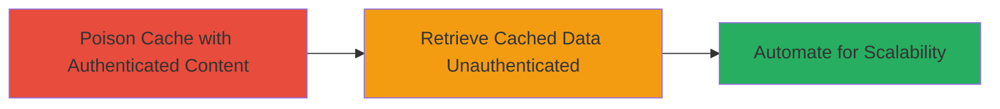

---
tags:
  - web-cache-poisoning
  - information-disclosure
  - user-data-leak
type: attack_chain
tools:
  - '[[tools/Custom-POC-HTML-JS-Script]]'
tactics:
  - '[[Initial Access]]'
  - '[[Collection]]'
verified: false
platforms:
  - Web
submitted: true
complexity: medium
created_at: '2023-10-01T00:00:00Z'
procedures:
  - '[[procedures/Poison-Web-Cache-with-Authenticated-User-Content]]'
  - '[[procedures/Retrieve-Poisoned-Cache-Content-as-Unauthenticated-User]]'
  - '[[procedures/Automate-Cache-Poisoning-Using-JavaScript-PoC]]'
step_count: 3
techniques:
  - '[[Exploit Public-Facing Application]]'
updated_at: '2025-12-14T17:25:13.492Z'
description: >-
  A multi-stage attack exploiting web cache poisoning on Lyst.com by caching
  authenticated user content under public .css URLs, enabling unauthenticated
  retrieval of sensitive user data like email, name, member ID, and username.
skill_level: intermediate
impact_level: high
id: d88f368a-6708-4563-b177-8a7d9b9757fe
validated: true
mitre_tactics:
  - '[[Initial Access]]'
  - '[[Collection]]'
mitre_techniques:
  - '[[Exploit Public-Facing Application]]'
---
# Web Cache Poisoning via .css URLs Leading to User Information Disclosure

Multi-stage attack chain demonstrating a complete attack workflow exploiting improper cache keying on Lyst.com, where authenticated responses are cached under public .css endpoints, leading to disclosure of sensitive user information.

## Chain Metrics Dashboard

| Metric | Value |
|--------|-------|
| Chain Status | Unverified |
| Total Steps | 3 |
| Execution Time | ~5 minutes |
| Skill Level | Intermediate |
| Complexity | Medium |
| Impact Level | High |

## Attack Flow Visualization

## Prerequisites & Requirements

### Required Tools

- [[tools/Custom-POC-HTML-JS-Script]]

### Target Environment

- Web application with caching enabled (e.g., Lyst.com)
- No specific ports required; operates over HTTPS
- Network access to the target site

### Initial Access Requirements

- Valid user credentials for authentication
- Browser with incognito/private mode support
- No prior access needed beyond public internet

## Detailed Attack Procedures

### Step 1: Poison Web Cache with Authenticated User Content
procedure: [[procedures/Poison-Web-Cache-with-Authenticated-User-Content]]

**Objective**: Cache authenticated user-specific content under a public .css URL to poison the server's cache.

**Instructions**: Log in to the target site (e.g., Lyst.com) using valid credentials. Then, navigate to a crafted URL ending in .css, such as `https://www.lyst.com/shop/trends/mens-dress-shoes/blahblah.css`. The server will respond with personalized content (e.g., including username, slug, ID, email) and cache it without distinguishing authentication state.

**Expected Output**: The page loads with user-specific elements visible in the response.

**Success Indicators**:
- Personalized content (e.g., username, email) appears in the response body
- No authentication prompt during the request

### Step 2: Retrieve Poisoned Cache Content as Unauthenticated User
procedure: [[procedures/Retrieve-Poisoned-Cache-Content-as-Unauthenticated-User]]

**Objective**: Access the poisoned cache entry without authentication to extract sensitive user data.

**Instructions**: Open an incognito or private browsing session (no login). Visit the same crafted .css URL (e.g., `https://www.lyst.com/shop/trends/mens-dress-shoes/blahblah.css`). Inspect the page source or response to view cached content.

**Expected Output**: Response includes sensitive data like email, member ID, username, and slug from the authenticated session.

**Success Indicators**:
- Sensitive user information visible in unauthenticated response
- Data matches the authenticated user's details

### Step 3: Automate Cache Poisoning Using JavaScript PoC
procedure: [[procedures/Automate-Cache-Poisoning-Using-JavaScript-PoC]]

**Objective**: Scale the attack by automating the generation and poisoning of multiple .css URLs.

**Instructions**: While logged in, load the Custom PoC HTML/JS Script in a browser. The script generates a random 10-character ID (e.g., from 'QWERTZUIOPASDFGHJUKLYXCVBNM1234567890'), constructs a URL like `https://www.lyst.com/[random].css`, opens it in a popup to trigger caching, waits 3 seconds, closes the popup, and displays the URL for later unauthenticated retrieval.

**Expected Output**: Console or alert shows the generated URL; cache is poisoned for that endpoint.

**Success Indicators**:
- Popup opens and closes successfully
- Generated URL can be retrieved unauthenticated in Step 2

## Attack Chain Summary

### Key Achievements

1. Successful cache poisoning of authenticated content under public URLs
2. Disclosure of user email, name, member ID, username, and slug to unauthenticated attackers
3. Automation enabling scalable exploitation and potential compromise of login security features

## Technique & Tactic Coverage

### MITRE ATT&CK Techniques

- [[Exploit Public-Facing Application]]

### MITRE ATT&CK Tactics

- [[Initial Access]]
- [[Collection]]

---

*Last updated: 2023-10-01T00:00:00Z*
