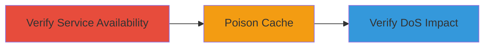

---
tags:
  - web-cache-poisoning
  - dos
  - host-header
type: attack_chain
tools:
  - '[[tools/curl]]'
tactics:
  - '[[Initial Access]]'
  - '[[Impact]]'
commands:
  - '[[commands/curl-poison-cache-host-header]]'
platforms:
  - Web
complexity: medium
procedures:
  - '[[procedures/Exploit-Web-Cache-Poisoning-for-DoS]]'
step_count: 3
techniques:
  - '[[Exploit Public-Facing Application]]'
  - '[[Network Denial of Service]]'
description: >-
  Exploits web cache poisoning by manipulating the Host header to cache a
  poisoned response, leading to Denial of Service on the target application.
skill_level: intermediate
impact_level: high
id: 546f48b0-3e67-42d9-a54e-35b77fdc7a2d
created_at: '2025-12-13T09:00:34.084Z'
updated_at: '2025-12-13T09:00:34.084Z'
verified: false
validated: true
submitted: true
mitre_tactics:
  - '[[Initial Access]]'
  - '[[Impact]]'
mitre_techniques:
  - '[[Exploit Public-Facing Application]]'
  - '[[Network Denial of Service]]'
---
# Web Cache Poisoning via Host Header to Cause DoS on GSA Acquisition Site

Multi-stage attack chain demonstrating web cache poisoning exploitation leading to Denial of Service (DoS) on a public-facing web application.

## Chain Metrics Dashboard

| Metric | Value |
|--------|-------|
| Chain Status | Unverified |
| Total Steps | 3 |
| Execution Time | ~5 minutes |
| Skill Level | Intermediate |
| Complexity | Medium |
| Impact Level | High |

## Attack Flow Visualization



## Prerequisites & Requirements

### Required Tools

- [[tools/curl]]

### Target Environment

- Target Platform: Web
- Required services/ports: HTTPS on standard port, with port 8888 referenced (non-existent)
- Network access requirements: Public internet access to https://acquisition-uat.gsa.gov

### Initial Access Requirements

- Credential requirements: None
- Network position: External attacker
- Prior access needed: None

## Detailed Attack Procedures

### Step 1: Verify Service Availability
procedure: [[procedures/Exploit-Web-Cache-Poisoning-for-DoS]]

**Objective**: Ensure the target application is responsive before attempting to poison the cache.

**Instructions**: Access the URL with a cache buster parameter to confirm normal operation without affecting the main cache.

Visit https://acquisition-uat.gsa.gov/?letme=4449 in a browser or via a simple request.

**Expected Output**: The application loads normally without errors.

**Success Indicators**:
- Application responds with expected content
- No connection issues observed

### Step 2: Poison the Cache
procedure: [[procedures/Exploit-Web-Cache-Poisoning-for-DoS]]

**Objective**: Manipulate the Host header to inject a poisoned response into the cache, referencing an invalid port.

**Instructions**: Use [[commands/curl-poison-cache-host-header]] to send the crafted request:

```bash
curl https://acquisition-uat.gsa.gov/\?letme\=4447 -H "Host: acquisition-uat.gsa.gov:8888"
```

This poisons the cache for requests with the specific query parameter.

**Expected Output**: The server accepts the request and caches the poisoned response.

**Success Indicators**:
- Request completes without immediate errors
- Cache is poisoned for subsequent requests

### Step 3: Verify DoS Impact
procedure: [[procedures/Exploit-Web-Cache-Poisoning-for-DoS]]

**Objective**: Confirm that the poisoned cache causes the application to enter a DoS state.

**Instructions**: Revisit the URL with a different cache buster parameter to trigger the poisoned response.

Access https://acquisition-uat.gsa.gov/?letme=4449 again.

Observe the application attempting multiple failed connections to acquisition-uat.gsa.gov:8888.

**Expected Output**: The application fails to load, showing connection timeouts or errors due to repeated invalid requests.

**Success Indicators**:
- Legitimate requests are blocked
- DoS condition is achieved, preventing access

## Attack Chain Summary

### Key Achievements

1. Successful poisoning of web cache via Host header manipulation
2. Induction of DoS by forcing invalid internal requests
3. Demonstration of vulnerability in caching mechanism

## Technique & Tactic Coverage

### MITRE ATT&CK Techniques

- [[Exploit Public-Facing Application]]
- [[Network Denial of Service]]

### MITRE ATT&CK Tactics

- [[Initial Access]]
- [[Impact]]

*Last updated: 2023-10-01*
