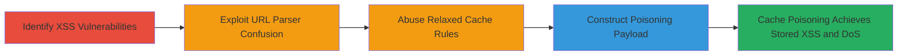

# Web Cache Poisoning via URL Parser Confusion Leading to Stored XSS and DoS on Glassdoor

Multi-stage attack chain demonstrating exploitation of URL parser discrepancies and relaxed caching to inject and cache XSS payloads on Glassdoor's CDN, affecting all users with stored XSS for approximately 10 minutes per poisoning and enabling persistent DoS through repeated attacks.

## Chain Metrics Dashboard

| Metric | Value |
|--------|-------|
| Chain Status | Unverified |
| Total Steps | 5 |
| Execution Time | ~10 minutes per poisoning cycle |
| Skill Level | Intermediate |
| Complexity | Medium |
| Impact Level | High |

## Attack Flow Visualization



## Prerequisites & Requirements

### Required Tools

- Browser developer tools for payload testing
- Proxy tool like Burp Suite for request manipulation

### Target Environment

- Web application with CDN caching (e.g., Glassdoor.com)
- Endpoints under /Job/, /mz-survey/interview/collectQuestions_input.htm/, /Award/, /List/
- No specific ports; HTTP/HTTPS access required

### Initial Access Requirements

- Public access to the web application
- No credentials needed; anonymous requests suffice
- Ability to send crafted HTTP requests with cookies, headers, and dot-segment paths

## Detailed Attack Procedures

### Step 1: Identify Reflected XSS in Cookies and Parameters
procedure: [[procedures/Identify-Reflected-XSS-in-Cookies-and-Parameters]]

**Objective**: Locate unexploitable reflected XSS triggered by cookie and parameter combinations on /Job/ endpoints to prepare for escalation.

**Instructions**: Use a proxy to intercept and modify requests to https://glassdoor.com/Job/. Set a cookie like `test=<script>alert(1)</script>` and append a parameter `?param=<script>alert(1)</script>`. Send the request and inspect the response for reflected payload without execution due to encoding.

```bash
curl -H "Cookie: test=\"<script>alert(1)</script>\"" "https://glassdoor.com/Job/some-job?param=\"<script>alert(1)</script>\"" -v
```

**Expected Output**: Response reflects the payload but does not execute due to output encoding.

**Success Indicators**:
- Payload appears in response source
- No alert triggers, confirming unexploitable state

### Step 2: Identify Stored XSS in Cookies and Headers
procedure: [[procedures/Identify-Stored-XSS-in-Cookies-and-Headers]]

**Objective**: Detect unexploitable stored XSS via cookie and header combinations on /mz-survey/interview/collectQuestions_input.htm/ for later cache integration.

**Instructions**: Craft a request to https://glassdoor.com/mz-survey/interview/collectQuestions_input.htm/ with a malicious cookie and custom header. Use a payload like `<script>alert(1)</script>` in both, submit, and check if it's stored but not executable.

```bash
curl -H "Cookie: vuln=\"<script>alert(1)</script>\"" -H "X-Custom: \"<script>alert(1)</script>\"" "https://glassdoor.com/mz-survey/interview/collectQuestions_input.htm/" -v
```

**Expected Output**: Payload stored in response or subsequent pages but sanitized on execution.

**Success Indicators**:
- Payload persists in storage checks
- No execution observed, validating unexploitable nature

### Step 3: Exploit URL Parser Confusion with Dot Segments
procedure: [[procedures/Exploit-URL-Parser-Confusion-with-Dot-Segments]]

**Objective**: Identify discrepancy in dot segment (/../) handling between frontend caching server (normalizes) and backend (treats as path) per RFC 3986.

**Instructions**: Send a request with dot segments in the path, e.g., /Award/../List/, and observe if the cache key ignores segments while backend processes them differently. Use curl to test normalization.

```bash
curl "https://glassdoor.com/Award/../List/some-list" -H "Host: glassdoor.com" -v
```

**Expected Output**: Cache entry created without segments, but backend routes to intended path.

**Success Indicators**:
- Cache logs show normalized URL
- Backend response matches non-normalized path

### Step 4: Abuse Relaxed Cache Rules on Static Pages
procedure: [[procedures/Abuse-Relaxed-Cache-Rules-on-Static-Pages]]

**Objective**: Confirm that /Award/ and /List/ pages are cached as static content without strict validation, enabling poisoning.

**Instructions**: Request a /Award/ or /List/ page multiple times and check cache headers (e.g., Cache-Control: public, max-age=600). Verify no Vary headers enforce strictness.

```bash
curl -I "https://glassdoor.com/Award/some-award" -v
```

**Expected Output**: Headers indicate caching for ~10 minutes without query/cookie variation.

**Success Indicators**:
- Cache-Control allows public caching
- Repeated requests hit cache

### Step 5: Construct Cache Poisoning Payload for XSS
procedure: [[procedures/Construct-Cache-Poisoning-Payload-for-XSS]]

**Objective**: Combine XSS payloads with dot segments to poison cache, converting to stored XSS on CDN and enabling DoS via repetition.

**Instructions**: Craft a request to /Job/ or survey endpoint with XSS in cookie/param, append dot segments to route to /Award/ or /List/ (e.g., /Job/../Award/). Submit to poison cache for 10 minutes.

```bash
curl -H "Cookie: test=\"<script>alert(document.cookie)</script>\"" "https://glassdoor.com/Job/../Award/some-award?param=\"<script>alert(document.cookie)</script>\"" -v
```

**Expected Output**: Malicious response cached and served to all users accessing /Award/.

**Success Indicators**:
- Subsequent clean requests to /Award/ trigger XSS
- Cache persists for ~10 minutes; repeat for DoS

## Attack Chain Summary

### Key Achievements

1. Escalated unexploitable reflected/stored XSS to cache-wide stored XSS via poisoning.
2. Exploited parser confusion to mismatch cache keys and backend paths.
3. Enabled mass user impact and DoS by filling cache with malicious content every 10 minutes.

## Technique & Tactic Coverage

### MITRE ATT&CK Techniques

- [[Exploit Public-Facing Application]] Exploit Public-Facing Application
- [[Drive-by Compromise]] Drive-by Compromise
- [[Endpoint Denial of Service]] Endpoint Denial of Service

### MITRE ATT&CK Tactics

- [[Initial Access]] Initial Access
- [[Execution]] Execution
- [[Impact]] Impact

---
*Last updated: 2023-10-01T00:00:00Z*
