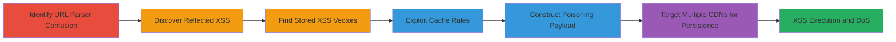

# Web Cache Poisoning via URL Parser Confusion Leading to Stored XSS and DoS

Multi-stage attack chain demonstrating exploitation of URL parser discrepancies and XSS vulnerabilities to poison CDN caches, enabling widespread stored XSS and denial of service on a web application like Glassdoor.

## Chain Metrics Dashboard

| Metric | Value |
|--------|-------|
| Chain Status | Unverified |
| Total Steps | 6 |
| Execution Time | ~10 minutes per cache refresh cycle |
| Skill Level | Intermediate |
| Complexity | Medium |
| Impact Level | High |

## Attack Flow Visualization

## Prerequisites & Requirements

### Required Tools

- Browser developer tools for payload testing
- Proxy tool like Burp Suite for request manipulation

### Target Environment

- Web application with frontend caching/CDN (e.g., Akamai or similar)
- Backend server handling dynamic paths
- Endpoints like /Job/, /mz-survey/interview/collectQuestions_input.htm/, /Award/, /List/

### Initial Access Requirements

- Public access to the web application
- No authentication required for initial probing
- Ability to send crafted HTTP requests

## Detailed Attack Procedures

### Step 1: Identify URL Parser Confusion
procedure: [[procedures/Exploit-URL-Parser-Confusion-with-Dot-Segments]]

**Objective**: Detect mismatch in URL handling between frontend caching server and backend to enable cache poisoning.

**Instructions**: Craft requests with dot segments like `/../` in paths to /Award/ or /List/ endpoints. Observe if the frontend normalizes the URL (removing segments) while the backend processes the original path, leading to mismatched caching.

For example, send a request to `https://target.com/Award/../Job/payload` and check cache behavior.

**Expected Output**: Frontend caches under /Award/ but backend executes /Job/ logic, storing dynamic content.

**Success Indicators**:
- Cache entry created under normalized path
- Backend responds with content from non-static path

### Step 2: Discover Reflected XSS
procedure: [[procedures/Identify-Reflected-XSS-in-Cookies-and-Parameters-on-Job-Pages]]

**Objective**: Locate reflected XSS in cookie-parameter combinations on /Job/ pages for payload injection.

**Instructions**: Test /Job/ endpoints by setting cookies with XSS payloads (e.g., ``) combined with query parameters. Submit requests like `https://target.com/Job/?param=` with matching cookie values, checking for reflection without encoding on the page.

**Expected Output**: Payload reflected in page source, potentially executable in victim's browser.

**Success Indicators**:
- Payload appears unencoded in response
- Alert or script execution in browser

### Step 3: Find Stored XSS Vectors
procedure: [[procedures/Identify-Stored-XSS-in-Cookies-and-Headers-on-Survey-Pages]]

**Objective**: Identify stored XSS in cookie-header pairs on survey pages to persist payloads.

**Instructions**: Target `https://target.com/mz-survey/interview/collectQuestions_input.htm/` by injecting XSS into cookies and custom headers (e.g., `X-Custom: `). Verify if the combination leads to storage or reflection without sanitization.

**Expected Output**: Payload stored or reflected in subsequent responses, affecting session.

**Success Indicators**:
- Payload persists across requests
- Execution on page load

### Step 4: Exploit Relaxed Cache Rules
procedure: [[procedures/Exploit-Relaxed-Cache-Rules-on-Award-and-List-Endpoints]]

**Objective**: Leverage over-permissive caching on /Award/ and /List/ to store dynamic malicious content.

**Instructions**: Send requests to /Award/ or /List/ paths assuming static nature, but include dynamic elements from prior steps. Confirm caching without validation by checking response headers like Cache-Control.

**Expected Output**: Dynamic content cached for ~10 minutes.

**Success Indicators**:
- Cache-Control headers indicate storage
- Repeated requests return cached malicious response

### Step 5: Construct Payload with Dot Segments
procedure: [[procedures/Construct-Payload-with-Dot-Segments-to-Poison-Cache]]

**Objective**: Combine parser confusion with XSS to inject and cache payloads as stored XSS.

**Instructions**: Build a request like `https://target.com/List/../Job/?param=` with XSS in cookies. Use the mismatch to cache the /Job/ response under /List/, converting reflected XSS to stored.

**Expected Output**: Cache poisoned with executable XSS for 10 minutes on local CDN.

**Success Indicators**:
- Victims accessing /List/ execute XSS
- Cookie theft or session hijacking

### Step 6: Extend Impact to All Users
procedure: [[procedures/Extend-Impact-to-All-Users-via-Multiple-CDNs]]

**Objective**: Amplify attack by targeting global CDNs and maintaining poison via loops.

**Instructions**: Repeat poisoning requests across different CDN edges (e.g., vary IP geolocation). Automate every 10 minutes to refresh cache before expiration.

**Expected Output**: Widespread XSS affecting all users, leading to DoS via cache overload.

**Success Indicators**:
- XSS triggers on multiple user sessions
- Cache responses from various CDNs contain payload

## Attack Chain Summary

### Key Achievements

1. Exploited URL parser mismatch to enable cache poisoning
2. Converted unexploitable reflected/stored XSS into cacheable payloads
3. Achieved persistent stored XSS and DoS impacting all users via CDNs

## Technique & Tactic Coverage

### MITRE ATT&CK Techniques

- [[Exploit Public-Facing Application]] Exploit Public-Facing Application
- [[JavaScript]] JavaScript
- [[Endpoint Denial of Service]] Endpoint Denial of Service

### MITRE ATT&CK Tactics

- [[Initial Access]] Initial Access
- [[Execution]] Execution
- [[Impact]] Impact

---
*Last updated: 2023-10-01T00:00:00Z*
