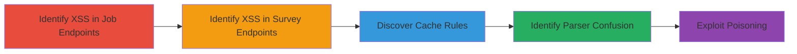

---
tags:
  - web-cache-poisoning
  - xss
  - dos
  - cdn
  - url-parsing
type: attack_chain
tools: []
tactics:
  - '[[Initial Access]]'
  - '[[Execution]]'
  - '[[Exfiltration]]'
commands: []
platforms:
  - Web
complexity: medium
procedures:
  - '[[procedures/Identify-Unexploitable-XSS-in-Job-Endpoints]]'
  - '[[procedures/Identify-Unexploitable-XSS-in-Survey-Endpoints]]'
  - '[[procedures/Discover-Relaxed-Cache-Rules]]'
  - '[[procedures/Identify-URL-Parser-Confusion]]'
  - '[[procedures/Exploit-Cache-Poisoning-with-Dot-Segments]]'
step_count: 5
techniques:
  - '[[Exploit Public-Facing Application]]'
  - '[[JavaScript]]'
description: >-
  Multi-stage attack exploiting URL parser confusion and reflected XSS to
  achieve web cache poisoning, escalating to stored XSS and potential DoS on web
  applications using CDNs.
skill_level: intermediate
impact_level: high
id: e78c4094-1c18-4528-ac36-2baa34a0fa38
created_at: '2025-12-13T09:00:34.656Z'
updated_at: '2025-12-13T09:00:34.656Z'
verified: false
validated: true
submitted: true
mitre_tactics:
  - '[[Initial Access]]'
  - '[[Execution]]'
  - '[[Exfiltration]]'
mitre_techniques:
  - '[[Exploit Public-Facing Application]]'
  - '[[JavaScript]]'
---
# Web Cache Poisoning via URL Parser Confusion Leading to Stored XSS and DoS

Multi-stage attack chain demonstrating a complete attack workflow.

## Chain Metrics Dashboard

| Metric | Value |
|--------|-------|
| Chain Status | Unverified |
| Total Steps | 5 |
| Execution Time | ~30 minutes |
| Skill Level | Intermediate |
| Complexity | Medium |
| Impact Level | High |

## Attack Flow Visualization

## Prerequisites & Requirements

### Required Tools

- None specified; standard web testing tools like browsers and proxies may be used.

### Target Environment

- Web platform with CDN and frontend caching server.
- Services: CDN, Frontend caching server, Backend web server.
- Network access to target endpoints.

### Initial Access Requirements

- Public access to web endpoints.
- No credentials required for initial discovery.

## Detailed Attack Procedures

### Step 1: Identify Unexploitable XSS in Job Endpoints
procedure: [[procedures/Identify-Unexploitable-XSS-in-Job-Endpoints]]

**Objective**: Discover reflected XSS vulnerabilities in cookies and parameters on /Job/ pages that are initially unexploitable without caching.

**Instructions**: Inspect pages under /Job/ for XSS triggers via cookie and parameter injection. Test by injecting payloads like  into cookies and parameters to observe reflection.

**Expected Output**: Confirmation of reflected XSS, but no exploitation without caching.

**Success Indicators**:
- XSS payload reflected in page output.
- No immediate execution due to lack of caching.

### Step 2: Identify Unexploitable XSS in Survey Endpoints
procedure: [[procedures/Identify-Unexploitable-XSS-in-Survey-Endpoints]]

**Objective**: Discover reflected XSS vulnerabilities in cookies and headers on /mz-survey/interview/collectQuestions_input.htm/ pages that are initially unexploitable without caching.

**Instructions**: Inspect pages under /mz-survey/interview/collectQuestions_input.htm/ for XSS triggers via cookie and header injection. Test by setting headers or cookies with payloads like  and observe reflection.

**Expected Output**: Confirmation of reflected XSS in headers and cookies.

**Success Indicators**:
- XSS payload reflected.
- Identified as unexploitable initially.

### Step 3: Discover Relaxed Cache Rules
procedure: [[procedures/Discover-Relaxed-Cache-Rules]]

**Objective**: Identify endpoints with relaxed caching assuming static content, such as /Award/ and /List/.

**Instructions**: Analyze cache headers and behavior on /Award/ and /List/ endpoints by sending requests and observing Cache-Control or ETag responses to confirm static caching assumptions.

**Expected Output**: Evidence of caching rules treating pages as static.

**Success Indicators**:
- Cache hits observed on repeated requests.
- Relaxed rules confirmed.

### Step 4: Identify URL Parser Confusion
procedure: [[procedures/Identify-URL-Parser-Confusion]]

**Objective**: Detect mismatch in URL normalization between frontend caching and backend servers regarding dot segments (/../).

**Instructions**: Test URLs with dot segments like /Award/../Job/ and observe how frontend normalizes them while backend treats them differently, per RFC 3986 section 5.2.4.

**Expected Output**: Confirmation of parser disagreement.

**Success Indicators**:
- Frontend removes /../, backend does not.
- Potential for cache key mismatch identified.

### Step 5: Exploit Cache Poisoning with Dot Segments
procedure: [[procedures/Exploit-Cache-Poisoning-with-Dot-Segments]]

**Objective**: Construct payloads using dot segments to poison cache, storing XSS from /Job/ and /mz-survey/ to /Award/ and /List/, escalating to stored XSS.

**Instructions**: Craft requests like /Award/../Job/ with injected XSS payloads in cookies/parameters/headers. The cache poisons for ~10 minutes, potentially looping to affect all users and enabling DoS.

**Expected Output**: Poisoned cache serving XSS to victims.

**Success Indicators**:
- Stored XSS executes on victim browsers.
- Potential DoS through widespread impact.

## Attack Chain Summary

### Key Achievements

1. Escalation from reflected to stored XSS via cache poisoning.
2. Potential for DoS by affecting multiple users.
3. Exploitation of URL parser confusion for persistent attacks.

## Technique & Tactic Coverage

### MITRE ATT&CK Techniques

- [[Exploit Public-Facing Application]]
- [[JavaScript]]

### MITRE ATT&CK Tactics

- [[Initial Access]]
- [[Execution]]
- [[Exfiltration]]

*Last updated: 2023-10-01*
