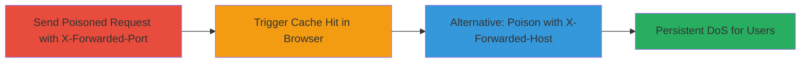

---
tags:
  - cache-poisoning
  - dos
  - web-cache
  - x-forwarded-headers
type: attack_chain
tools:
  - '[[tools/curl]]'
tactics:
  - '[[Impact]]'
commands:
  - '[[commands/curl-poison-x-forwarded-port]]'
  - '[[commands/curl-poison-x-forwarded-host]]'
platforms:
  - Web
complexity: low
procedures:
  - '[[procedures/Poison-Cache-with-X-Forwarded-Port]]'
  - '[[procedures/Trigger-Poisoned-Cache-Response]]'
  - '[[procedures/Poison-Cache-with-X-Forwarded-Host]]'
step_count: 3
techniques:
  - '[[Exploit Public-Facing Application]]'
  - '[[Network Denial of Service]]'
description: >-
  Multi-stage attack exploiting unvalidated X-Forwarded-Port and
  X-Forwarded-Host headers to poison web caches, causing persistent denial of
  service on affected endpoints.
skill_level: intermediate
impact_level: high
id: c4d7cb8d-837c-42b4-98fa-636e04373ce5
created_at: '2025-12-14T17:26:56.768Z'
updated_at: '2025-12-14T17:26:56.768Z'
verified: false
validated: true
submitted: true
mitre_tactics:
  - '[[Impact]]'
mitre_techniques:
  - '[[Exploit Public-Facing Application]]'
  - '[[Network Denial of Service]]'
---
# Web Cache Poisoning via X-Forwarded Headers Leading to Persistent DoS

## Overview

This attack chain demonstrates how attackers can exploit web cache poisoning vulnerabilities by manipulating X-Forwarded-Port and X-Forwarded-Host headers in requests to index.php endpoints on www.hackerone.com. The caching system, likely Varnish on Acquia Cloud with Drupal, incorporates these headers into the cache key without validation, allowing the creation of poisoned cache entries that redirect to invalid ports. This results in a persistent denial of service (DoS), where subsequent users experience connection failures to affected pages and redirects until the cache expires. The attack requires no authentication and can be executed remotely over HTTP/HTTPS.

## Chain Metrics Dashboard

| Metric | Value |
|--------|-------|
| Chain Status | Unverified |
| Total Steps | 3 |
| Execution Time | ~1 minute |
| Skill Level | Intermediate |
| Complexity | Low |
| Impact Level | High |

## Attack Flow Visualization



## Prerequisites & Requirements

### Required Tools

- [[tools/curl]]

### Target Environment

- Web platform with caching (e.g., Varnish on Acquia Cloud)
- PHP/Drupal-based application
- Exposed index.php endpoints
- No specific ports beyond standard 443 (HTTPS)

### Initial Access Requirements

- Public internet access to the target (www.hackerone.com)
- No credentials required
- Ability to send custom HTTP headers

## Detailed Attack Procedures

### Step 1: Poison Cache with Invalid Port
procedure: [[procedures/Poison-Cache-with-X-Forwarded-Port]]

**Objective**: Manipulate the X-Forwarded-Port header to create a unique, poisoned cache entry that redirects to an invalid port, affecting all subsequent requests.

**Instructions**: Use [[commands/curl-poison-x-forwarded-port]] to send a request with an invalid port value:

```bash
curl -H 'X-Forwarded-Port: 123' https://www.hackerone.com/index.php?dontpoisoneveryone=1
```

This poisons the cache by storing a response with an invalid redirect.

**Expected Output**: HTTP 200 or redirect response that gets cached; no immediate error, but cache is now poisoned.

**Success Indicators**:
- Request completes successfully (cache entry created)
- Subsequent verification shows poisoned behavior

### Step 2: Trigger Poisoned Cache Response
procedure: [[procedures/Trigger-Poisoned-Cache-Response]]

**Objective**: Retrieve the poisoned cache entry to confirm the DoS impact, simulating how other users would be affected.

**Instructions**: Load the target URL in a browser or use a standard GET request without custom headers to hit the cache:

```bash
curl https://www.hackerone.com/index.php?dontpoisoneveryone=1
```

The response will attempt to connect to the invalid port (123), causing failure.

**Expected Output**: Connection error or failed redirect due to invalid port.

**Success Indicators**:
- Browser shows connection refused or timeout
- Affects all cache hits until expiration

### Step 3: Alternative Poisoning with Host Header
procedure: [[procedures/Poison-Cache-with-X-Forwarded-Host]]

**Objective**: Use X-Forwarded-Host as an alternative vector to achieve the same cache poisoning effect.

**Instructions**: Execute [[commands/curl-poison-x-forwarded-host]] to poison via the host header:

```bash
curl -H 'X-Forwarded-Host: www.hackerone.com:123' https://www.hackerone.com/index.php?dontpoisoneveryone=1
```

This creates another poisoned entry with the invalid port in the host.

**Expected Output**: Successful request that caches the poisoned redirect.

**Success Indicators**:
- Cache poisoned similarly to Step 1
- Verification in Step 2 shows DoS

## Attack Chain Summary

### Key Achievements

1. Successful cache poisoning without authentication
2. Persistent DoS impacting site-wide redirects and pages
3. Demonstration of multiple header vectors for reliability

## Technique & Tactic Coverage

### MITRE ATT&CK Techniques

- [[Exploit Public-Facing Application]]
- [[Network Denial of Service]]

### MITRE ATT&CK Tactics

- [[Impact]]

---
*Last updated: 2023-10-01*
