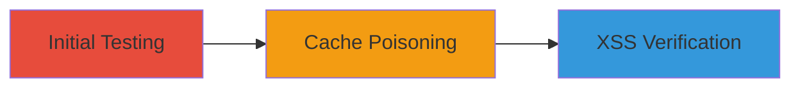

---
tags:
  - web-cache-poisoning
  - xss
  - stored-xss
  - header-manipulation
type: attack_chain
tools:
  - '[[tools/curl]]'
tactics:
  - '[[Initial Access]]'
  - '[[Execution]]'
commands:
  - '[[commands/curl-set-x-forwarded-host]]'
  - '[[commands/curl-inject-xss-payload]]'
  - '[[commands/curl-access-poisoned-page]]'
platforms:
  - Web
complexity: medium
procedures:
  - '[[procedures/Test-for-Web-Cache-Poisoning-via-Header-Manipulation]]'
  - '[[procedures/Inject-Malicious-Host-for-Cache-Poisoning]]'
  - '[[procedures/Verify-Stored-XSS-in-Poisoned-Cache]]'
step_count: 3
techniques:
  - '[[Exploit Public-Facing Application]]'
  - '[[JavaScript]]'
description: >-
  Exploitation of web cache poisoning combined with stored XSS via manipulation
  of the X-Forwarded-Host header on okmedia.insideok.ru, allowing injection of
  malicious hosts to poison the cache with XSS payloads for persistent script
  execution.
skill_level: intermediate
impact_level: high
id: cbf69e8a-d008-47a8-bb4f-86321fc088c8
created_at: '2025-12-13T09:00:33.973Z'
updated_at: '2025-12-13T09:00:33.973Z'
verified: false
validated: true
submitted: true
mitre_tactics:
  - '[[Initial Access]]'
  - '[[Execution]]'
mitre_techniques:
  - '[[Exploit Public-Facing Application]]'
  - '[[JavaScript]]'
---
# Web Cache Poisoning via X-Forwarded-Host Leading to Stored XSS

Multi-stage attack chain demonstrating the exploitation of improper validation of the X-Forwarded-Host header on okmedia.insideok.ru, leading to web cache poisoning and stored XSS. This allows attackers to inject malicious hosts that poison the cache with XSS payloads, resulting in persistent script execution in users' browsers when they access the poisoned pages. The attack was discovered through header manipulation testing and has a high severity impact due to potential session hijacking or data theft affecting multiple users.

## Chain Metrics Dashboard

| Metric | Value |
|--------|-------|
| Chain Status | Unverified |
| Total Steps | 3 |
| Execution Time | ~5 minutes |
| Skill Level | Intermediate |
| Complexity | Medium |
| Impact Level | High |

## Attack Flow Visualization



## Prerequisites & Requirements

### Required Tools

- [[tools/curl]]

### Target Environment

- Target Platform: Web
- Required services/ports: HTTP/HTTPS on okmedia.insideok.ru
- Network access requirements: Direct access to the target domain

### Initial Access Requirements

- Credential requirements: None
- Network position: External attacker
- Prior access needed: None

## Detailed Attack Procedures

### Step 1: Test for Web Cache Poisoning via Header Manipulation
procedure: [[procedures/Test-for-Web-Cache-Poisoning-via-Header-Manipulation]]

**Objective**: Identify if the target mishandles the X-Forwarded-Host header, allowing potential cache poisoning.

**Instructions**: Use [[commands/curl-set-x-forwarded-host]] to test header manipulation by sending a request with a modified X-Forwarded-Host value:

```bash
curl -H "X-Forwarded-Host: malicious.example.com" https://okmedia.insideok.ru/
```

Observe the response to check if the host is reflected without validation.

**Expected Output**: Response includes the injected host value, indicating vulnerability.

**Success Indicators**:
- Injected host appears in the response
- No validation errors or blocks

### Step 2: Inject Malicious Host for Cache Poisoning
procedure: [[procedures/Inject-Malicious-Host-for-Cache-Poisoning]]

**Objective**: Poison the web cache by injecting a malicious host containing an XSS payload.

**Instructions**: Execute [[commands/curl-inject-xss-payload]] to send a request that poisons the cache with an XSS payload in the host:

```bash
curl -H "X-Forwarded-Host: \"><script>alert('XSS')</script>" https://okmedia.insideok.ru/
```

This injects the payload into the cached response.

**Expected Output**: Cache is poisoned, and subsequent requests serve the malicious content.

**Success Indicators**:
- Payload is stored in the cache
- No immediate errors from the server

### Step 3: Verify Stored XSS in Poisoned Cache
procedure: [[procedures/Verify-Stored-XSS-in-Poisoned-Cache]]

**Objective**: Confirm that the poisoned cache delivers the XSS payload to users.

**Instructions**: Access the poisoned page using [[commands/curl-access-poisoned-page]] to simulate a user request:

```bash
curl https://okmedia.insideok.ru/
```

Check if the response includes the injected XSS script.

**Expected Output**: Response contains the XSS payload, which would execute in a browser.

**Success Indicators**:
- XSS payload is present in the response
- Script executes persistently on access

## Attack Chain Summary

### Key Achievements

1. Successful identification of header manipulation vulnerability
2. Poisoning of web cache with malicious XSS payload
3. Persistent execution of arbitrary scripts in user browsers

## Technique & Tactic Coverage

### MITRE ATT&CK Techniques

- [[Exploit Public-Facing Application]]
- [[JavaScript]]

### MITRE ATT&CK Tactics

- [[Initial Access]]
- [[Execution]]

*Last updated: 2023-10-01*
