# 🎯 Webapp + Heartbleed Chain (no auth)

> **Enhanced Attack Chain Dashboard** — Privilege Escalation Chain

---

## 📊 Chain Metrics Dashboard

| Metric | Value |
|--------|-------|
| **Chain Status** | ⚠️ **UNVERIFIED** |
| **Total Steps** | `9` |
| **Execution Time** | ~2-4 hours |
| **Skill Level** | 🟡 Intermediate-Advanced |
| **Complexity** | High |
| **Impact Level** | 🔴 **CRITICAL** |

---

## 🎭 Attack Flow Visualization

```mermaid
graph TD
    A[🌐 Initial Recon]
    B[👥 Enumeration]
    C[🎫 Exploitation]
    D[🔑 Analysis]
    E[💥 Cracking]
    F[🔓 Initial Access]
    G[🩸 Deep Enumeration]
    H[📊 Analysis]
    I[⚙️ Privilege Escalation]
    J[🎯 Rights Escalation]
    K[💎 Credential Harvest]
    L[👑 Domain Compromise]
    A --> B
    B --> C
    C --> D
    D --> E
    E --> F
    F --> G
    G --> H
    H --> I
    I --> J
    J --> K
    K --> L
    
    style A fill:#4a90e2,stroke:#2e5c8a,stroke-width:3px,color:#fff
    style C fill:#e25555,stroke:#8a2e2e,stroke-width:3px,color:#fff
    style E fill:#e25555,stroke:#8a2e2e,stroke-width:3px,color:#fff
    style H fill:#9b59b6,stroke:#6c3483,stroke-width:3px,color:#fff
    style K fill:#e74c3c,stroke:#a93226,stroke-width:3px,color:#fff
    style L fill:#27ae60,stroke:#1e8449,stroke-width:3px,color:#fff
```



---

## 🛠️ Prerequisites & Requirements

### Required Tools
```bash path=null start=null
# Tools will be listed here based on procedures
```

### Target Environment
- ✅ Linux target system
- ✅ Web application target
- ✅ Network connectivity to target

### Initial Access Requirements
- 🔓 Requirements based on first step of chain
- 🔓 See detailed procedures below

---

## 🔬 Detailed Attack Procedures

### **[Step 1]** Basic Port Scan with Service Enumeration

**Progress:** `█░░░░░░░░░` 11% | **Risk:** 🟢 Low

**Procedure:** [[Basic Port Scan with Service Enumeration]]

> 📝 **Objective:** Perform an Nmap port scan on a target and enumerate banners of ports 1-1024, as well as popular services (a full list can be found in /usr/share/nmap/nmap-services).

**Expected Output:**
- Refer to procedure documentation for details

**Success Indicators:** ✅ Objective achieved

---

### **[Step 2]** Directory Brute Force a Web App (Wfuzz)

**Progress:** `██░░░░░░░░` 22% | **Risk:** 🟢 Low

**Procedure:** [[Directory Brute Force a Web App (Wfuzz)]]

> 📝 **Objective:** Enumerate a webs app's files and folders by performing a dictionary brute force attack.

**Expected Output:**
- Refer to procedure documentation for details

**Success Indicators:** ✅ Objective achieved

---

### **[Step 3]** Convert Hex Dump to Binary

**Progress:** `███░░░░░░░` 33% | **Risk:** 🔴 High

**Procedure:** [[Convert Hex Dump to Binary]]

> 📝 **Objective:** Hex dump is binary data represented in hex pairs. Data in this format can be converted back to binary using tools such as xxd. Example of data in hex pairs:

**Expected Output:**
- Refer to procedure documentation for details

**Success Indicators:** ✅ Objective achieved

---

### **[Step 4]** Port Scan with Vulnerability Enumeration

**Progress:** `████░░░░░░` 44% | **Risk:** 🟢 Low

**Procedure:** [[Port Scan with Vulnerability Enumeration]]

> 📝 **Objective:** Perform an Nmap port scan of a target's ports and enumerate with Nmap's "vuln" scripts, enumerating services for popular CVEs and misconfigurations. For a list of all scripts which are run, see the Nmap website.

**Expected Output:**
- Refer to procedure documentation for details

**Success Indicators:** ✅ Objective achieved

---

### **[Step 5]** Exploit the Heartbleed Vulnerability

**Progress:** `█████░░░░░` 55% | **Risk:** 🔴 High

**Procedure:** [[Exploit the Heartbleed Vulnerability]]

> 📝 **Objective:** Heartbleed is a serious vulnerability found in all OpenSSL versions from 1.0.1 (released March 14, 2012)  to 1.0.1g (released April 7, 2014). This vulnerability allows remote attackers to read protected memory on the affected web server, potentially disclosing sensitive information including privat

**Expected Output:**
- Refer to procedure documentation for details

**Success Indicators:** ✅ Objective achieved

---

### **[Step 6]** Decode a Base64 Encoded String

**Progress:** `██████░░░░` 66% | **Risk:** 🟡 Medium

**Procedure:** [[Decode a Base64 Encoded String]]

> 📝 **Objective:** Decode a Base64 string using Linux's base64 tool.

**Expected Output:**
- Refer to procedure documentation for details

**Success Indicators:** ✅ Objective achieved

---

### **[Step 7]** Connect to an SSH Server with a Private Key

**Progress:** `███████░░░` 77% | **Risk:** 🟡 Medium

**Procedure:** [[Connect to an SSH Server with a Private Key]]

> 📝 **Objective:** Use SSH to connect to a remote SSH server using a private key.

**Expected Output:**
- Refer to procedure documentation for details

**Success Indicators:** ✅ Objective achieved

---

### **[Step 8]** List Running Processes

**Progress:** `████████░░` 88% | **Risk:** 🟡 Medium

**Procedure:** [[List Running Processes]]

> 📝 **Objective:** List processes to identify potentially vulnerable software and settings.

**Expected Output:**
- Refer to procedure documentation for details

**Success Indicators:** ✅ Objective achieved

---

### **[Step 9]** Attach to Existing tmux Server Socket by Path

**Progress:** `██████████` 100% | **Risk:** 🟡 Medium

**Procedure:** [[Attach to Existing tmux Server Socket by Path]]

> 📝 **Objective:** When creating a session, tmux allows users to specify an alternate path for the socket. This opens up a vulnerability if other users are able to read/write to the socket, allowing them to attach to the session with full permissions of the user who opened it.

**Expected Output:**
- Refer to procedure documentation for details

**Success Indicators:** ✅ Objective achieved

---

## 🎯 Attack Chain Summary

### Key Achievements
- ✅ Directory Brute Force a Web App (Wfuzz)
- ✅ Port Scan with Vulnerability Enumeration
- ✅ Exploit the Heartbleed Vulnerability
- ✅ Connect to an SSH Server with a Private Key
- ✅ Attach to Existing tmux Server Socket by Path
- ... and 4 more procedures

---

## 📈 Technique & Tactic Coverage

---

**Last Updated:** 2023-05-29T16:48:53.162677+00:00 | **Chain Version:** 2.0 Enhanced | **Status:** ⚠️ Draft
