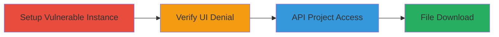

# Weblate API Access Control Bypass for Unauthorized Translation File Access

Multi-stage attack chain demonstrating a complete attack workflow exploiting improper access controls in the Weblate API, allowing anonymous users to access sensitive translation files despite UI-level restrictions.

## Chain Metrics Dashboard

| Metric | Value |
|--------|-------|
| Chain Status | Unverified |
| Total Steps | 4 |
| Execution Time | ~10 minutes |
| Skill Level | Intermediate |
| Complexity | Low |
| Impact Level | Low |

## Attack Flow Visualization



## Prerequisites & Requirements

### Required Tools

- [[curl]]

### Target Environment

- Weblate 2.15-dev on a local or remote server
- Django-based web application
- Port 8000 open for HTTP access

### Initial Access Requirements

- Network access to the Weblate instance (local or remote)
- No credentials required (anonymous access)
- Administrative access to set up or modify permissions if demonstrating locally

## Detailed Attack Procedures

### Step 1: Setup Vulnerable Instance
procedure: [[procedures/Setup-Weblate-Instance-with-Removed-Permissions]]

**Objective**: Configure a Weblate instance with permissions removed from the Guest group to simulate the vulnerable state where UI enforces controls but API does not.

**Instructions**: Install and run Weblate 2.15-dev locally, remove all permissions from the Guest group, and restart the server. This creates a scenario where anonymous users are denied UI access but can still interact with the API.

**Expected Output**: Weblate server running on http://localhost:8000 with a test project and component configured, and Guest group permissions cleared.

**Success Indicators**:
- Server logs confirm restart without errors
- Test project 'testproject' and component 'testcomponent' visible in admin but inaccessible via UI for guests

### Step 2: Verify Web UI Access Denial
procedure: [[procedures/Verify-Web-UI-Access-Denial]]

**Objective**: Confirm that the web UI properly enforces access controls, denying anonymous access to project details.

**Instructions**: As an anonymous user, navigate to the project URL in a browser, such as http://192.168.1.129:8000/projects/testproject/. This step validates that the vulnerability is API-specific.

**Expected Output**: Access denied error or permission prompt in the browser.

**Success Indicators**:
- UI displays denial message
- No project details visible without authentication

### Step 3: Access Project Details via API
procedure: [[procedures/Access-Project-Details-via-API]]

**Objective**: Retrieve project and translation details via the API endpoint as an anonymous user, bypassing UI controls.

**Instructions**: Use [[commands/curl-api-get]] to query the API endpoint for translations:

```bash
curl -X GET "http://192.168.1.129:8000/api/components/testproject/testcomponent/translations/"
```

Parse the JSON response to confirm project details are returned.

**Expected Output**: JSON response containing project metadata, including a 'file_url' for the translation file.

**Success Indicators**:
- API returns 200 OK with project data
- No authentication required

### Step 4: Download Translation File via API
procedure: [[procedures/Download-Translation-File-via-API]]

**Objective**: Download the full translation file using the URL from the API response, exposing potentially sensitive content.

**Instructions**: Extract the 'file_url' from the previous API response (e.g., http://192.168.1.129:8000/api/translations/testproject/testcomponent/en_CA/file/) and use [[commands/curl-file-download]] to fetch it:

```bash
curl -X GET "http://192.168.1.129:8000/api/translations/testproject/testcomponent/en_CA/file/" -o translation.po
```

**Expected Output**: Downloaded .po or similar translation file containing all strings.

**Success Indicators**:
- File downloads successfully without errors
- File contains full translation content

## Attack Chain Summary

### Key Achievements

1. Successfully set up a vulnerable Weblate instance with removed guest permissions
2. Confirmed UI access denial for anonymous users
3. Retrieved project details via API without authentication
4. Downloaded sensitive translation files, potentially exposing confidential data

## Technique & Tactic Coverage

### MITRE ATT&CK Techniques

- [[Exploit Public-Facing Application]]

### MITRE ATT&CK Tactics

- [[Initial Access]]

---
*Last updated: 2023-10-01T12:00:00Z*
