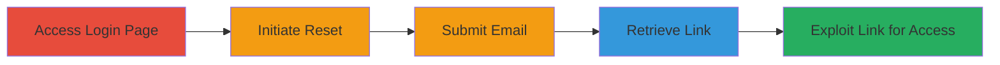

---
tags:
  - account-takeover
  - auth-bypass
  - password-reset
  - weblate
type: attack_chain
tools: []
tactics:
  - '[[Initial Access]]'
commands: []
verified: false
platforms:
  - Web
submitted: true
complexity: low
created_at: '2023-10-01T00:00:00Z'
procedures:
  - '[[procedures/Access-Weblate-Login-Page]]'
  - '[[procedures/Initiate-Password-Reset]]'
  - '[[procedures/Submit-Email-for-Reset]]'
  - '[[procedures/Retrieve-Reset-Link-from-Email]]'
  - '[[procedures/Exploit-Reset-Link-for-Access]]'
step_count: 5
techniques:
  - '[[Valid Accounts]]'
updated_at: '2025-12-14T17:32:58.268Z'
description: >-
  Exploits improper session handling in Weblate's hosted platform password reset
  process to achieve unauthorized account access without changing the password.
skill_level: beginner
impact_level: high
id: 4cc2a4fa-a770-46ba-b9fd-850b9803b4aa
validated: true
mitre_tactics:
  - '[[Initial Access]]'
mitre_techniques:
  - '[[Valid Accounts]]'
---
# Weblate Account Takeover via Password Reset Bypass

Multi-stage attack chain demonstrating account takeover through exploitation of the password reset mechanism on hosted.weblate.org.

## Chain Metrics Dashboard

| Metric | Value |
|--------|-------|
| Chain Status | Unverified |
| Total Steps | 5 |
| Execution Time | ~5 minutes |
| Skill Level | Beginner |
| Complexity | Low |
| Impact Level | High |

## Attack Flow Visualization

## Prerequisites & Requirements

### Required Tools

- Web browser (e.g., Chrome, Firefox)
- Access to the victim's email account

### Target Environment

- Web platform: hosted.weblate.org
- No specific services or ports required beyond standard HTTPS (443)
- Internet access

### Initial Access Requirements

- Knowledge of the victim's email address
- Ability to access the victim's email (e.g., via phishing or shared device)
- No prior credentials needed

## Detailed Attack Procedures

### Step 1: Access Login Page
procedure: [[procedures/Access-Weblate-Login-Page]]

**Objective**: Reach the authentication entry point to begin the reset process.

**Instructions**: Open a web browser and navigate to the Weblate hosted login page at https://hosted.weblate.org/accounts/login/. This is the standard entry for user authentication.

**Expected Output**: The login form is displayed, including fields for username/email and password, along with a 'Reset it' link for forgotten passwords.

**Success Indicators**:
- Login page loads successfully
- 'Reset it' option is visible under the password field

### Step 2: Initiate Password Reset
procedure: [[procedures/Initiate-Password-Reset]]

**Objective**: Trigger the password reset flow to generate a reset request.

**Instructions**: On the login page, locate and click the 'Reset it' button or link associated with the password field. This initiates the reset workflow without requiring login.

**Expected Output**: Redirect to the password reset form, prompting for the user's email address and possibly a CAPTCHA.

**Success Indicators**:
- Reset form appears
- No authentication barriers encountered

### Step 3: Submit Email for Reset
procedure: [[procedures/Submit-Email-for-Reset]]

**Objective**: Request a reset link by providing the victim's email, completing any verification.

**Instructions**: Enter the victim's email address into the provided field. Solve the CAPTCHA if presented (e.g., select images or enter text as required). Click the submit button to send the reset request.

**Expected Output**: A success message indicating that a reset email has been sent to the provided address.

**Success Indicators**:
- Confirmation message displayed
- Email sent (verifiable in next step)

### Step 4: Retrieve Reset Link from Email
procedure: [[procedures/Retrieve-Reset-Link-from-Email]]

**Objective**: Obtain the password reset link sent by Weblate to the victim's email.

**Instructions**: Access the victim's email inbox (e.g., via webmail or email client). Search for an email from Weblate containing the subject related to password reset. Open the email and copy or note the reset link provided in the body.

**Expected Output**: Email received with a clickable reset link, typically valid for a short time (e.g., 1 hour).

**Success Indicators**:
- Reset email arrives in inbox
- Link is present and unexpired

### Step 5: Exploit Reset Link for Access
procedure: [[procedures/Exploit-Reset-Link-for-Access]]

**Objective**: Use the reset link to bypass authentication and gain direct account access.

**Instructions**: Click the reset link from the email. The link should direct to a password change page, but due to the vulnerability, it logs the user in directly without prompting for a new password.

**Expected Output**: User is authenticated and redirected to the account dashboard or profile page, with full access to the Weblate account features.

**Success Indicators**:
- Immediate login without password prompt
- Access to account settings, projects, or translations
- Session active and persistent

## Attack Chain Summary

### Key Achievements

1. Bypassed standard authentication via flawed reset mechanism
2. Achieved full account takeover using only email access
3. Demonstrated risk in shared device scenarios (e.g., open email sessions)

## Technique & Tactic Coverage

### MITRE ATT&CK Techniques

- [[Valid Accounts]]

### MITRE ATT&CK Tactics

- [[Initial Access]]

---
*Last updated: 2023-10-01T00:00:00Z*
