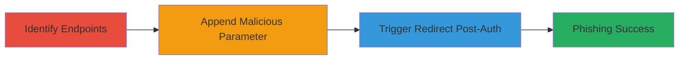

---
tags:
  - open-redirect
  - phishing
  - social-auth
  - weblate
type: attack_chain
tools: []
tactics:
  - '[[Initial Access]]'
verified: false
platforms:
  - Web
submitted: true
complexity: low
created_at: '2023-10-01T00:00:00Z'
procedures:
  - '[[procedures/Identify-Vulnerable-Social-Login-Endpoints]]'
  - '[[procedures/Append-Malicious-Next-Parameter]]'
  - '[[procedures/Trigger-Redirect-After-Authentication]]'
step_count: 3
techniques:
  - '[[Drive-by Compromise]]'
  - '[[Exploit Public-Facing Application]]'
updated_at: '2025-12-14T17:24:23.466Z'
description: >-
  A multi-step attack exploiting an open redirect vulnerability in Weblate's
  social authentication endpoints to redirect authenticated users to malicious
  sites, enabling phishing or session hijacking.
skill_level: beginner
impact_level: medium
id: 4a02f29c-7cbc-4d5a-9885-7868aa8f909a
validated: true
mitre_tactics:
  - '[[Initial Access]]'
mitre_techniques:
  - '[[Drive-by Compromise]]'
  - '[[Exploit Public-Facing Application]]'
---
# Weblate Open Redirect in Social Authentication for Phishing Attacks

Multi-stage attack chain demonstrating exploitation of an open redirect vulnerability in Weblate's social login endpoints to trick users into visiting malicious sites after authentication.

## Chain Metrics Dashboard

| Metric | Value |
|--------|-------|
| Chain Status | Unverified |
| Total Steps | 3 |
| Execution Time | ~5 minutes |
| Skill Level | Beginner |
| Complexity | Low |
| Impact Level | Medium |

## Attack Flow Visualization

## Prerequisites & Requirements

### Required Tools

- Web browser for manual testing
- No specialized tools required

### Target Environment

- Web platform
- Weblate instance with social authentication enabled (e.g., hosted.weblate.org)
- Services: Facebook Login, Google OAuth2, GitHub Login, Bitbucket Login, GitLab Login
- Network access: Public internet to target URLs

### Initial Access Requirements

- No prior credentials needed
- Ability to craft and send HTTP requests (e.g., via browser URL manipulation)
- Target user must be tricked into clicking the malicious link

## Detailed Attack Procedures

### Step 1: Identify Vulnerable Social Login Endpoints
procedure: [[procedures/Identify-Vulnerable-Social-Login-Endpoints]]

**Objective**: Locate the social authentication endpoints in Weblate that accept a 'next' parameter without validation.

**Instructions**: Manually examine the Weblate instance for social login URLs. Common endpoints include those for Facebook, Google, GitHub, Bitbucket, and GitLab. No commands are needed; use browser developer tools or direct URL inspection to confirm the structure.

**Expected Output**: List of vulnerable URLs, such as https://hosted.weblate.org/accounts/login/facebook/.

**Success Indicators**:
- Endpoints identified without redirect validation
- 'next' parameter accepted in URL query

### Step 2: Append Malicious Next Parameter
procedure: [[procedures/Append-Malicious-Next-Parameter]]

**Objective**: Modify the login URLs to include a malicious 'next' parameter pointing to an external site.

**Instructions**: Craft the malicious URL by appending ?next=///evil.com (using triple slash to bypass basic checks) to each social login endpoint. For example, construct https://hosted.weblate.org/accounts/login/facebook/?next=///evil.com. Share this link with the target user via email or other means to lure them into clicking it.

**Expected Output**: Modified URLs ready for distribution.

**Success Indicators**:
- URL accepts the parameter without error
- No immediate validation rejection

### Step 3: Trigger Redirect After Authentication
procedure: [[procedures/Trigger-Redirect-After-Authentication]]

**Objective**: Observe the redirection to the malicious site upon completing social authentication.

**Instructions**: Have the target user click the crafted link, authenticate via the social provider, and complete the login process. Monitor the browser to confirm redirection to the specified evil.com instead of an internal Weblate page.

**Expected Output**: User redirected to malicious site post-authentication.

**Success Indicators**:
- Successful social login
- Automatic redirect to external malicious domain
- Potential for phishing page load

## Attack Chain Summary

### Key Achievements

1. Identified unvalidated 'next' parameters in multiple social login endpoints.
2. Crafted and delivered malicious redirect links.
3. Achieved post-authentication redirection to arbitrary external sites, enabling phishing.

## Technique & Tactic Coverage

### MITRE ATT&CK Techniques

- [[Drive-by Compromise]]
- [[Exploit Public-Facing Application]]

### MITRE ATT&CK Tactics

- [[Initial Access]]

---
*Last updated: 2023-10-01T00:00:00Z*
