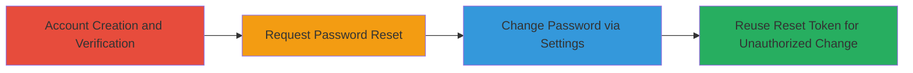

---
tags:
  - broken-auth
  - password-reset
  - token-reuse
  - account-takeover
  - weblate
  - django
type: attack_chain
tools: []
tactics:
  - '[[Initial Access]]'
verified: false
platforms:
  - Web
submitted: true
complexity: low
created_at: '2023-10-01T00:00:00Z'
procedures:
  - '[[procedures/Create-and-Verify-Weblate-Account]]'
  - '[[procedures/Request-Weblate-Password-Reset]]'
  - '[[procedures/Change-Password-via-Weblate-Settings]]'
  - '[[procedures/Reuse-Weblate-Password-Reset-Token]]'
step_count: 4
techniques:
  - '[[Account Manipulation]]'
  - '[[Exploit Public-Facing Application]]'
updated_at: '2025-12-14T17:31:19.721Z'
description: >-
  Demonstrates exploitation of a broken authentication vulnerability in Weblate
  where password reset tokens remain valid after password changes via account
  settings, allowing unauthorized password modifications.
skill_level: low
impact_level: medium
id: 1d99eb47-d5ad-4ce1-83e3-5ef8a6133a57
validated: true
mitre_tactics:
  - '[[Initial Access]]'
mitre_techniques:
  - '[[Account Manipulation]]'
  - '[[Exploit Public-Facing Application]]'
---
# Weblate Password Reset Token Reuse for Unauthorized Account Modification

Multi-stage attack chain demonstrating exploitation of a session token management flaw in Weblate's password reset mechanism. The vulnerability allows attackers to reuse a password reset token even after the password has been changed through account settings, potentially enabling unauthorized account modifications if the token is intercepted or controlled.

## Chain Metrics Dashboard

| Metric | Value |
|--------|-------|
| Chain Status | Unverified |
| Total Steps | 4 |
| Execution Time | ~5 minutes |
| Skill Level | Low |
| Complexity | Low |
| Impact Level | Medium |

## Attack Flow Visualization

## Prerequisites & Requirements

### Required Tools

- Web browser (e.g., Chrome, Firefox)
- Access to an email account for verification

### Target Environment

- Weblate instance (e.g., https://demo.weblate.org)
- Web platform with Django backend
- No specific ports or services beyond standard HTTP/HTTPS

### Initial Access Requirements

- No prior credentials needed; starts with account creation
- Email access for confirmation and reset links
- Network access to the Weblate web application

## Detailed Attack Procedures

### Step 1: Account Creation and Verification
procedure: [[procedures/Create-and-Verify-Weblate-Account]]

**Objective**: Establish a test account to demonstrate the vulnerability.

**Instructions**: Follow the procedure to register and confirm the account via email.

**Expected Output**: Successful login capability with the new account.

**Success Indicators**:
- Account created and email confirmed
- Able to log in to the Weblate dashboard

### Step 2: Request Password Reset
procedure: [[procedures/Request-Weblate-Password-Reset]]

**Objective**: Generate a password reset token without using it immediately.

**Instructions**: Initiate the reset process to receive the token via email, but do not click the link yet.

**Expected Output**: Email containing the reset link with a valid token.

**Success Indicators**:
- Reset email received
- Token link copied or noted for later use

### Step 3: Change Password via Settings
procedure: [[procedures/Change-Password-via-Weblate-Settings]]

**Objective**: Modify the password through normal login and settings to test token invalidation.

**Instructions**: Log in with existing credentials and update the password in the account profile.

**Expected Output**: Password successfully changed, requiring new credentials for login.

**Success Indicators**:
- Password updated in settings
- Logout and relogin with new password succeeds

### Step 4: Reuse Reset Token
procedure: [[procedures/Reuse-Weblate-Password-Reset-Token]]

**Objective**: Demonstrate the vulnerability by using the original token post-password change.

**Instructions**: Access the saved reset link and attempt another password change.

**Expected Output**: Successful password change using the stale token.

**Success Indicators**:
- Token remains valid despite prior change
- Unauthorized password modification achieved

## Attack Chain Summary

### Key Achievements

1. Exposed flaw in password reset token lifecycle management
2. Demonstrated potential for account compromise via token interception
3. Highlighted violation of secure session invalidation best practices

## Technique & Tactic Coverage

### MITRE ATT&CK Techniques

- [[Account Manipulation]]
- [[Exploit Public-Facing Application]]

### MITRE ATT&CK Tactics

- [[Initial Access]]

---

*Last updated: 2023-10-01T00:00:00Z*
