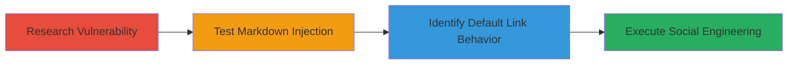

# Window.Opener Exploitation via Target='_blank' Links in HackerOne Markdown Reports

Multi-stage attack chain demonstrating a potential exploitation workflow in HackerOne's platform, where Markdown-rendered links to trusted domains open in new tabs without rel='noopener', allowing access to the opener window for DOM manipulation via social engineering.

## Chain Metrics Dashboard

| Metric | Value |
|--------|-------|
| Chain Status | Unverified |
| Total Steps | 4 |
| Execution Time | ~10 minutes |
| Skill Level | Intermediate |
| Complexity | Medium |
| Impact Level | Low |

## Attack Flow Visualization

## Prerequisites & Requirements

### Required Tools

- Browser developer tools for inspection
- Access to a HackerOne account for testing

### Target Environment

- HackerOne platform (Web)
- Markdown rendering in reports or comments
- Team collaboration features

### Initial Access Requirements

- HackerOne user account
- Ability to create or comment on reports
- Social engineering access to invite users to teams

## Detailed Attack Procedures

### Step 1: Research Rel=Noopener Vulnerability
procedure: [[procedures/Research-Rel-Noopener-Vulnerability]]

**Objective**: Understand the risks associated with target='_blank' links without rel='noopener' to inform the attack approach.

**Instructions**: Review educational resources on the vulnerability to grasp how window.opener can be accessed from new tabs.

**Expected Output**: Knowledge of exploitation risks, such as tabnabbing or DOM manipulation.

**Success Indicators**:
- Comprehension of window.opener access mechanics
- Identification of relevant test scenarios

### Step 2: Test Markdown Target Attribute Injection
procedure: [[procedures/Test-Markdown-Target-Attribute-Injection]]

**Objective**: Attempt to inject custom target attributes into Markdown links to verify parser behavior.

**Instructions**: In a HackerOne report or comment, use Markdown syntax to try setting target='_blank' and inspect the rendered HTML.

**Expected Output**: Confirmation that custom attributes are ignored by the parser.

**Success Indicators**:
- Parser ignores injected {:target="_blank"}
- No custom attributes applied in output HTML

### Step 3: Identify Default Target='_blank' on Trusted Links
procedure: [[procedures/Identify-Default-Target-Blank-on-Trusted-Links]]

**Objective**: Discover how default links to trusted domains are rendered, revealing the exploitable configuration.

**Instructions**: Embed a link to a trusted domain like YouTube in Markdown and inspect the rendered link attributes using browser tools.

**Expected Output**: Links render with target='_blank' but without rel='noopener'.

**Success Indicators**:
- Default target='_blank' observed on trusted links
- Absence of rel='noopener' confirmed

### Step 4: Demonstrate Social Engineering Attack Scenario
procedure: [[procedures/Demonstrate-Social-Engineering-Attack-Scenario]]

**Objective**: Simulate an attack where a victim is tricked into clicking a crafted link, enabling window.opener exploitation.

**Instructions**: Invite a test user to a team, craft a malicious URL pointing to a trigger endpoint, and lure the victim to click it from a report.

**Expected Output**: Potential access to the opener window for DOM-based attacks.

**Success Indicators**:
- Victim clicks the link
- Attacker gains reference to window.opener

## Attack Chain Summary

### Key Achievements

1. Identified a UX-driven rendering flaw in HackerOne's Markdown parser.
2. Demonstrated social engineering prerequisites for exploitation.
3. Highlighted low-severity impact due to team-based access requirements.
4. Provided proof-of-concept for window.opener risks.

## Technique & Tactic Coverage

### MITRE ATT&CK Techniques

- [[JavaScript]]
- [[T1566.001]]

### MITRE ATT&CK Tactics

- [[Execution]]
- [[Initial Access]]

---
*Last updated: 2023-10-01T12:00:00Z*
